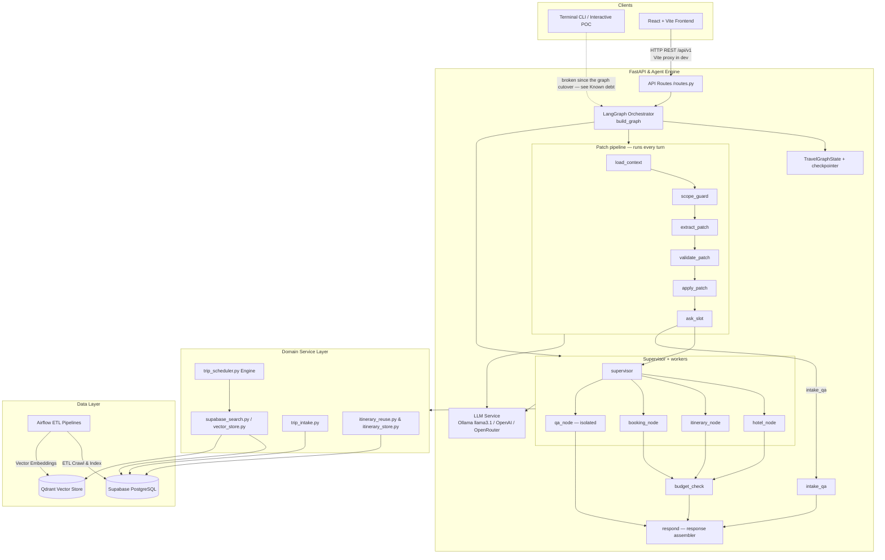
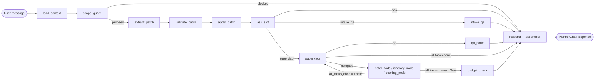

# Architecture Document — VSF Trip Planner AI Agent

## System Overview

VSF Trip Planner là một hệ thống AI Agent thông minh phục vụ lập kế hoạch du lịch tự động đa lượt (multi-turn conversation) cho khách du lịch tại Việt Nam. Hệ thống kết hợp giữa **LangGraph Orchestrator**, **FastAPI Backend**, **Supabase (PostgreSQL + pgvector)**, **Qdrant Vector Store** và **Airflow Data Pipeline** để phân tích nhu cầu, tìm kiếm địa điểm ngữ nghĩa (RAG), tự động lập lịch tối ưu khoảng cách/thời gian và tái sử dụng lịch trình mẫu (Tier 1 Cache).

## Architecture Diagram



> The diagram covers the **chat turn**. Three REST subsystems sit beside it and do not
> run through the graph: **Auth** (Supabase JWT on every request), **Booking & Payment**
> (room hold → VNPay → email), and the **Admin API** (+ its own SPA). See § Booking &
> Payment, § Admin API, and the Authentication note under Backend.

## Components

### 1. Frontend (React + Vite Web UI)

- **Deployment:** built and served on the EC2 host behind Caddy (auto-HTTPS) at the
  project's domain — see [`docs/ops/deployment-runbook.md`](docs/ops/deployment-runbook.md).
- **Technology:** React 19 + Vite 8 + Tailwind 4 (+ i18next). Local dev server on
  `5173` with a `/api` proxy (see [`docs/setup/SETUP_GUIDE.md`](docs/setup/SETUP_GUIDE.md)).
- **Purpose:** Full-featured chat UI for the trip planner — multi-turn conversation,
  hotel selection cards, itinerary panel, and suggestion chips. A separate **admin
  console SPA** lives under `frontend/src/admin/` (see § Admin API).
- **Key Features:**
  - Single-page app (`src/App.tsx`, TypeScript) with split layout: `ChatPanel` + `ItineraryPanel`.
  - `useChatSession` hook owns all state via `useReducer`; no component calls `fetch` directly.
  - `src/api/chat-client.ts` owns the chat calls; `stream-client.ts` owns the SSE turn.
  - Session ID persisted in `sessionStorage`; server-restart detection silently re-creates the session.
  - Vite dev-server proxies `/api → http://localhost:8000` — no CORS headers needed in dev.
- **Running:**
  ```bash
  cd frontend
  npm install
  npm run dev        # → http://localhost:5173
  ```

### 2. Backend (FastAPI)

- **Purpose:** REST API Gateway — receives requests, validates with Pydantic, and dispatches to the LangGraph session.
- **API Design:** full surface in `docs/chat_api_contract.md`. The endpoints the frontend
  actually calls:
  - `POST /api/v1/chat/session` — create session, returns `{session_id, created_at}`
  - `POST /api/v1/planner_chat` — main chat turn, returns `PlannerChatResponse`
  - `POST /api/v1/planner_chat/stream` — same turn over SSE
  - `POST /api/v1/hotels/select` — pick a hotel (this is what creates the trip)
  - `POST /api/v1/hotels/change` — swap the chosen hotel
  - `GET /api/v1/chat/{session_id}/plan` — fetch current trip plan
  - `DELETE /api/v1/chat/{session_id}` — reset / end session

  `POST /hotels/search`, `POST /itineraries/generate`, and `POST /chat/select_place` were
  **removed** (2026-08-15): they read state belonging to the deleted control plane and
  answered `success` with empty data. See the contract doc's "Removed endpoints" table.

  Booking, payment, and the admin console are separate surfaces — see § Booking &
  Payment and § Admin API below.
- **Session registry:** `SessionRegistry` in `src/agents/session.py` holds in-memory `TripSession`
  objects with per-session locks, configurable TTL (`SESSION_TTL_SECONDS`) and cap (`MAX_SESSIONS`).
- **Authentication:** Supabase Auth. Every visitor — anonymous or permanent — carries a
  real Supabase-issued JWT; guests get one via Anonymous Auth. `backend/src/auth/jwt_verifier.py`
  verifies it **locally** (primary path: JWKS / ES256 from `{SUPABASE_URL}/auth/v1/.well-known/jwks.json`,
  cached 5 min — not a per-request network call; `SUPABASE_JWT_SECRET` HS256 is an unused legacy
  fallback). `AUTH_REQUIRED` (default `false`) governs only what happens to a request with no/invalid
  token: `false` → `current_user = None`; `true` → `401`. Session ownership mismatches return
  `404`, never `403` (anti-enumeration). Admin endpoints sit behind an always-strict `require_admin`
  (`app_role == "admin"` claim). Full model: `docs/architecture/authentication.md`.
- **Running:**
  ```bash
  uvicorn src.main:app --reload --port 8000
  # API docs → http://localhost:8000/docs
  ```

### 3. AI Agent (LangGraph)

- **Agent Type:** Stateful multi-node graph (`StateGraph`), compiled by
  `build_graph` (`src/agents/graph/graph.py`). This is the **only** control plane a
  chat turn runs through. The legacy `process_chat_turn` cascade it once ran
  alongside is gone, and there is no setting to switch back to it.
- **State:** `TravelGraphState` (`src/agents/graph/state.py`), persisted per session by
  a checkpointer (Postgres in the app, `MemorySaver` for CLI/tests). `travel_state` is
  the validated business state (slot map); `trip_data` is a **separate top-level key**,
  not nested inside it — `travel_state` round-trips through
  `TravelState.from_dict()`/`.to_dict()` every turn and silently drops anything outside
  `ALLOWED_PATHS`, which destroyed the built itinerary one turn later when `trip_data`
  lived there.
- **Nodes** — all 14, matching `NODE_NAMES` (`graph.py`):

| Node | Role |
|---|---|
| `load_context` | Rehydrates the turn: message, language, session state. Deliberately never resets `messages` or `trip_data`. |
| `scope_guard` | Jailbreak detection before any LLM call, gated by `JAILBREAK_GUARD_MODE`. A block routes straight to `respond`. |
| `extract_patch` | LLM turns the user message into a **proposed patch** (a list of `{path, operation, value}` changes). |
| `validate_patch` | Validates each change against `ALLOWED_PATHS` and slot rules. Rejects rather than coerces. |
| `apply_patch` | Commits the validated changes to `travel_state`. |
| `ask_slot` | Sole writer of `missing_slots`. Asks for the next missing slot, or lets the turn proceed. |
| `intake_qa` | Answers a genuine question asked *while* a slot is still missing, so the pending question isn't blindly re-asked. |
| `supervisor` | Delegates to one worker per iteration, from the eligible set. A **first** delegation spends no LLM call — `WORKER_ORDER` already fixes the order. The LLM path is for recovery, once a worker has reported. |
| `hotel_node` | Hotel search and selection. Selecting a hotel is what **creates** `trip_data`. |
| `itinerary_node` | Itinerary editor: `rebuild_days`, `edit_item`, `lock_days`. Builds one day per invocation, re-queueing itself. |
| `booking_node` | Declines explicitly — booking is not open yet (`_IMPOSSIBLE` is unconditionally `True`). |
| `qa_node` | Read-only Q&A, an isolated compiled subgraph with its own checkpointer and tool set. |
| `budget_check` | Deterministic trip-total validation, one bounded re-plan pass, then reports. Never invents missing prices. |
| `respond` | **Response assembler.** Builds `PlannerChatResponse` from state. Does not generate language — see below. |

- **`respond` is an assembler, not an NLG node.** It picks a reply in priority order:
  `intake_qa` answer + `ask_slot` question → the last worker's own `task_results` reply →
  `qa_node`'s answer via `messages` → a generic acknowledgement. That last step is a
  safety net only; reaching it means a node finished a turn silently, so it logs at
  ERROR. Believing a "formatting & polish node" existed here is exactly why worker
  silence went unnoticed for so long: everyone assumed something downstream owned the
  wording.
- **Control Flow:**



#### Patch pipeline — why the patch commits *before* the slot gate

`extract_patch → validate_patch → apply_patch → ask_slot`, in that order, and the order
is load-bearing. Facts land first; only then does the graph decide whether to ask for
what is still missing.

The reverse order — gate first, commit second — is what creates a whole class of
deadlock: a pending question about one slot blocks a fact the user just volunteered
about a *different* slot. The user answers a question that has already been answered,
the answer is discarded because a different question is outstanding, and the
conversation cannot move. Committing first means every fact in a message lands
regardless of what the turn was waiting for, and `ask_slot` then asks about whatever is
genuinely still missing.

This also makes compound messages work by construction: "đi Đà Nẵng 3 ngày 2 người ngân
sách 3 triệu" sets four slots in one patch, and `ask_slot` finds nothing left to ask.

#### Trip creation path

There is exactly one way a trip comes into existence: **the user picks a hotel.**

```
intake complete → hotel_node searches → user picks a hotel
                                              │
                                              ▼
                        build_selected_hotel_trip creates the WHOLE trip
                        (hotel + full itinerary scheduled around it)
                                              │
                                              ▼
                        itinerary_node from here on only EDITS
                        (rebuild_days, edit_item, lock_days)
```

`hotel_node`'s `selected_hotel_id` branch is the only writer that *creates*
`trip_data`. `itinerary_node`, `budget_check`, and the `rebuild_day` subgraph all
modify a trip that already exists; none can produce one.

This is causal, not arbitrary. The itinerary is scheduled around the hotel's location —
distances, clustering, meal windows all depend on where the user is staying — so it
cannot be laid out first. `WORKER_ORDER` puts `hotel_node` ahead of `itinerary_node` for
the same reason: rebuilding an itinerary before a hotel change would schedule around a
hotel that is about to be replaced.

Two things follow, and both are enforced rather than assumed:

- **`itinerary_node` is an editor.** `routing.requires_existing_trip` states this by
  name and makes the node impossible until a trip exists. Its action vocabulary is
  `rebuild_days` / `edit_item` / `lock_days`; `build_itinerary` survives only as a
  historical alias for `rebuild_days` (older checkpointer threads can still carry it) and
  never built anything from scratch.
- **Asking for an itinerary too early is redirected, not refused.** When the turn's only
  pending work is `itinerary_node` and there is no trip yet, `supervisor` delegates to
  `hotel_node` with `routing_source="needs_trip_first"` and hands the pending slot over
  rather than adding to it — `all_tasks_done` is `not pending_tasks` and `hotel_node`
  only removes itself, so leaving `itinerary_node` pending would loop the turn until the
  iteration cap.

A second creation path was considered and rejected: having `itinerary_node` build a trip
around the top-ranked hotel automatically. It would take the choice away from the user
(the product deliberately offers `hotel_options`), duplicate `build_selected_hotel_trip`,
and create a second writer of `trip_data`. Reopen it only if the product decides it wants
a "just pick one for me" mode.

#### Node contracts

Workers do not get to be trusted. `CONTRACTS` (`src/agents/graph/contracts.py`) declares
per worker:

| Field | Meaning |
|---|---|
| `reads` / `writes` | `TravelState` dotted paths the worker may touch. A write outside `writes` is a violation. |
| `tools` | Tools the worker may call. |
| `emits_reply` | Whether the worker owes the user a reply on every turn it finishes. |

`enforce_contract` wraps each declared worker at the node boundary (`graph.py`) and
checks both: paths written, and — for `emits_reply` workers — that the turn actually
left a reply in `task_results`. Two exemptions exist, and the node signals each in its
own update rather than the checker guessing: a worker that re-queued itself in
`pending_tasks` is mid-job (the multi-day itinerary build speaks once, at the end), and
`unresolved_resume_text` marks a turn that is discarded and replayed anyway.

`CONTRACT_ENFORCEMENT_MODE` decides what a violation costs: `strict` (the default, so
CI refuses to merge a new one) raises `ContractViolation`; `log` records it at ERROR and
lets the turn continue. **Production runs `log`** — raising there would turn a silent
worker into a lost turn, which is worse than the degraded reply the check exists to
catch.

`qa_node` is exempt from all of this and deliberately so: it is never wrapped, because
its subgraph schema structurally cannot reach `travel_state` at all. That is a stronger
guarantee than a runtime check — isolation by schema boundary, not by inspection.

#### Reply generation rule

> **Replies carrying data — prices, counts, dates, times, entity names — are generated by
> deterministic templates reading straight from state. The LLM is used only where no data
> is at stake: intake questions and Q&A answers. There is no exception, not even a
> rewrite-only one, because an LLM that rewrites a number is an LLM that can invent one.**

This is already how the code behaves; it is written down here so it stops being folklore:

| Where | What it does |
|---|---|
| `trip_formatter.py::format_trip_response_from_json` | Renders hotel, days, times from `trip_data` |
| `hotel_node.py::_binding_constraint_reply` | Counts exactly how many hotels each filter excluded |
| `budget_check.py` | Reports coverage and shortfall; *"never invent missing prices"* |

Vietnamese string literals passed through `t()` are **not** hardcoded text — Vietnamese
is the msgid by gettext convention, with real catalogues in
`backend/locales/{vi,en}/LC_MESSAGES/`.

**A rewrite-only rephrasing layer was built, measured, and removed.** The record is kept
here because "just let a model rephrase the finished text, it never sees the data"
is the obvious next idea, and it was tried under the strongest fences available: the node
received the finished reply and never the state, sat on one edge only, and enforced
number parity *as a multiset* inside the node before its output could be used.

The eval (2026-08-16, 35 samples, `gpt-5-mini`) scored **100% number parity** — every
digit survived every rewrite, including a 7-day itinerary that came back with all 31
lines intact. The number fence worked. Reading the output found two rewrites that passed
it anyway:

| Sample | Original | Rewrite | What broke |
|---|---|---|---|
| `hotel_amenity_drop_all` | "Yêu cầu 'hồ bơi' loại **7 khách sạn**, 'gần biển' loại **5 khách sạn** — không còn lựa chọn nào." | "Với yêu cầu 'hồ bơi' **(7 khách sạn)** và 'gần biển' **(5 khách sạn)**, hiện không còn lựa chọn nào." | The counts are how many hotels each filter **excluded**. The rewrite reads as how many hotels each filter **matched** — the opposite — while ending on "no options left", which is now incoherent. |
| `budget_replan_failed` | "**Sau khi tìm** khách sạn rẻ hơn, tổng chi phí vẫn là 13,500,000 VND…" | "**Dù đã tìm được** khách sạn rẻ hơn, tổng chi phí vẫn là 13,500,000 VND…" | The original says a cheaper-hotel search ran. The rewrite asserts one **was found** — a fact the original never stated, and one `budget_check` reports separately when true. |

Both keep every number perfectly. Neither is a wording problem: they change what the
reply *claims*. A parity check is mechanical and structurally cannot catch a rewrite that
keeps every digit while inverting the meaning, so the fence that made the node
defensible only ever covered half the failure mode. The layer bought nicer phrasing at
the cost of an LLM call on the user's turn and a class of error nothing in the system
can detect — so it was deleted rather than left off behind a flag, since a disabled
rewrite path is a standing invitation to enable it. Re-introducing one needs a new
argument, not a new model.

### 4. Database (Supabase PostgreSQL)

- **Type:** PostgreSQL 15+ with `pgvector` extension.
- **Tables:**
  - Catalog & planning: `destinations`, `hotels`, `rooms`, `room_prices`, `attractions`,
    `tours`, `events`, `itineraries`, `itinerary_items`, `amenity_catalog`.
  - Sessions & chat: `sessions` (`user_id → auth.users`), `chat_messages`.
  - Booking & payment: `bookings`, `payments`.
  - Hotel identity resolution (ETL dedup): `hotel_identity_groups`, `hotel_identity_members`.
  - Admin: `admin_audit_log`.
  - `auth.users` is managed by Supabase Auth, not by the app schema.
- **Schema Management:** Centralised in `backend/scripts/database_schema.sql` and migrations
  in `backend/scripts/migrations/` (dated `YYYYMMDD_*.sql`).

### 4.1. Data Pipelines

- **Airflow Stack:** `backend/src/airflow/docker-compose.yaml`.
- **Attraction Producers:** Crawl & normalise attraction data from OSM, OTA, and Google Maps.
- **Hotel Producer:** ETL pipeline normalising hotel data from Agoda & Booking.com
  (`data/agoda.json`, `data/booking.json`).

### 5. Vector Store

- **Type:** Qdrant Client + Supabase `pgvector`.
- **Embeddings:** `bge-m3` (1024-dimensional dense vectors) — **model is locked**;
  all stored vectors use this dimension. Switching embedding models breaks similarity search.
- **Purpose:** RAG Semantic Search for attractions by semantic description, and
  Tier 1 Itinerary Reuse Fingerprint match (>88% similarity).
- **Embedding provider:** Ollama `bge-m3` is required in every environment (local and cloud).
  Only the *chat* model (`llm_model`) is swappable via `LLM_PROVIDER`.

### 6. Booking & Payment

Booking is a **REST feature, not a graph worker.** The graph's `booking_node` still
declines unconditionally (`_IMPOSSIBLE["booking_node"] = True`) — chat never books. The
flow runs entirely through `src/api/routes.py` + `src/services/`:

- `POST /api/v1/bookings` → `booking_service.reserve_booking` — creates a `RESERVED`
  hold (`bookings` table), guarded so a guest can hold only one hotel at a time.
- `POST /api/v1/payments/vnpay` → `vnpay_service` — builds a signed VNPay payment URL;
  `GET /api/v1/payments/vnpay/ipn` receives VNPay's server-to-server IPN and is the
  **only** path that moves a booking to `CONFIRMED` (`payments` table).
- `booking_service.confirm_booking` → `email_service.send_booking_confirmation_email`
  (Brevo API; migrated from Resend, commit `3ae8137`).
- `POST /api/v1/bookings/{id}/cancel`, `GET /api/v1/payments/{id}`,
  `GET /api/v1/chat/{session_id}/booking-receipt` round out the surface.

RPCs: migrations `20260818_add_booking_reservation_rpcs.sql`,
`20260818_add_payments_table.sql`, `20260819_add_guest_single_hotel_hold_guard.sql`.
Full flow, data model, and incident log: `docs/architecture/booking_and_payment_workflow_vi.md`.

### 7. Admin API

`src/api/admin/` — an `APIRouter(prefix="/admin", dependencies=[Depends(require_admin)])`
mounted at `/api/v1`, with a dedicated SPA at `frontend/src/admin/`. Sub-routers:
`hotels`, `rooms`, `room_prices`, `destinations`, `amenities`, `amenity_catalog`,
`orders`, `embedding`, `pipelines`, `overview`; the `audit` module records mutations to
`admin_audit_log`. It manages the catalog the planner reads from and the bookings the
payment flow creates; it does not touch graph state.

---

## Layer Architecture & Import Rules

The codebase uses a strict **one-way import rule** to prevent circular dependencies:

```
api  →  agents  →  services  →  domain  →  models
         ↑               ↑
       (session)      (config)
```

| Layer | Package | Role |
|-------|---------|------|
| `api` | `src/api/` | HTTP handlers — public `routes.py` / `streaming.py` and `admin/`; call `agents.session`, return Pydantic schemas |
| `agents` | `src/agents/` | LangGraph graph, session registry, turn routing |
| `services` | `src/services/` | Business logic — LLM, Supabase search, scheduler, intake, booking, payment (VNPay), email |
| `domain` | `src/domain/` | Pure state, validation, constraints — imports nothing above it (no `services`, no I/O, no LLM, no Supabase) |
| `models` | `src/models/` | Pydantic schemas only — no imports from upper layers |
| `auth` | `src/auth/` | Supabase JWT verification; used as FastAPI dependencies by `api` |
| `guardrails` | `src/guardrails/` | Deterministic pre-model guards (jailbreak detection), called from `scope_guard` |
| `clients` | `src/clients/` | Supabase client construction — leaf, used by `services` |
| `config` | `src/config.py` | Settings — imported by any layer, imports nothing above it |

**Never import upward** (e.g. `services` must not import from `api`).

---

## Environment Matrix

| Setting | Local dev | Deployed (cloud) |
|---------|-----------|-----------------|
| `LLM_PROVIDER` | `ollama` | `openai` / `openrouter` |
| `LLM_MODEL` | `llama3.1` | `gpt-4o-mini` or an OpenRouter id |
| `EMBEDDING_PROVIDER` | `ollama` | `ollama` |
| `EMBEDDING_MODEL` | `bge-m3` | `bge-m3` (locked — do not change) |
| Frontend | Vite dev server + `/api` proxy | Built assets, host TBD |
| Ollama required? | Yes | Yes (embeddings only; chat model is cloud) |

> **Note:** Embeddings have no cloud fallback — `bge-m3` 1024-dim is locked into
> both vector stores. Ollama must run everywhere; only the chat model is swappable.

---

## Data Flow

1. User types a message in the React frontend.
2. The frontend sends `POST /api/v1/planner_chat` (or `/planner_chat/stream` for SSE)
   with `{session_id, message}`.
3. The FastAPI handler acquires the per-session lock and calls `_run_turn_via_graph`,
   which invokes the compiled graph against this session's checkpointer thread.
4. The patch pipeline runs: the message becomes a proposed patch, is validated against
   `ALLOWED_PATHS`, and commits to `travel_state`. `ask_slot` then either asks for the
   next missing slot (turn ends at `respond`) or hands off to `supervisor`.
5. `supervisor` delegates to one eligible worker per iteration, in `WORKER_ORDER`.
   `all_tasks_done` — a plain predicate on a conditional edge, no LLM — decides whether
   to loop back for the next worker or move on to `budget_check`.
6. Each worker leaves its own reply in `task_results`; `enforce_contract` verifies it did.
7. `respond` assembles `PlannerChatResponse` (`session_id`, `reply`, `suggestions`,
   `stage`, `hotel_options`, `trip_plan`, `intake`, budget and preference fields) and
   returns it. `stage` is **derived from state**, not from which branch ran.
8. The frontend's `useChatSession` reducer updates state; the chat and itinerary panels
   re-render.

---

## Known debt

Recorded rather than fixed, so none of it is rediscovered as a surprise. Each entry says
what is wrong and why it was left.

| Item | State | Why it is still here |
|---|---|---|
| `src/cli/terminal_chat.py` | **Broken — raises `ImportError` on import.** It imports `process_chat_turn` from `src.agents.session`, which no longer exists after the graph cutover. | Nothing imports it, so nothing failed loudly. Fixing it means either porting the CLI onto `build_graph` or deleting it — a product call, not a cleanup. The main diagram marks the CLI edge as broken for this reason. |
| `POST /hotels/change` | Works, frontend depends on it. | It drives the turn by sending the natural-language string `"đổi khách sạn"` into the graph for an extractor to re-interpret, instead of setting a deterministic state signal the way `POST /hotels/select` does (`extra_state={"selected_hotel_id": …}`). Fixing it needs a new signal `hotel_node` reads. |
| Legacy fields on `TripSession` | Present, no longer read by the API layer. | `intake_state`, `hotel_pref_state`, `pending_hotel_selection`, and `session.trip_data` belong to the deleted plane. `src/api/routes.py` no longer reads any of them, but `agents/session.py` (serialize/restore, `derive_stage`), `models/schemas.py`, `services/trip_planner.py`, `services/session_store.py`, several `agents/tools/*`, and the broken CLI still do. Removing them is its own plan. |
| `booking_node` | Registered, wired, and unconditionally impossible (`_IMPOSSIBLE["booking_node"] = True`). | Deliberate: booking ships as a **REST flow** (§ Booking & Payment), not through chat. The node stays in `WORKER_ORDER` and the supervisor's `Literal` in case chat-driven booking is added later, rather than being removed and re-added. |
| Stale references to `process_chat_turn` | In docstrings only (`api/streaming.py`, `agents/tools/*`, `agents/graph/__init__.py`). | Harmless prose describing a function that is gone; worth a sweep, not worth a risky edit pass. |

---

## Design Decisions

| Decision | Choice | Reason |
|----------|--------|--------|
| Framework | FastAPI | Async, auto-docs Swagger, type-safe with Pydantic |
| Agent Engine | LangGraph | Complex state management, conditional routing, multi-node cleanly |
| Database | Supabase (PostgreSQL + pgvector) | Production-grade DB, integrated vector search & SQL RPC |
| Vector Store | Qdrant + pgvector | High similarity-search performance for 1024d embeddings |
| LLM | Ollama (llama3.1) / OpenAI / OpenRouter | Configurable provider; Vietnamese reasoning + local/cloud flexibility |
| Frontend | React + Vite | Fast HMR, lightweight bundle, clean component model; no SSR needed for a chat SPA |
| Session storage | In-memory `SessionRegistry` | Low latency for chat turns; TTL eviction prevents unbounded growth |
| Import discipline | One-way layer rule | Prevents circular imports as the codebase grows |
