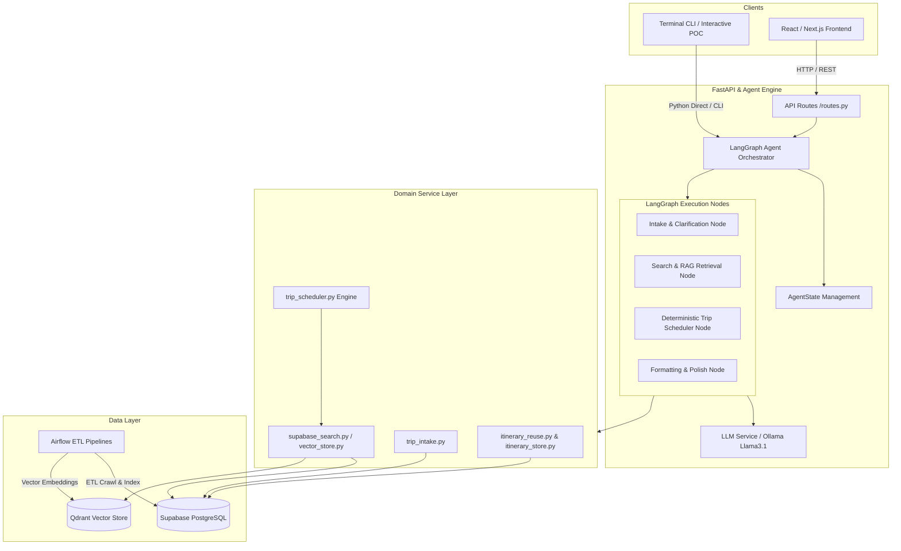

# Architecture Document — VSF Trip Planner AI Agent

## System Overview

VSF Trip Planner là một hệ thống AI Agent thông minh phục vụ lập kế hoạch du lịch tự động đa lượt (multi-turn conversation) cho khách du lịch tại Việt Nam. Hệ thống kết hợp giữa **LangGraph Orchestrator**, **FastAPI Backend**, **Supabase (PostgreSQL + pgvector)**, **Qdrant Vector Store** và **Airflow Data Pipeline** để phân tích nhu cầu, tìm kiếm địa điểm ngữ nghĩa (RAG), tự động lập lịch tối ưu khoảng cách/thời gian và tái sử dụng lịch trình mẫu (Tier 1 Cache).

## Architecture Diagram

## Components

### 1. Frontend (CLI & Web UI)
- **Purpose:** Cung cấp giao diện tương tác chat trực quan cho người dùng cuối (chạy CLI Terminal POC và giao diện Web).
- **Key Features:**
  - Chat dạng Terminal linh hoạt (`python -m scripts.poc_trip_planner` hoặc `scripts/terminal_chat.py`).
  - Hỗ trợ hiển thị Markdown, bảng lịch trình từng ngày và trạng thái Agent Flow theo thời gian thực.
  - Phản hồi nhanh với streaming log.

### 2. Backend (FastAPI)
- **Purpose:** REST API Gateway phục vụ nhận request, validate dữ liệu đầu vào và kích hoạt LangGraph Agent.
- **API Design:** RESTful Pydantic endpoints (`/chat`, `/status`, `/search_attractions`, `/search_hotels`).
- **Authentication:** Environment variable API Keys & Supabase Service Role JWT.

### 3. AI Agent (LangGraph)
- **Agent Type:** Stateful Multi-Node Agent Graph (`StateGraph`).
- **State:** `AgentState` chứa `query`, `messages`, `intake_state`, `reuse_query`, `raw_candidates`, `scheduled_itinerary`, `response`, `error`.
- **Nodes:**
  - `intake_node`: Trích xuất nhu cầu chuyến đi (Đi đâu, bao lâu, mấy người, sở thích) và hỏi câu hỏi làm rõ nếu thiếu.
  - `retrieval_node`: Kiểm tra Tier 1 Reuse Cache & thực hiện RAG tìm kiếm địa điểm / khách sạn từ Supabase & Qdrant.
  - `scheduler_node`: Gọi thuật toán deterministic `trip_scheduler.py` phân bổ thời gian, cụm khoảng cách (clustering radius) và khung giờ ăn/nghỉ.
  - `respond_node`: Format dữ liệu lịch trình thành văn bản tư vấn và structured JSON payload.
- **Control Flow Diagram:**

### 4. Database (Supabase PostgreSQL)
- **Type:** PostgreSQL 15+ hỗ trợ Extension `pgvector`.
- **Tables:** `destinations`, `hotels`, `rooms`, `room_prices`, `attractions`, `events`, `sessions`, `chat_messages`, `itineraries`, `itinerary_items`.
- **Schema Management:** Quản lý tập trung trong [scripts/database_schema.sql](file:///d:/Git%20repo/vsf-project/scripts/database_schema.sql) và các bản migration trong [scripts/migrations/](file:///d:/Git%20repo/vsf-project/scripts/migrations/).

### 4.1. Data Pipelines
- **Airflow Stack:** `src/airflow/docker-compose.yaml`.
- **Attraction Producers:** Crawl & chuẩn hóa dữ liệu điểm tham quan từ OSM, OTA và Google Maps.
- **Hotel Producer:** ETL pipeline chuẩn hóa dữ liệu khách sạn từ Agoda & Booking.com (`data/agoda.json`, `data/booking.json`).

### 5. Vector Store
- **Type:** Qdrant Client + Supabase `pgvector`.
- **Embeddings:** `bge-m3` (1024-dimensional dense vectors).
- **Purpose:** RAG Semantic Search tìm kiếm địa điểm theo mô tả ngữ nghĩa và Tier 1 Itinerary Reuse Fingerprint match (> 88% similarity).

---

## Data Flow

1. Người dùng nhập tin nhắn chat từ CLI hoặc Web UI.
2. FastAPI `/chat` hoặc CLI runner chuyển câu thoại vào LangGraph `AgentState`.
3. `intake_node` phân tích xem đã đủ 3 tham số cốt lõi (`destination`, `duration`, `people`) hay chưa.
4. Nếu đủ, `retrieval_node` tìm kiếm dữ liệu qua Supabase / Qdrant RAG.
5. `scheduler_node` tính toán khoảng cách haversine, cụm bán kính (5km, 10km, 15km) và xếp lịch theo giờ mở/đóng cửa.
6. `respond_node` tổng hợp lịch trình, format response và lưu bản thảo (`Finalized` / `Draft`).
7. Trả về kết quả hoàn chỉnh cho người dùng.

---

## Design Decisions

| Decision | Choice | Reason |
|----------|--------|--------|
| Framework | FastAPI | Bất đồng bộ (async), auto-docs Swagger, type-safe với Pydantic |
| Agent Engine | LangGraph | Quản lý state phức tạp, hỗ trợ conditional routing & multi-node cleanly |
| Database | Supabase (PostgreSQL + pgvector) | Database chuẩn production, tích hợp vector search & SQL RPC |
| Vector Store | Qdrant + pgvector | Hiệu năng tìm kiếm tương đồng cao cho 1024d embeddings |
| LLM | Ollama (Llama 3.1) / OpenAI API | Hỗ trợ suy luận tiếng Việt tốt và chạy mượt local/cloud |
