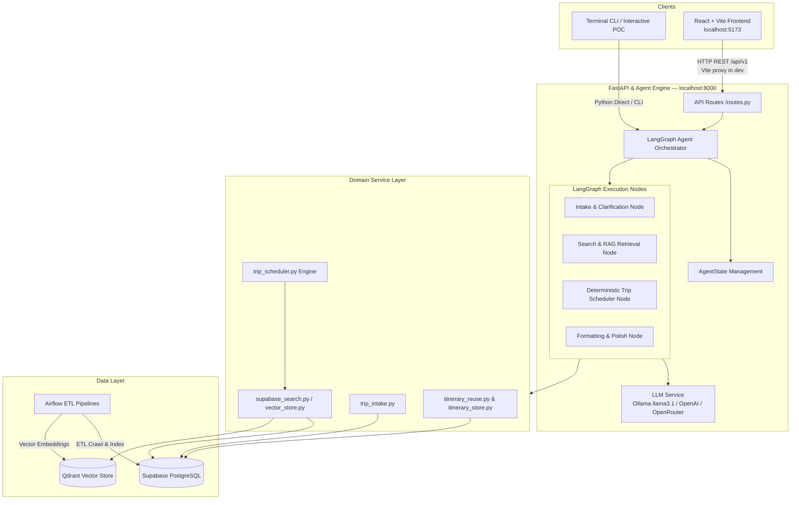
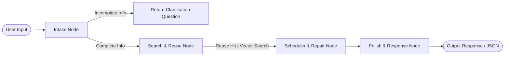

# Architecture Document — VSF Trip Planner AI Agent

## System Overview

VSF Trip Planner là một hệ thống AI Agent thông minh phục vụ lập kế hoạch du lịch tự động đa lượt (multi-turn conversation) cho khách du lịch tại Việt Nam. Hệ thống kết hợp giữa **LangGraph Orchestrator**, **FastAPI Backend**, **Supabase (PostgreSQL + pgvector)**, **Qdrant Vector Store** và **Airflow Data Pipeline** để phân tích nhu cầu, tìm kiếm địa điểm ngữ nghĩa (RAG), tự động lập lịch tối ưu khoảng cách/thời gian và tái sử dụng lịch trình mẫu (Tier 1 Cache).

## Architecture Diagram



## Components

### 1. Frontend (React + Vite Web UI)

- **Technology:** React 18 + Vite 6, served at `http://localhost:5173` in development.
- **Purpose:** Full-featured chat UI for the trip planner — multi-turn conversation,
  hotel selection cards, itinerary panel, and suggestion chips.
- **Key Features:**
  - Single-page app (`src/App.jsx`) with split layout: `ChatPanel` + `ItineraryPanel`.
  - `useChatSession` hook owns all state via `useReducer`; no component calls `fetch` directly.
  - `chat-client.js` owns all four API calls: `createSession`, `sendMessage`, `getPlan`, `resetSession`.
  - Session ID persisted in `sessionStorage`; server-restart detection silently re-creates the session.
  - Vite dev-server proxies `/api → http://localhost:8000` — no CORS headers needed in dev.
- **Running:**
  ```bash
  cd frontend
  npm install
  npm run dev        # → http://localhost:5173
  ```

### 2. Backend (FastAPI)

- **Purpose:** REST API Gateway — receives requests, validates with Pydantic, and dispatches to the LangGraph session.
- **API Design:** Four endpoints defined in `docs/chat_api_contract.md`:
  - `POST /api/v1/chat/session` — create session, returns `{session_id, created_at}`
  - `POST /api/v1/planner_chat` — main chat turn, returns `PlannerChatResponse`
  - `GET /api/v1/chat/{session_id}/plan` — fetch current trip plan
  - `DELETE /api/v1/chat/{session_id}` — reset / end session
- **Session registry:** `SessionRegistry` in `src/agents/session.py` holds in-memory `TripSession`
  objects with per-session locks, configurable TTL (`SESSION_TTL_SECONDS`) and cap (`MAX_SESSIONS`).
- **Authentication:** Environment variable API Keys & Supabase Service Role JWT.
- **Running:**
  ```bash
  uvicorn src.main:app --reload --port 8000
  # API docs → http://localhost:8000/docs
  ```

### 3. AI Agent (LangGraph)

- **Agent Type:** Stateful Multi-Node Agent Graph (`StateGraph`).
- **State:** `AgentState` contains `query`, `messages`, `intake_state`, `reuse_query`,
  `raw_candidates`, `scheduled_itinerary`, `response`, `error`.
- **Nodes:**
  - `intake_node`: Extracts trip requirements (destination, duration, people, preferences)
    and asks clarifying questions if incomplete.
  - `retrieval_node`: Checks Tier 1 Reuse Cache and performs RAG search for
    attractions/hotels via Supabase & Qdrant.
  - `scheduler_node`: Calls deterministic `trip_scheduler.py` to allocate time slots,
    cluster by distance radius, and set meal/rest windows.
  - `respond_node`: Formats the itinerary into chat text and structured JSON payload.
- **7-branch routing** in `process_chat_turn` (`src/services/chat_session.py`) — order is
  load-bearing, documented in full in `docs/chat_api_contract.md`.
- **Control Flow:**



### 4. Database (Supabase PostgreSQL)

- **Type:** PostgreSQL 15+ with `pgvector` extension.
- **Tables:** `destinations`, `hotels`, `rooms`, `room_prices`, `attractions`, `events`,
  `sessions`, `chat_messages`, `itineraries`, `itinerary_items`.
- **Schema Management:** Centralised in `scripts/database_schema.sql` and migrations
  in `scripts/migrations/`.

### 4.1. Data Pipelines

- **Airflow Stack:** `src/airflow/docker-compose.yaml`.
- **Attraction Producers:** Crawl & normalise attraction data from OSM, OTA, and Google Maps.
- **Hotel Producer:** ETL pipeline normalising hotel data from Agoda & Booking.com
  (`data/agoda.json`, `data/booking.json`).

### 5. Vector Store

- **Type:** Qdrant Client + Supabase `pgvector`.
- **Embeddings:** `bge-m3` (1024-dimensional dense vectors) — **model is locked**;
  all stored vectors use this dimension. Switching embedding models breaks similarity search.
- **Purpose:** RAG Semantic Search for attractions by semantic description, and
  Tier 1 Itinerary Reuse Fingerprint match (>88% similarity).
- **Embedding provider:** Ollama `bge-m3` is required in every environment (local and cloud).
  Only the *chat* model (`llm_model`) is swappable via `LLM_PROVIDER`.

---

## Layer Architecture & Import Rules

The codebase uses a strict **one-way import rule** to prevent circular dependencies:

```
api  →  agents  →  services  →  domain  →  models
         ↑               ↑
       (session)      (config)
```

| Layer | Package | Role |
|-------|---------|------|
| `api` | `src/api/` | HTTP handlers — call `agents.session`, return Pydantic schemas |
| `agents` | `src/agents/` | LangGraph graph, session registry, turn routing |
| `services` | `src/services/` | Business logic — LLM, Supabase search, scheduler, intake |
| `domain` | `src/domain/` | Pure state, validation, constraints — imports nothing above it (no `services`, no I/O, no LLM, no Supabase) |
| `models` | `src/models/` | Pydantic schemas only — no imports from upper layers |
| `config` | `src/config.py` | Settings — imported by any layer, imports nothing above it |

**Never import upward** (e.g. `services` must not import from `api`).

---

## Environment Matrix

| Setting | Local dev | Deployed (cloud) |
|---------|-----------|-----------------|
| `LLM_PROVIDER` | `ollama` | `openai` / `openrouter` |
| `LLM_MODEL` | `llama3.1` | `gpt-4o-mini` or an OpenRouter id |
| `EMBEDDING_PROVIDER` | `ollama` | `ollama` |
| `EMBEDDING_MODEL` | `bge-m3` | `bge-m3` (locked — do not change) |
| Frontend | Vite dev server + `/api` proxy | Built assets, host TBD |
| Ollama required? | Yes | Yes (embeddings only; chat model is cloud) |

> **Note:** Embeddings have no cloud fallback — `bge-m3` 1024-dim is locked into
> both vector stores. Ollama must run everywhere; only the chat model is swappable.

---

## Data Flow

1. User types a message in the React frontend or CLI.
2. React `useChatSession` sends `POST /api/v1/planner_chat` with `{session_id, message}`.
3. FastAPI `planner_chat` handler acquires the per-session lock and calls `process_chat_turn`.
4. `process_chat_turn` routes the message through 7 ordered branches (see `docs/chat_api_contract.md`).
5. The chosen branch calls the appropriate tool (`select_hotel`, `recommend_hotels`, etc.)
   or falls through to the ReAct agent (`session.agent.stream()`).
6. `derive_stage()` derives the response `stage` from which tool actually ran.
7. `PlannerChatResponse` (`session_id`, `reply`, `suggestions`, `stage`, `hotel_options`,
   `trip_plan`, `intake`) is returned to the frontend.
8. The React `useChatSession` reducer updates state; `ChatPanel` and `ItineraryPanel` re-render.

---

## Design Decisions

| Decision | Choice | Reason |
|----------|--------|--------|
| Framework | FastAPI | Async, auto-docs Swagger, type-safe with Pydantic |
| Agent Engine | LangGraph | Complex state management, conditional routing, multi-node cleanly |
| Database | Supabase (PostgreSQL + pgvector) | Production-grade DB, integrated vector search & SQL RPC |
| Vector Store | Qdrant + pgvector | High similarity-search performance for 1024d embeddings |
| LLM | Ollama (llama3.1) / OpenAI / OpenRouter | Configurable provider; Vietnamese reasoning + local/cloud flexibility |
| Frontend | React + Vite | Fast HMR, lightweight bundle, clean component model; no SSR needed for a chat SPA |
| Session storage | In-memory `SessionRegistry` | Low latency for chat turns; TTL eviction prevents unbounded growth |
| Import discipline | One-way layer rule | Prevents circular imports as the codebase grows |
