# AI Travel Chatbot - Entity Relationship Diagram (ERD)

Bản đồ thực thể liên kết (ERD) chi tiết dưới đây thể hiện kiến trúc dữ liệu **ĐẦY ĐỦ 100% CÁC CỘT (FIELDS)** của toàn bộ 10 bảng trong PostgreSQL, bao gồm cả mảng, thời gian, và tracking.

```mermaid
erDiagram
    destinations {
        UUID id PK
        VARCHAR name
        VARCHAR region
        VARCHAR coordinates
        TEXT description
        TIMESTAMP created_at
        TIMESTAMP updated_at
    }
    
    hotels {
        UUID id PK
        UUID destination_id FK
        VARCHAR name
        TEXT description
        SMALLINT star_rating
        TEXT_ARRAY amenities
        VARCHAR coordinates
        TEXT_ARRAY images
        TEXT_ARRAY videos
        TEXT_ARRAY source_urls
        TEXT_ARRAY source_ids
        TIMESTAMP created_at
        TIMESTAMP updated_at
    }
    
    rooms {
        UUID id PK
        UUID hotel_id FK
        VARCHAR name
        SMALLINT max_adults
        SMALLINT max_children
        SMALLINT number_of_beds
        VARCHAR bed_type
        TEXT_ARRAY room_facilities
        TEXT_ARRAY images
        TIMESTAMP created_at
        TIMESTAMP updated_at
    }
    
    room_prices {
        UUID id PK
        UUID room_id FK
        DECIMAL price
        VARCHAR currency
        DATE check_in_date
        DATE check_out_date
        TEXT source_url
        TEXT package_details
        SMALLINT available_rooms
        TIMESTAMP crawled_at
    }
    
    attractions {
        UUID id PK
        UUID destination_id FK
        VARCHAR name
        VARCHAR category
        BOOLEAN is_tour
        SMALLINT estimated_duration_minutes
        TIME opening_time
        TIME closing_time
        TEXT departure_schedule
        DECIMAL ticket_price_adult
        DECIMAL ticket_price_child
        DECIMAL rating
        INT review_count
        VARCHAR coordinates
        TEXT_ARRAY images
        TIMESTAMP created_at
        TIMESTAMP updated_at
    }
    
    events {
        UUID id PK
        UUID destination_id FK
        UUID attraction_id FK "nullable"
        VARCHAR name
        TEXT description
        TIMESTAMP start_date
        TIMESTAMP end_date
        TEXT_ARRAY images
        TIMESTAMP created_at
        TIMESTAMP updated_at
    }
    
    sessions {
        VARCHAR session_id PK
        JSONB context_data
        TIMESTAMP created_at
        TIMESTAMP updated_at
    }
    
    chat_messages {
        UUID id PK
        VARCHAR session_id FK
        VARCHAR sender_type
        TEXT message_content
        TIMESTAMP created_at
    }
    
    itineraries {
        UUID id PK
        VARCHAR session_id FK
        SMALLINT duration_days
        SMALLINT number_of_adults
        SMALLINT number_of_children
        DECIMAL budget
        TEXT_ARRAY preferences
        VARCHAR status
        TIMESTAMP created_at
        TIMESTAMP updated_at
    }
    
    itinerary_items {
        UUID id PK
        UUID itinerary_id FK
        SMALLINT day_number
        SMALLINT order_index
        TIME start_time
        TIME end_time
        VARCHAR reference_type "Hotel/Attraction/Event"
        UUID reference_id "Polymorphic"
        DECIMAL estimated_cost
        TIMESTAMP created_at
        TIMESTAMP updated_at
    }

    %% Quan hệ Địa lý & Điểm đến
    destinations ||--o{ hotels : "có các Khách sạn"
    destinations ||--o{ attractions : "có Điểm tham quan/Nhà hàng"
    destinations ||--o{ events : "tổ chức Sự kiện"
    
    %% Quan hệ Khách sạn
    hotels ||--o{ rooms : "có các Hạng phòng"
    rooms ||--o{ room_prices : "có các Gói giá theo ngày"
    
    %% Quan hệ Điểm tham quan - Sự kiện
    attractions |o--o{ events : "là địa điểm tổ chức (Tùy chọn)"
    
    %% Quan hệ AI Chat & Lịch trình
    sessions ||--o{ chat_messages : "lưu Lịch sử Chat"
    sessions ||--o{ itineraries : "sinh ra Lịch trình"
    
    %% Quan hệ Chi tiết Lịch trình
    itineraries ||--o{ itinerary_items : "chứa các Hoạt động"
    
    %% Mối quan hệ Đa hình (Polymorphic) - Nét đứt (---) thể hiện Logical Link
    itinerary_items }o..o| hotels : "Có thể trỏ tới"
    itinerary_items }o..o| attractions : "Có thể trỏ tới"
    itinerary_items }o..o| events : "Có thể trỏ tới"
```

