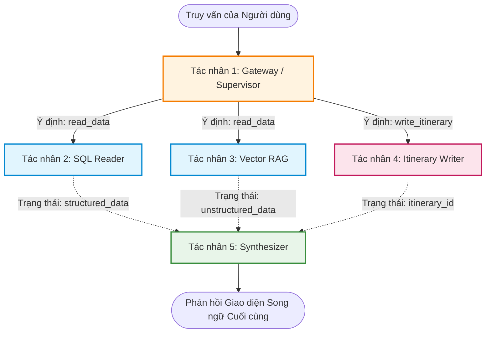

# V-OTA AI Chat: Kiến Trúc Tạo Lập & Chèn Lịch Trình (Phiên bản Giữa năm 2026)

## 1. Luồng LangGraph 5 Tác Nhân (5-Agent Workflow)

Để quản lý trạng thái giữa các tác nhân này một cách an toàn, LangGraph sẽ truyền một đối tượng `State` (Trạng thái) chung bao gồm `user_query`, `retrieved_data` (từ DB/Vector), `draft_itinerary` (JSON) và `final_response`.

### **Sơ đồ Kiến trúc**

### **Tác nhân 1: Gateway / Supervisor Agent (Bộ điều phối)**

* **Mô hình:** Qwen 2.5 (7B) thông qua Ollama (Được lượng tử hóa 4-bit).
* **Vai trò:** Bộ định tuyến. Phân loại ý định (intent) trong tin nhắn của người dùng.
* **Lý do chọn mô hình này:** Qwen 2.5 có khả năng đa ngôn ngữ hàng đầu trong việc hiểu các cấu trúc câu tiếng Việt. Do RTX 5060 của bạn chỉ có 8GB VRAM, một mô hình 7B được nén xuống 4-bit là bắt buộc để tránh làm sập GPU. Nó xử lý việc phân loại cục bộ cực nhanh và hoàn toàn miễn phí, giúp giảm độ trễ API.
* **So sánh:**
* *So với Llama 3 (8B):* Qwen xử lý các ngôn ngữ Đông Nam Á bản địa tốt hơn một chút, giúp giảm thiểu lỗi phân loại tiếng lóng tiếng Việt.
* *So với API trả phí:* Sử dụng API đám mây trả phí chỉ để định tuyến lưu lượng truy cập sẽ gây ra độ trễ không cần thiết. Mô hình 7B chạy cục bộ thực hiện việc phân loại này miễn phí trong tích tắc.

### **Tác nhân 2: SQL Reader Agent (Chỉ đọc cơ sở dữ liệu)**

* **Mô hình:** Llama 3 (8B) thông qua Ollama.
* **Vai trò:** Truy xuất giá cả, tính khả dụng và dữ liệu thực tế từ PostgreSQL. Bị chặn hoàn toàn không cho phép chạy các lệnh `INSERT`, `UPDATE` hoặc `DELETE`.
* **Lý do chọn mô hình này:** Llama 3 xuất sắc trong việc tuân thủ các hướng dẫn nghiêm ngặt và gọi hàm (function calling) để tạo ra các câu lệnh SQL chính xác dựa trên từ điển dữ liệu của bạn. Nó vượt trội hơn các mô hình 7B tương đương ở các tác vụ cú pháp có cấu trúc.

### **Tác nhân 3: Vector RAG Agent (Tìm kiếm ngữ nghĩa)**

* **Mô hình:** Qwen 2.5 (7B) thông qua Ollama.
* **Vai trò:** Truy xuất các mô tả định tính, phong cách (vibe) và đánh giá từ Qdrant để làm phong phú thêm các tùy chọn.
* **Lý do chọn mô hình này:** Tìm kiếm ngữ nghĩa đòi hỏi phải nắm bắt được ý định chủ quan (VD: "Tôi muốn tìm một homestay yên tĩnh, lãng mạn"). Khả năng thấu hiểu sâu sắc tiếng Việt trò chuyện của Qwen giúp chuyển đổi các mong muốn chủ quan của người dùng thành các truy vấn vector Qdrant cực kỳ chính xác.

### **Tác nhân 4: Itinerary Writer Agent (Ghi vào cơ sở dữ liệu)**

* **Mô hình:** Gemini 3.6 Flash (`gemini-3.6-flash`) thông qua Google Gen AI SDK.
* **Vai trò:** Chuyển đổi ngữ cảnh trò chuyện thành cấu trúc quan hệ chặt chẽ của cơ sở dữ liệu.
* **Lý do chọn mô hình này:** Khi thế hệ 1.5 đã ngừng hoạt động, `gemini-3.6-flash` là tiêu chuẩn sẵn sàng sản xuất mới nhất. Nó được thiết kế riêng cho việc lập trình phức tạp, lập kế hoạch tác nhân (agentic planning) và suy luận có cấu trúc. Việc tạo ra các tệp JSON lồng nhau, phức tạp để chèn vào nhiều bảng đòi hỏi năng lực suy luận cao mà các mô hình 7B cục bộ khó đáp ứng, và Gemini 3.6 Flash xử lý việc này một cách mượt mà bằng cách sử dụng các khoản tín dụng miễn phí trên Google Cloud của bạn.

### **Tác nhân 5: Synthesizer Agent (Giao diện người dùng)**

* **Mô hình:** Gemini 3.6 Flash (`gemini-3.6-flash`) thông qua Google Gen AI SDK.
* **Vai trò:** Đọc trạng thái thành công từ Writer Agent và định dạng một phản hồi đẹp mắt, song ngữ cho người dùng.
* **Why this model:** Nó sở hữu cửa sổ ngữ cảnh khổng lồ lên tới 1.048.576 token, đảm bảo không bị cắt cụt (truncate) dữ liệu nếu các tác nhân SQL/Vector trả về các mảng dữ liệu lớn. Nó xử lý hoàn hảo việc tổng hợp song ngữ Anh - Việt.

---

## 2. Quy trình Thực thi Chèn dữ liệu (Từng bước)

Khi người dùng yêu cầu tạo và lưu một lịch trình cụ thể, LangGraph thực hiện chuỗi tuần tự sau:

1. **Thu thập Ngữ cảnh (Đọc):** Supervisor định tuyến yêu cầu tới các tác nhân SQL và Vector để đảm bảo khách sạn và điểm tham quan được chọn thực sự tồn tại trong cơ sở dữ liệu và lấy ra các mã `UUID` của chúng.
2. **Soạn thảo (Định dạng):** Itinerary Writer Agent nhận các `UUID` đã được xác thực và xây dựng một payload JSON có cấu trúc khớp chính xác với schema của bảng `itineraries` và `itinerary_items`.
3. **Kiểm chuẩn Dữ liệu (Backend Python):** Trước khi chạy SQL, backend FastAPI chặn payload JSON từ tác nhân. **Pydantic** sẽ kiểm tra tính hợp lệ của schema (đảm bảo `duration_days` là số nguyên, ngày tháng hợp lệ và các khóa ngoại trùng khớp).
4. **Giao dịch Cơ sở dữ liệu (Ghi):**
* **Bước A:** Backend chèn bản ghi cha vào bảng `itineraries` (Trạng thái: 'Draft').
* **Bước B:** Backend lặp qua lịch trình từng ngày và chèn từng dòng vào bảng `itinerary_items`, sử dụng `itinerary_id` mới và các `reference_id` (UUID) đã thu thập ở Bước 1.
* **Bước C:** Giao dịch (Transaction) được commit vào PostgreSQL.

5. **Hiển thị cho Người dùng (Tổng hợp):** Synthesizer Agent tạo ra phản hồi định dạng markdown thân thiện với giao diện người dùng.

---

## 3. Lựa chọn Mô hình & Phân tích So sánh

Việc nâng cấp lên Gemini 3.6 Flash cải thiện đáng kể cách thức hoạt động của các tác nhân Writer và Synthesizer. Dưới đây là phần so sánh với các lựa chọn thay thế về giá cả và hiệu năng.

### **Gemini 3.6 Flash so với Gemini 3.5 Flash-Lite**

* **Hiệu năng:** Gemini 3.6 Flash được tối ưu hóa cao cho việc tạo cấu trúc JSON phức tạp và các tác vụ tác nhân, sử dụng ít token đầu ra hơn cho cùng khối lượng công việc. Gemini 3.5 Flash-Lite là mô hình nhanh nhất trong thế hệ 3.5, nhưng nó phù hợp hơn cho việc trích xuất và định tuyến đơn giản thay vì suy luận phức tạp.
* **Giá cả:** Gemini 3.6 Flash có giá **$1.50 cho mỗi 1 triệu token đầu vào** và **$7.50 cho mỗi 1 triệu token đầu ra** (token suy luận tính theo mức giá đầu ra chuẩn). Gemini 3.5 Flash-Lite rẻ hơn đáng kể với **$0.30 cho 1 triệu token đầu vào** và **$2.50 cho 1 triệu token đầu ra**.
* **Đánh giá:** Gemini 3.6 Flash vẫn là lựa chọn ưu việt hơn cho Itinerary Writer Agent nhằm đảm bảo việc ánh xạ cơ sở dữ liệu quan hệ nhiều bảng diễn ra chính xác tuyệt đối.

### **Gemini 3.6 Flash so với OpenAI (Họ GPT-5.4)**

* **Giá cả:** GPT-5.4 Standard có giá **$2.50** đầu vào và **$15.00** đầu ra cho mỗi 1 triệu token; GPT-5.4-mini có giá **$0.75** đầu vào và **$4.50** đầu ra.
* **Hiệu năng:** Mặc dù GPT-5.4 mang lại khả năng viết mã đẳng cấp thế giới, nhưng phiên bản GPT-5.4 Standard đắt hơn khoảng 40% ở phần đầu vào và gấp đôi ở phần đầu ra so với Gemini 3.6 Flash.
* **Đánh giá:** Gemini 3.6 Flash nằm ở phân khúc hợp lý, kết hợp giữa năng lực suy luận cấu trúc cao cấp và mức giá tầm trung, đồng thời giúp bạn tận dụng tối đa các khoản tín dụng miễn phí trên Google Cloud.

### **Gemini 3.6 Flash so với Anthropic Claude (Sonnet 5 / Haiku 4.5)**

* **Giá cả:** Claude Sonnet 5 có giá **$3.00** đầu vào và **$15.00** đầu ra cho mỗi 1 triệu token. Claude Haiku 4.5 có giá **$1.00** đầu vào và **$5.00** đầu ra.
* **Đánh giá:** Claude Sonnet 5 là chuẩn mực ngành về thực thi tác nhân nhưng có giá API tiêu chuẩn đắt gấp đôi Gemini 3.6 Flash. Claude Haiku 4.5 rẻ hơn nhưng lại thiếu chiều sâu suy luận cần thiết cho các tác vụ chèn cơ sở dữ liệu nhiều bảng. Gemini 3.6 Flash là lựa chọn chiến lược nhất cho bản PoC này.

---

## 4. Ngăn xếp Công nghệ Yêu cầu (Tech Stack)

* **Framework:** `FastAPI` (Python) - Cung cấp các API endpoint bất đồng bộ (asynchronous) tốc độ cao để kết nối giao diện chat phía frontend với vòng lặp tác nhân.
* **Orchestration:** `LangGraph` - Quản lý máy trạng thái (state machine), định tuyến có điều kiện và đảm bảo sự tách biệt giữa luồng đọc (read) và luồng ghi (write).
* **Data Validation:** `Pydantic` - Ép buộc kiểm tra tính hợp lệ nghiêm ngặt đối với đầu ra JSON từ Gemini 3.6 Flash trước khi chèn vào cơ sở dữ liệu.
* **Local Inference:** `Ollama` (hoặc `vLLM`) - Chạy các mô hình Qwen và Llama đã được lượng tử hóa trên GPU RTX 5060 (8GB VRAM) cho các tác vụ Supervisor và Reader.
* **Cloud Inference:** SDK `google-genai` - Thay thế thư viện `vertexai` đã cũ để gọi `gemini-3.6-flash` phục vụ cho logic JSON nhiều bước và tổng hợp phản hồi.
* **Database Drivers:** `asyncpg` (cho các thao tác PostgreSQL hiệu năng cao) và `qdrant-client` (cho tìm kiếm ngữ nghĩa Vector).