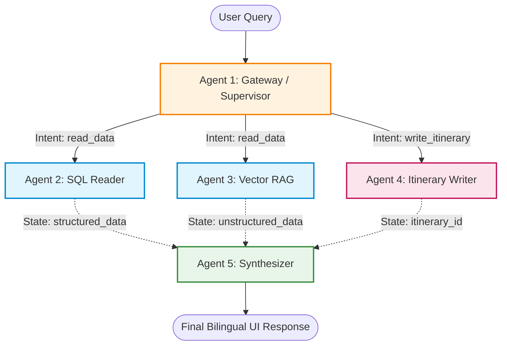

# V-OTA AI Chat: Itinerary Generation & Insertion Architecture (Mid-2026 Revision)

## 1. The 5-Agent LangGraph Workflow

To manage the state between these agents safely, LangGraph will pass a shared `State` object that includes the `user_query`, `retrieved_data` (from DB/Vector), `draft_itinerary` (JSON), and `final_response`.

### **Architecture Flowchart**

### **Agent 1: The Gateway / Supervisor Agent**

* **Model:** Qwen 2.5 (7B) via Ollama (4-bit Quantized).
* **Role:** The router. It classifies the intent of the user's message.
* **Why this model:** Qwen 2.5 has top-tier multilingual capabilities for grasping Vietnamese phrasing. Because your RTX 5060 only has 8GB VRAM, a 7B parameter model compressed to 4-bit is strictly required to prevent crashing the GPU. It handles rapid classification locally for free, saving API latency.
* **Comparison:**
* *vs. Llama 3 (8B):* Qwen performs slightly better with native Southeast Asian languages, reducing misclassifications for Vietnamese slang.
* *vs. Paid APIs:* Using a paid cloud API just to route traffic introduces unnecessary latency. A local 7B model executes this classification for free in milliseconds.

### **Agent 2: The SQL Reader Agent (Read-Only)**

* **Model:** Llama 3 (8B) via Ollama.
* **Role:** Fetches prices, availability, and factual data from PostgreSQL. Strictly blocked from running `INSERT`, `UPDATE`, or `DELETE`.
* **Why this model:** Llama 3 excels at rigid instruction following and function calling to generate precise SQL queries from your data dictionary. It outperforms equivalent 7B models at structured syntax tasks.

### **Agent 3: The Vector RAG Agent (Read-Only)**

* **Model:** Qwen 2.5 (7B) via Ollama.
* **Role:** Fetches qualitative descriptions, vibes, and reviews from Qdrant.
* **Why this model:** Semantic search requires grasping subjective intent. Qwen's deep comprehension of conversational Vietnamese translates complex user desires into highly accurate Qdrant vector searches.

### **Agent 4: The Itinerary Writer Agent (Write to DB)**

* **Model:** Gemini 3.6 Flash (`gemini-3.6-flash`) via Google Gen AI SDK.
* **Role:** Translates the conversation context into the strict relational structure of the database.
* **Why this model:** With the 1.5 generation retired, `gemini-3.6-flash` is the newest production-ready standard. It is engineered specifically for complex coding, agentic planning, and structured reasoning tasks. Generating complex, multi-table JSON inserts requires high reasoning that local 7B models struggle with, and Gemini 3.6 Flash handles this flawlessly using your free Google Cloud credits.

### **Agent 5: The Synthesizer Agent (User UI)**

* **Model:** Gemini 3.6 Flash (`gemini-3.6-flash`) via Google Gen AI SDK.
* **Role:** Reads the success state from the Writer Agent and formats a beautiful, bilingual response for the user.
* **Why this model:** It boasts an immense context window of up to 1,048,576 tokens, ensuring it will not truncate if the SQL/Vector agents retrieve massive data arrays. It natively handles perfect bilingual Vietnamese/English synthesis.

---

## 2. The Insertion Execution Flow (Step-by-Step)

When a user requests to generate and save a specific itinerary, the LangGraph executes the following sequence:

1. **Context Gathering (Reads):** The Supervisor routes the request to the SQL and Vector agents to ensure the chosen hotels and attractions actually exist in the database and fetches their `UUID`s.
2. **Drafting (Formatting):** The Itinerary Writer Agent receives the validated `UUID`s and constructs a highly specific JSON payload mapping to the `itineraries` and `itinerary_items` schema.
3. **Data Validation (Python Backend):** Before executing SQL, the FastAPI backend intercepts the JSON payload from the agent. **Pydantic** validates the schema (ensuring `duration_days` is an integer, dates are valid, and foreign keys match).
4. **Database Transaction (Writes):**
* **Step A:** The backend inserts the parent record into the `itineraries` table (Status: 'Draft').
* **Step B:** The backend loops through the daily schedule and inserts each row into `itinerary_items`, using the new `itinerary_id` and the `reference_id`s (UUIDs) gathered in Step 1.
* **Step C:** The transaction is committed to PostgreSQL.

5. **User Display (Synthesis):** The Synthesizer Agent generates the UI-friendly markdown response.

---

## 3. Model Selection & Comparative Analysis

The upgrade to Gemini 3.6 Flash fundamentally improves how the Writer and Synthesizer agents operate. Here is how it compares against alternatives in both price and performance.

### **Gemini 3.6 Flash vs. Gemini 3.5 Flash-Lite**

* **Performance:** Gemini 3.6 Flash is highly optimized for complex JSON structure generation and agentic tasks, utilizing fewer output tokens for the same workloads. Gemini 3.5 Flash-Lite is the fastest model in the 3.5 family, but it is built for simple extraction and routing rather than complex reasoning.
* **Price:** Gemini 3.6 Flash is priced at **$1.50 per 1M input tokens** and **$7.50 per 1M output tokens**, with thinking tokens billed at the standard output rate. Gemini 3.5 Flash-Lite is significantly cheaper at **$0.30 per 1M input tokens** and **$2.50 per 1M output tokens**.
* **Verdict:** Gemini 3.6 Flash remains the superior choice for your Itinerary Writer Agent to ensure strict multi-table relational database mapping.

### **Gemini 3.6 Flash vs. OpenAI (GPT-5.4 Family)**

* **Pricing:** GPT-5.4 Standard costs **$2.50** per 1M input tokens and **$15.00** per 1M output tokens, while GPT-5.4-mini costs **$0.75** input and **$4.50** output.
* **Performance:** While GPT-5.4 delivers world-class coding capabilities, GPT-5.4 Standard is roughly 40% more expensive on input and double the price on output compared to Gemini 3.6 Flash.
* **Verdict:** Gemini 3.6 Flash sits squarely in the sweet spot, matching high-end structural reasoning with mid-tier pricing, while keeping you comfortably within your Google Cloud free tier credits.

### **Gemini 3.6 Flash vs. Anthropic Claude (Sonnet 5 / Haiku 4.5)**

* **Pricing:** Claude Sonnet 5 costs **$3.00** per 1M input and **$15.00** per 1M output. Claude Haiku 4.5 costs **$1.00** input and **$5.00** output.
* **Verdict:** Claude Sonnet 5 is an industry benchmark for agentic execution but is double the standard API price of Gemini 3.6 Flash. Claude Haiku 4.5 is cheaper but falls short on the deep reasoning required for multi-table database insertion tasks. Gemini 3.6 Flash is the most strategic choice for this PoC.

---

## 4. The Required Tech Stack

* **Framework:** `FastAPI` (Python) - High-speed, asynchronous API endpoints to connect the frontend chat interface to the agent loop.
* **Orchestration:** `LangGraph` - Manages the state machine, conditional routing, and ensures read vs. write separation.
* **Data Validation:** `Pydantic` - Enforces strict validation on the Gemini 3.6 Flash JSON outputs before database insertion.
* **Local Inference:** `Ollama` (or `vLLM`) - Serves the quantized Qwen and Llama models on the 8GB RTX 5060 for Supervisor and Reader tasks.
* **Cloud Inference:** `google-genai` SDK - Replaces the deprecated `vertexai` library to call `gemini-3.6-flash` for multi-step JSON logic and synthesis.
* **Database Drivers:** `asyncpg` (for high-performance PostgreSQL operations) and `qdrant-client` (for semantic searches).