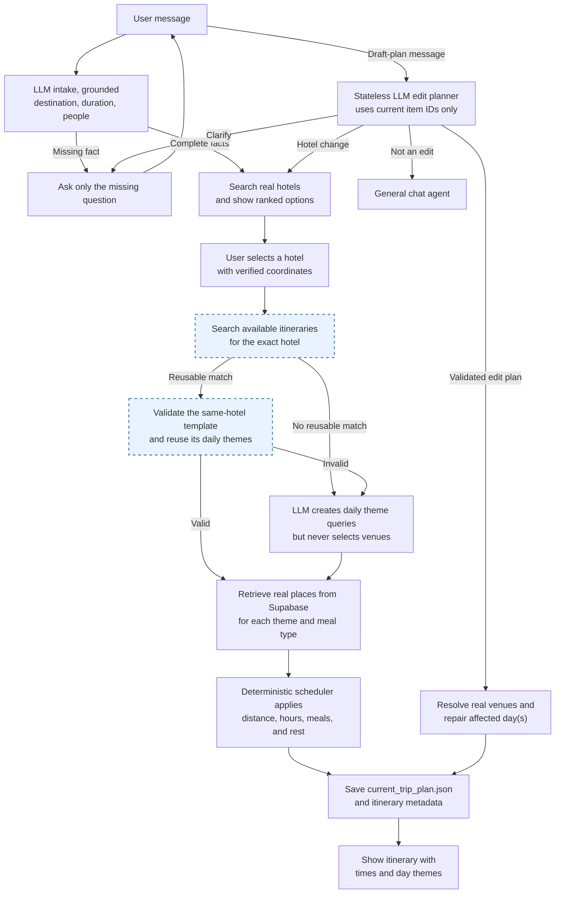
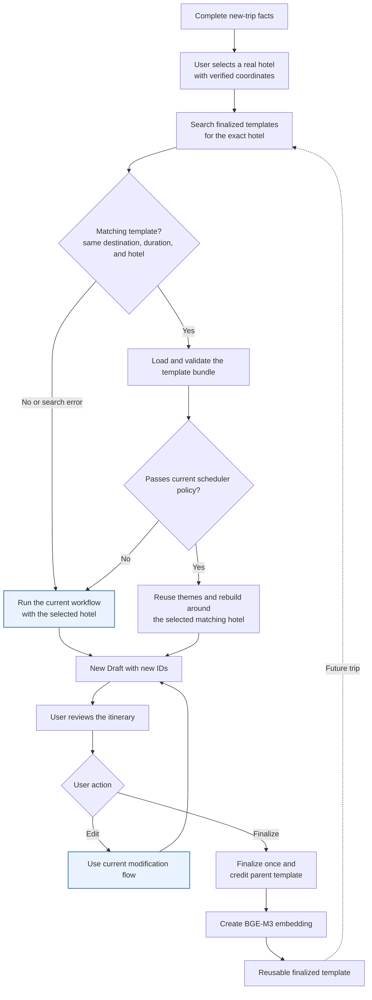
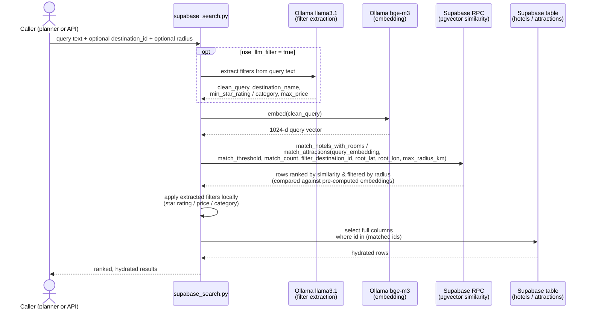
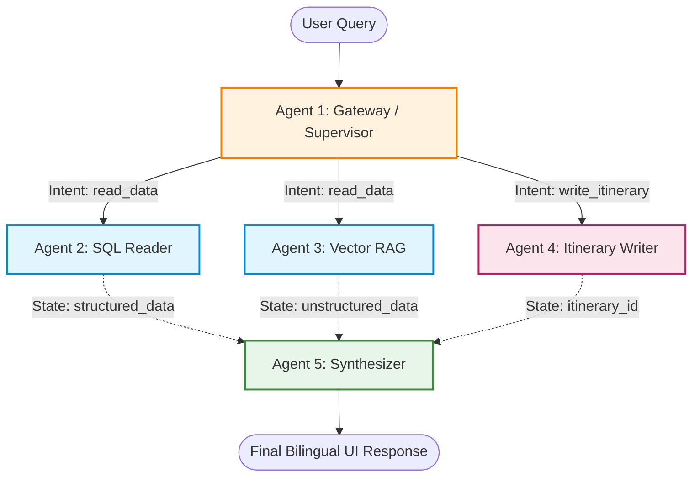

# Agent Workflow and Semantic Search Stack

## Purpose and scope

This document describes the implemented terminal trip-planning flow and the
semantic-search stack it uses today. It is the source of truth for
`scripts/poc_trip_planner.py`; it intentionally distinguishes that runtime
from older architecture documents that describe a proposed multi-agent Qdrant
design.

The main design choice is simple: **the LLM interprets constrained language,
but deterministic Python selects and schedules real places.** The planner never
accepts an LLM-invented hotel, restaurant, cafe, or attraction as an itinerary
record.

## System at a glance

### Current implemented workflow

This retains the implemented workflow and shows the itinerary-search insertion
point in blue. The user chooses a hotel before reuse search, and the RPC requires
an exact `hotel_id` match in addition to destination and duration. When no
reusable plan is found, the existing hotel-aware planner continues unchanged.

### Planned itinerary-reuse extension

The reuse extension is a safe shortcut into the existing flow, not a separate
planner. Every retrieved template is for the selected hotel, hydrated, and
checked again. An invalid template returns to the current workflow; a hotel
replacement performs a new hotel-specific reuse search and rebuilds all days.

## Agent workflow

### 1. LLM intake, deterministically grounded

`TripIntakeState` sends the user's message to `llama3.1` to extract
destination, duration, party size, and preference terms as structured JSON.
The LLM's destination guess is never trusted directly: a pure grounding
function (`_ground_extracted_facts` / `_match_known_destination` in
`trip_intake.py`) accepts it only if it matches a real `destinations` row
(name or alias); an unmatched or ambiguous guess is discarded, and the state
field stays empty. It asks a question only when destination, duration, or
party size is still missing after grounding — this is what avoids a
general-purpose model losing or corrupting facts the user already gave, now
enforced by validation instead of by never letting the model touch the field.

### 2. Intent routing

For a new trip, the terminal loop calls the planner directly once the three
<!-- Incoming documentation superseded by the resolved current implementation. -->
<!-- Historical remote design retained only for conflict traceability:
classifier of which action it is — `change_hotel`, `replace_place`,
`reschedule`, `add_place`, or `remove_place` — with a fixed safe default
(`replace_place`) as the only fallback if the LLM call itself fails.
-->
required facts are present. For every message against a saved Draft, a
stateless LLM edit planner receives a compact itinerary snapshot containing
the hotel, themes, constraints, and saved item IDs. It returns `apply`,
`clarify`, or `not_edit` plus typed operations. Deterministic code rejects
unknown item IDs, resolves real replacement venues, and applies the entire
edit atomically. Only `not_edit` messages continue to the general chat agent.

### 3. Hotel selection is a hard gate

The planner first runs the shared semantic hotel search, then hydrates result
IDs from Supabase. A hotel is eligible only when it belongs to the requested
destination and has valid coordinates. If no such record exists, planning stops
with an explanatory error rather than silently selecting a different hotel or
inventing one.

The selected hotel anchors the daily geographic clusters and supplies explicit
meal-inclusion metadata. Only meals marked as included, complimentary, free, or
otherwise clearly covered are treated as hotel meals.

### 4. The LLM generates themes, not venue lists

`llama3.1` receives the destination, available categories, preferences, and
number of days. It returns a constrained JSON list of
`{day_number, title, query}`. The deterministic normalizer accepts only a
usable query, derives a safe Vietnamese title from query keywords, removes
duplicates, and fills gaps with a deterministic category rotation.

This keeps semantic expansion while preventing malformed titles and fictitious
venues from entering the itinerary.

### 5. Semantic candidate retrieval and hydration

The application queries attractions independently for every daily theme. It
also queries separate pools for breakfast, lunch restaurants, cafes, and dinner.
Search returns compact ranked records; a second Supabase table read hydrates
each result with the fields required for truthful scheduling: UUID, category,
coordinates, rating, opening and closing times, tour flag, description, and
stored duration.

### 6. Deterministic scheduling and repair

The scheduler consumes only hydrated `PlaceCandidate` objects. It creates a
balanced day using real IDs: breakfast, morning attraction, lunch, hotel rest,
afternoon attraction, recovery cafe, dinner, and an optional light evening stop.
It uses straight-line Haversine distance, assumed urban travel speed, opening
hours, meals covered by the hotel, and playground limits. When valid food or
coffee is unavailable, it uses a hotel meal/rest block instead of substituting
an unrelated attraction.

Edits other than a hotel change preserve unaffected days and item IDs where
possible, then revalidate the changed day. A hotel change regenerates the plan
so all daily clusters are based on the new hotel location.

## Active technology stack

| Layer | Technology used now | How it is used | Why it is used |
|---|---|---|---|
<!-- Historical remote design retained only for conflict traceability:
| Terminal orchestration | Python, LangGraph, LangChain tools | `create_react_agent` exposes only generate and modify tools; the grounded intake gate bypasses model routing until destination/duration/people are all confirmed. | Keeps conversational capability without placing factual venue selection in the model. |
| Chat / constrained extraction | Ollama `llama3.1` (`llama3.1:latest` for search-filter extraction) | Produces daily semantic queries and structured edit intent; optionally extracts semantic text plus filters from general search queries. | Runs locally, supports Vietnamese interactions, and is limited to small structured tasks. |
-->
| Terminal orchestration | Python, LangGraph, LangChain tools | `create_react_agent` exposes only generate and modify tools; deterministic intake bypasses model routing for complete new-trip facts. | Keeps conversational capability without placing factual venue selection in the model. |
| Chat / constrained extraction | Ollama `llama3.1` (`llama3.1:latest` for search-filter extraction) | Produces daily semantic queries and a stateless typed edit plan using only current itinerary IDs; optionally extracts semantic text plus filters from general search queries. | Runs locally, supports Vietnamese interactions, and is limited to small structured tasks. |
| Embeddings | Ollama `bge-m3` through `OllamaEmbeddings` | Embeds the cleaned hotel or attraction query once per semantic search. | Multilingual embeddings suit Vietnamese and English travel queries and avoid a cloud embedding dependency. |
| Semantic vector store | Supabase PostgreSQL RPC / pgvector deployment | Calls `match_attractions` and `match_hotels_with_rooms` with query embedding, threshold, count, optional destination filter, and optional radius filter (`root_latitude`, `root_longitude`, `max_radius_km`). | Keeps vector retrieval beside relational records and uses SQL/RPC filtering without a second active data store. |
| Relational source of truth | Supabase PostgreSQL | Holds destinations, hotels, rooms, attractions, itineraries, and itinerary items; hydrates search results by UUID. | Schedules require factual fields and durable IDs, not vector snippets. |
| Deterministic planner | Pure Python scheduler | Scores candidates and creates/revalidates time blocks. | Makes geo/time safety reproducible and unit-testable. |
| API surface | FastAPI | Preserves `/search_attractions` and `/search_hotels` response contracts. | Makes semantic search reusable without exposing internal scheduling details. |
| Durable local plan | UTF-8 JSON | Writes `data/current_trip_plan.json`; daily themes are stored under `itineraries[0].day_themes`. | Simple terminal-session persistence and a stable edit target; `data/` is gitignored so session state never risks a commit. |

## Model responsibilities

| Model | Responsibility | Not responsible for |
|---|---|---|
<!-- Historical remote design retained only for conflict traceability:
| Ollama `llama3.1` | Trip-intake fact extraction (grounded before use), daily theme query generation, structured edit-action classification, optional query-filter extraction. | Selecting venue records, scheduling times, calculating distance, or fabricating facts. |
-->
| Ollama `llama3.1` | Trip-intake fact extraction (grounded before use), daily theme query generation, typed edit planning, optional query-filter extraction. | Selecting venue records, scheduling times, calculating distance, or fabricating facts. |
| Ollama `bge-m3` | Turning a cleaned natural-language query into a vector used by Supabase retrieval. | Producing user-visible prose or deciding business rules. |
| Ollama `llama3:latest` | Optional Airflow attraction-description enrichment, configured with `OLLAMA_DESCRIPTION_MODEL`. | Terminal planning and semantic search in this workflow. |

## Semantic search: request-to-result path

The steps below run on every hotel or attraction search. Embeddings on the
data side — the vectors stored on each `hotels`/`attractions` row — are
computed ahead of time by a separate sync job (e.g.
`scripts/migrate_vectors_to_supabase.py`), not during this request. Only the
caller's query is embedded live.

Two distinct local models are involved, not one. `llama3.1` only ever
produces text/JSON (filter extraction here; theme generation and edit
classification elsewhere in the planner). `bge-m3` only ever produces the
embedding vector. Neither model sees the other's output, and neither model
ever produces a venue record directly — that always comes from the Supabase
row hydrated in the last step.

1. A caller supplies a natural-language query and an optional destination UUID.
2. In the general reusable search service, `llama3.1:latest` may extract a
   clean semantic phrase and filters such as destination, category, star rating,
   or maximum price. The planner passes `use_llm_filter=False` because it has
   already resolved the destination and created a precise themed query.
3. `bge-m3` embeds the semantic phrase locally through Ollama.
4. The client calls the matching Supabase RPC with `query_embedding`,
   `match_threshold`, `match_count`, `filter_destination_id`, and optional
   `root_latitude`, `root_longitude`, `max_radius_km`. Default thresholds are 0.40 for attractions and 0.35 for hotels.
5. The service applies exact metadata filters locally after retrieval. It
   over-fetches three times when a category, budget, star-rating, or price
   filter is active, then returns up to the requested count. If strict metadata
   filtering yields no result, it deliberately falls back to semantic matches.
6. The trip planner hydrates result UUIDs from the relational table before
   scheduling. Candidates without a UUID, name, or valid coordinates are
   rejected.

### Search contracts

The shared `search_attractions` and `search_hotels_with_rooms` interfaces
stay unchanged for legacy positional callers, with new optional radius arguments added at the end.

| Search | Active RPC | Planner-specific use |
|---|---|---|
| Hotels and rooms | `match_hotels_with_rooms` | Select one real, same-destination hotel with coordinates. |
| Attractions | `match_attractions` | Retrieve per-day theme candidates and separate food/cafe pools. |

### Summary of exact inputs by component

#### Inputs passed to Itinerary Builder (`build_itinerary_with_hotel_reselection`)

| Input Category | Variable / Structure | Description & Contents |
|---|---|---|
| **Intake & Metadata** | `TripIntakeState` | `destination` (name & UUID `destination_id`), `duration` (`number_of_days`), `people` (`number_of_people`), `preferences` list, `child_focused` boolean flag. |
| **Reuse Query** | `ItineraryReuseQuery` | `destination_id`, `destination_name`, `duration_days`, `number_of_adults`, `preferences` tuple, `child_focused` flag (used for Tier 1 candidate lookup). |
| **Hotel Candidates** | `hotel_candidates` (`List[PlaceCandidate]`) | Hydrated eligible hotels matching `destination_id` with valid coordinates and detected `covered_meals` (`breakfast`, `lunch`, `dinner`). |
| **Day Themes** | `themes` (`Sequence[DayTheme]`) | Normalized JSON list of `[{day_number, title, query}]` generated by LLM or loaded from a reusable template. |
| **Attraction Candidates** | `themed_candidates` (`Dict[int, List[PlaceCandidate]]`) | Hydrated attraction candidates retrieved for each daily theme query. |
| **Meal & Cafe Pools** | `restaurants`, `cafes`, `breakfasts`, `dinners` | Hydrated candidate pools of `PlaceCandidate` objects for lunch, afternoon relaxation, breakfast, and dinner (when not covered by hotel). |
| **Scheduling Rules** | `PlanningPolicy` & `child_focused` | Clustering radii (5km, 10km, 15km), urban travel speed (25 km/h), meal time windows, opening hours, and playground allowances. |

#### Inputs used for Semantic Search

| Search Type | Function / RPC | Search Inputs |
|---|---|---|
| **Attraction Search** | `search_attractions` / `match_attractions` | • **Text Query (`query`)**: Theme phrase or meal query (e.g., `"{theme.query}. Destination: {destination}"`). • **Query Embedding (`query_embedding`)**: 1024d dense vector from `bge-m3`. • **Destination Filter (`filter_destination_id`)**: Supabase `destination_id` UUID. • **Threshold & Count**: `match_threshold` (0.40), `match_count` (15–20). • **LLM Filters** (optional): `category`, `max_price`. • **Radius Filters** (optional): `root_latitude`, `root_longitude`, `max_radius_km`. |
| **Hotel Search** | `search_hotels_with_rooms` / `match_hotels_with_rooms` | • **Text Query (`query`)**: e.g., `"Hotel in {destination} for {people} people"`. • **Query Embedding (`query_embedding`)**: 1024d dense vector from `bge-m3`. • **Destination Filter (`filter_destination_id`)**: Supabase `destination_id` UUID. • **Threshold & Count**: `match_threshold` (0.35), `match_count` (5–10). • **LLM Filters** (optional): `min_star_rating`, `max_price`. • **Radius Filters** (optional): `root_latitude`, `root_longitude`, `max_radius_km`. |
| **Itinerary Reuse Search** | `search_reusable_itineraries` / `match_itineraries` | • **Reuse Fingerprint Query**: Text fingerprint string built from `ItineraryReuseQuery`. • **Fingerprint Embedding**: 1024d dense vector from `bge-m3`. • **Hard Filters**: exact `destination_id`, `duration_days`, and selected `hotel_id`. • **Threshold**: Similarity threshold set to **0.88** (88% similarity match). |

## Scheduling policy

The policy is implemented as pure functions and typed records in
`trip_scheduler.py`. These are application rules, not LLM prompt suggestions.

| Concern | Rule |
|---|---|
| Daily cluster | Day anchor uses 60% semantic similarity, 25% hotel proximity, 10% rating, and 5% known-hours completeness. Extra stops use 45% semantic similarity, 35% proximity to the anchor, 10% hotel proximity, and 10% rating. |
| Distance relaxation | Prefer candidates within 5 km of the anchor; relax to 10 km, then 15 km. No cluster candidate means a non-fabricated hotel fallback. |
| Travel time | Haversine straight-line distance at 25 km/h, rounded to five minutes with a 10-minute minimum. This is an estimate, not routing-engine ETA. |
| Hours | A known opening/closing interval must contain the full visit. Missing hours are treated as unknown, not as a fabricated opening interval. |
| Duration defaults | Tours: 180 min; nature/entertainment: 120; other attractions: 90; meal: 75; coffee: 45; hotel rest: 90. Stored duration wins. |
| Lunch | Starts in a flexible 11:00-12:30 window, preferring 11:30 rather than forcing 11:00. |
| Beach safety | Beach activities may start before 10:30 or at/after 15:30, never in the midday interval. |
| Recovery | A cafe is preferred after the afternoon activity; when no valid cafe exists, the hotel provides recovery/rest. |
| Meals | Use a real breakfast/lunch/dinner venue when available, unless the selected hotel explicitly covers that meal. |
| Children | At most one child-playground attraction per trip by default. A clearly child-focused request permits one per day. |

## Persistence and edit behavior

`current_trip_plan.json` contains `hotel`, `itineraries`,
`itinerary_items`, and `adjustments`. Each itinerary owns its
`day_themes` JSON array so the metadata is not duplicated at the top level.
The Supabase `itineraries` schema includes the additive `day_themes JSONB`
column; the runtime upserts itinerary metadata when the column is present.

On a local edit, the planner reloads the saved JSON, rehydrates referenced
attractions, applies the requested mutation, repairs conflicts, and replaces
only the affected day. The repairer moves noon beach activities, prevents
overlaps, enforces known hours, and removes playgrounds above the applicable
limit.

## Design comparison and trade-offs

### Deterministic scheduler vs. LLM-generated venue lists

| Option | Strengths | Weaknesses | Decision |
|---|---|---|---|
| LLM selects venues and emits itinerary JSON | Minimal code; fluent narrative. | Hallucinated records, weak geographic grouping, unreliable opening-hours compliance, and unstable edits. | Rejected for final selection and scheduling. |
| Semantic retrieval + deterministic scheduler | All itinerary references originate in Supabase; rules are testable and repeatable. | More retrieval/hydration calls and rule maintenance. | Chosen. |
| Hand-authored fixed itineraries | Highly predictable. | Does not adapt to hotel, theme, availability, or new data. | Not suitable for a trip planner. |

### Supabase pgvector RPC vs. Qdrant

| Option | Strengths | Weaknesses | Status |
|---|---|---|---|
| Supabase pgvector RPC | Active relational source of truth, UUID-based hydration, destination filters, one managed database for this flow. | Vector tuning and very large-scale ANN operations are less specialized than a dedicated vector engine. | Chosen for the active planner. |
| Qdrant | Strong dedicated vector-search features, payload filtering, and collection isolation. | A second index, synchronization path, and operational surface; `vector_store.py` is not used by the terminal planner. | Available/future path, not current planner runtime. |
| External managed vector API | Fast initial setup and vendor-managed scaling. | Cost, external data transfer, and less local-control alignment. | Not selected. |

### Local Ollama models vs. cloud LLM and embedding APIs

| Option | Strengths | Weaknesses | Decision |
|---|---|---|---|
| Local Ollama (`llama3.1`, `bge-m3`) | Keeps queries and embeddings local, avoids per-token API cost, works without an external model account. | Model quality and latency depend on local hardware; models must be installed and served. | Chosen for current implementation. |
| Cloud LLM / embedding API | Often stronger model quality and elastic throughput. | Cost, network dependency, privacy/data-transfer considerations, and an additional vendor dependency. | Not required for the current scoped tasks. |
| Rules/keyword-only search | Cheap and fully deterministic. | Poor synonym and multilingual intent matching, especially for subjective travel themes. | Used only as a supplement for intake and scheduling rules. |

### LangGraph tool orchestration vs. a fully bespoke loop

| Option | Strengths | Weaknesses | Decision |
|---|---|---|---|
| LangGraph with two narrow tools | Supports conversation, tool lifecycle, and future extension while limiting mutating actions. | Adds a framework dependency and is unnecessary once the intake gate has already resolved and grounded the core facts. | Used for chat and fallback paths. |
| Fully deterministic command loop | Smallest runtime surface and easiest traceability. | Less flexible language interaction and edit interpretation. | Not used — intake and edit-action classification are now LLM-based (grounded/gated, not rule-parsed); only the saved-plan routing gate stays a plain rule check. |
| Multi-agent planner/writer/synthesizer | Clear conceptual separation at large scale. | More prompts, state handoffs, hallucination surface, and GPU/API load. | Older proposal; not the active terminal implementation. |

## Planned itinerary-reuse extension

The reviewed itinerary-embedding plan integrates before daily theme generation.
After deterministic intake resolves destination and duration, the planner may
search finalized Supabase itinerary templates. A hit is only a candidate: the
system must hydrate its hotel and items, apply the current scheduler policies,
and fall through to normal planning when validation or repair fails.

Finalization becomes a third narrow agent capability alongside generation and
modification. Only explicit user confirmation finalizes a draft, credits its
source template exactly once, and makes its embedding eligible for reuse. Hotel
availability and cost recalculation remain outside the reuse MVP until travel
dates and grounded room-price contracts are added.

See `docs/ideas/itinerary-embedding-reuse-v2.md` for the reviewed schema,
service boundaries, phased tasks, tests, and rollout gates.

## Operational requirements and limits

- Ollama must be reachable at `OLLAMA_URL` (default
  `http://localhost:11434`) with `llama3.1` and `bge-m3` installed.
- `SUPABASE_URL` and `SUPABASE_SERVICE_KEY` must be available. The service
  key is server-side only and must not be exposed in a browser client.
- The Supabase schema needs embeddings and the `match_attractions` and
  `match_hotels_with_rooms` RPCs. The additive day-theme migration is
  `scripts/migrations/20260727_add_itinerary_day_themes.sql`.
- Coordinates are mandatory for selected hotels and scheduler candidates. Data
  lacking coordinates cannot be safely clustered.
- Straight-line travel is deliberately approximate. Add a routing provider only
  if street-network ETA becomes a product requirement.
- Opening hours have no weekday model in the current schema, so a stored range
  is treated as a daily interval. Unknown hours remain usable but are not
  claimed to be open.

## Key code and data references

- `scripts/poc_trip_planner.py` — terminal loop, constrained LLM roles,
  Supabase hydration, persistence, and edit application.
- `src/services/trip_intake.py` — LLM Vietnamese fact extraction, grounded
  against real destinations and a closed preference-label set before use.
- `src/services/trip_scheduler.py` — pure scoring, timing, validation,
  repair, and meal/playground policy.
- `src/services/supabase_search.py` — Ollama embedding, optional filter
  extraction, and Supabase RPC calls.
- `src/api/routes.py` — stable semantic-search API endpoints.
- `scripts/database_schema.sql` and
  `scripts/migrations/20260727_add_itinerary_day_themes.sql` — durable
  relational and JSONB data shape.
- `src/services/vector_store.py` — Qdrant adapter retained outside the active
  terminal-planner path.

## Decision summary

For the current trip planner, use **local semantic retrieval to find real
records** and **deterministic code to make schedule decisions**. Keep the LLM
at the edges—theme/query generation and structured language interpretation—so
correctness-critical outputs remain tied to Supabase data, fixed policies, and
testable functions.

---

## Proposed Multi-Agent Architecture (5-Agent LangGraph Extension)

For future multi-agent scalability beyond the single-agent pipeline, the following 5-agent LangGraph architecture is proposed to manage complex state transitions and strict separation of read vs. write responsibilities.

### 1. Agent Roles & Specifications

1. **Agent 1: Gateway / Supervisor Agent**
   - **Role**: Intent classification and routing.
   - **Recommended Model**: Qwen 2.5 (7B) via Ollama (4-bit Quantized) for fast local Vietnamese language comprehension without cloud API latency.

2. **Agent 2: SQL Reader Agent (Read-Only)**
   - **Role**: Fetches prices, availability, and factual data from PostgreSQL. Strictly restricted from executing `INSERT`, `UPDATE`, or `DELETE`.
   - **Recommended Model**: Llama 3 (8B) via Ollama for rigid SQL syntax generation and function calling.

3. **Agent 3: Vector RAG Agent (Read-Only)**
   - **Role**: Searches qualitative descriptions, reviews, and ambiance from Qdrant/pgvector.
   - **Recommended Model**: Qwen 2.5 (7B) via Ollama for semantic comprehension of natural Vietnamese travel queries.

4. **Agent 4: Itinerary Writer Agent (Write)**
   - **Role**: Converts conversation context and validated place UUIDs into strict relational JSON structures for database persistence.
   - **Recommended Model**: Gemini 3.6 Flash (`gemini-3.6-flash`) via Google Gen AI SDK for complex reasoning and schema compliance.

5. **Agent 5: Synthesizer Agent (User UI)**
   - **Role**: Formats the final user-facing response with Markdown tables, day themes, and bilingual Vietnamese/English descriptions.
   - **Recommended Model**: Gemini 3.6 Flash (`gemini-3.6-flash`) for its 1M+ token context window and natural synthesis capabilities.

### 2. Multi-Agent Model Comparison Matrix

| Model | Target Role | Key Strengths | Considerations |
|---|---|---|---|
| **Qwen 2.5 (7B local)** | Supervisor / Vector RAG | Outstanding Vietnamese NLP, local VRAM efficiency (fits 8GB RTX 5060), zero API cost. | Lower structural reasoning for multi-table DB writes. |
| **Llama 3 (8B local)** | SQL Reader | Rigid instruction following, accurate SQL function calling. | Limited to structured SQL tasks. |
| **Gemini 3.6 Flash** | Itinerary Writer / Synthesizer | State-of-the-art JSON schema compliance, 1M+ token context window, cost-efficient ($1.50/1M input). | Requires network connectivity and Google Cloud API credentials. |
| **Claude 3.5 Sonnet** | Alternative Writer | Highest agentic reasoning benchmark. | Higher API cost ($3.00/1M input, $15.00/1M output). |

