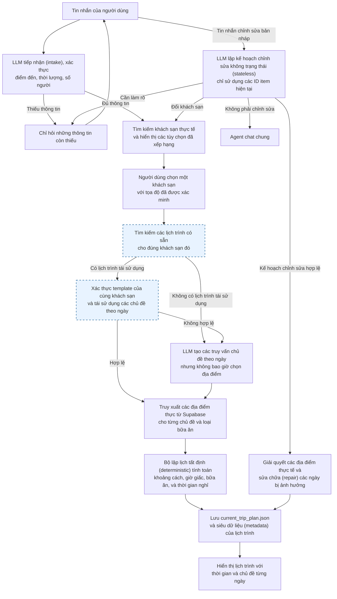
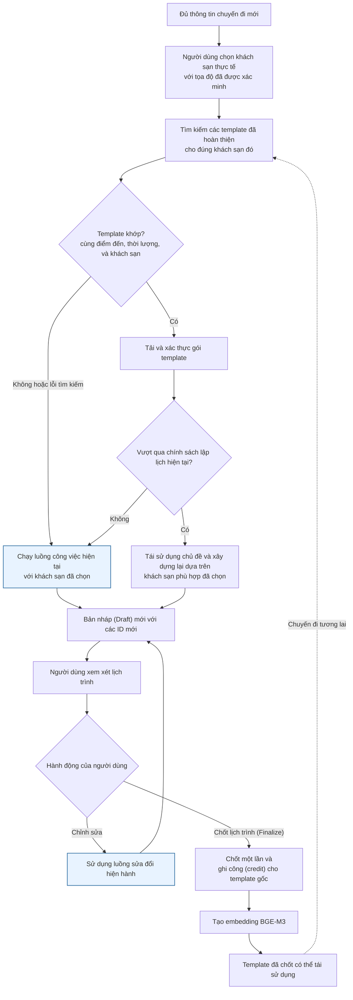
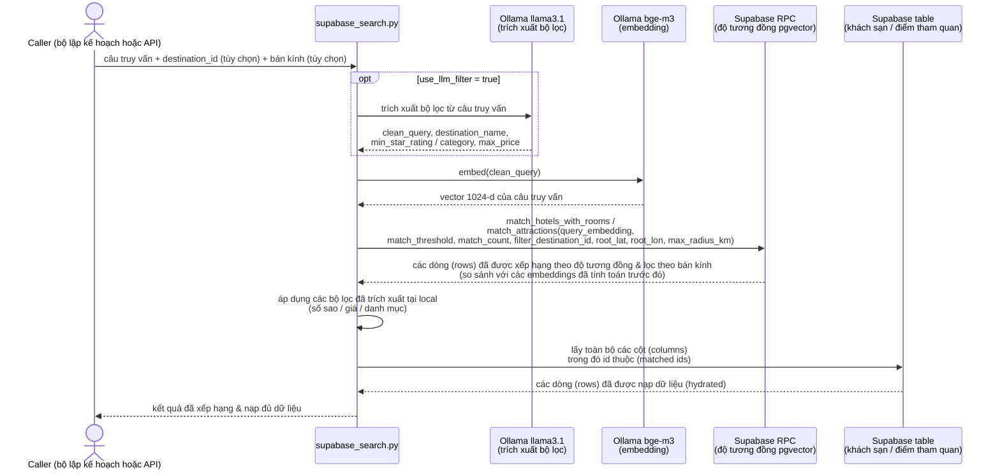

# Luồng Công Việc của Agent và Ngăn Xếp Tìm Kiếm Ngữ Nghĩa

> ⚠️ **TÀI LIỆU LỊCH SỬ — mô tả POC chạy qua terminal (`scripts/poc_trip_planner.py`),
> KHÔNG phải runtime hiện tại.** Hệ thống thật giờ là orchestrator LangGraph 14 node sau
> FastAPI; CLI terminal mà tài liệu này mô tả **đã hỏng** (import `process_chat_turn` đã bị xoá).
> Kiến trúc hiện tại xem:
> - [`langgraph_orchestrator_vi.md`](langgraph_orchestrator_vi.md) + [`langgraph_orchestrator_detail_vi.md`](langgraph_orchestrator_detail_vi.md)
> - [`chatbot-capabilities-and-happy-path-vi.md`](chatbot-capabilities-and-happy-path-vi.md)
> - [`../../ARCHITECTURE.md`](../../ARCHITECTURE.md)
>
> Phần **còn đúng**: đường đi của semantic search (`match_hotels_with_rooms` /
> `match_attractions`, chỉ embed query, hydrate theo UUID), **chính sách scheduler tất định**,
> và triết lý "LLM diễn giải, Python chọn" — tất cả đã mang sang graph. Mọi thứ về vòng lặp
> terminal, `TripIntakeState`, `create_react_agent`, và lưu `current_trip_plan.json` đã bị
> thay thế. Provider LLM/embedding mặc định giờ là Cloudflare Workers AI, không phải Ollama.
> Mục "Proposed 5-Agent LangGraph Extension" ở cuối đã bị thay bởi graph 14 node đã ship.

## Mục đích và phạm vi

Tài liệu này mô tả luồng lập kế hoạch chuyến đi qua terminal đã được triển khai và ngăn xếp (stack) tìm kiếm ngữ nghĩa mà hệ thống hiện đang sử dụng. Đây là nguồn chân lý (source of truth) cho `scripts/poc_trip_planner.py`; tài liệu này cố ý phân biệt rõ giữa môi trường runtime thực tế với các tài liệu kiến trúc cũ mô tả về đề xuất thiết kế đa agent (multi-agent) với Qdrant.

Lựa chọn thiết kế cốt lõi rất đơn giản: **LLM diễn giải ngôn ngữ tự nhiên trong một khuôn khổ bị ràng buộc, nhưng mã Python tất định (deterministic) sẽ chịu trách nhiệm lựa chọn và lập lịch cho các địa điểm thực tế.** Bộ lập kế hoạch (planner) sẽ không bao giờ chấp nhận một khách sạn, nhà hàng, quán cà phê hoặc điểm tham quan nào do LLM tự bịa ra để đưa vào bản ghi lịch trình.

## Tổng quan hệ thống

### Luồng công việc đã được triển khai hiện tại

Sơ đồ này giữ nguyên luồng công việc hiện hành và hiển thị điểm chèn quy trình tìm kiếm lịch trình (màu xanh dương). Người dùng phải chọn một khách sạn trước khi tìm kiếm tái sử dụng (reuse search), và RPC yêu cầu khớp chính xác `hotel_id` cùng với điểm đến và thời lượng. Nếu không tìm thấy kế hoạch tái sử dụng nào, bộ lập kế hoạch nhận biết khách sạn (hotel-aware planner) hiện tại sẽ tiếp tục hoạt động như bình thường.

### Tiện ích mở rộng tái sử dụng lịch trình dự kiến

Tiện ích tái sử dụng là một lối tắt an toàn đi vào luồng công việc hiện hành, không phải là một bộ lập kế hoạch riêng biệt. Mọi template được truy xuất đều dành riêng cho khách sạn đã chọn, được hydrate (nạp dữ liệu) và kiểm tra lại một lần nữa. Một template không hợp lệ sẽ bị trả về luồng công việc hiện tại; việc thay thế khách sạn sẽ thực hiện một truy vấn tái sử dụng mới theo khách sạn đó và xây dựng lại toàn bộ các ngày.

## Luồng công việc của Agent

### 1. Tiếp nhận (Intake) bằng LLM, dựa trên thông tin thực tế

`TripIntakeState` gửi tin nhắn của người dùng đến `llama3.1` để trích xuất điểm đến, thời lượng, số lượng người, và các điều kiện sở thích dưới dạng JSON có cấu trúc. Phỏng đoán của LLM về điểm đến không bao giờ được tin tưởng trực tiếp: một hàm xác thực (grounding) thuần túy (`_ground_extracted_facts` / `_match_known_destination` trong `trip_intake.py`) chỉ chấp nhận điểm đến đó nếu nó khớp với một dòng (tên hoặc bí danh) trong bảng `destinations` thực tế; các phỏng đoán không khớp hoặc mơ hồ sẽ bị loại bỏ và trường dữ liệu sẽ trống. Hệ thống chỉ đặt câu hỏi khi điểm đến, thời lượng, hoặc số lượng người vẫn bị thiếu sau khi đã xác thực — điều này giúp tránh việc một mô hình LLM đa dụng làm mất hoặc hỏng các dữ liệu mà người dùng đã cung cấp, hiện được đảm bảo qua quá trình kiểm tra hợp lệ thay vì không cho mô hình can thiệp vào các trường này.

### 2. Phân tuyến mục đích (Intent routing)

Đối với một chuyến đi mới, vòng lặp terminal gọi trực tiếp bộ lập kế hoạch một khi cả ba thông tin bắt buộc đều có sẵn. Đối với mỗi tin nhắn được gửi trên một bản Nháp (Draft) đã lưu, bộ lập kế hoạch chỉnh sửa LLM không trạng thái (stateless) sẽ nhận được một bản tóm tắt lịch trình thu gọn chứa khách sạn, các chủ đề, các ràng buộc, và các ID item đã lưu. Nó trả về `apply` (áp dụng), `clarify` (làm rõ), hoặc `not_edit` (không phải chỉnh sửa) kèm theo các hành động (operations) được định kiểu. Mã tất định (deterministic) sẽ từ chối các ID item không xác định, tự giải quyết các địa điểm thay thế thực tế, và áp dụng toàn bộ chỉnh sửa một cách nguyên tử (atomically). Chỉ các tin nhắn `not_edit` mới được chuyển đến agent chat chung.

### 3. Việc chọn khách sạn là rào cản bắt buộc (Hard gate)

Bộ lập kế hoạch trước tiên chạy tìm kiếm ngữ nghĩa chung cho khách sạn, sau đó hydrate (nạp dữ liệu) các ID kết quả từ Supabase. Một khách sạn chỉ hợp lệ khi nó thuộc về điểm đến đã yêu cầu và có tọa độ (coordinates) hợp lệ. Nếu không tồn tại bản ghi nào như vậy, việc lập kế hoạch sẽ dừng lại kèm theo thông báo lỗi giải thích lý do, thay vì âm thầm chọn một khách sạn khác hoặc tự bịa ra một khách sạn.

Khách sạn được chọn đóng vai trò là điểm neo (anchor) cho các cụm địa lý hàng ngày và cung cấp siêu dữ liệu rõ ràng về việc bao gồm các bữa ăn. Chỉ những bữa ăn được đánh dấu là "đã bao gồm" (included), "miễn phí" (complimentary/free), hoặc được chi trả rõ ràng mới được coi là bữa ăn tại khách sạn.

### 4. LLM tạo ra các chủ đề, không phải danh sách địa điểm

`llama3.1` nhận vào điểm đến, các danh mục khả dụng, sở thích, và số ngày. Nó trả về một danh sách JSON bị ràng buộc gồm `{day_number, title, query}`. Trình chuẩn hóa tất định (deterministic normalizer) chỉ chấp nhận các truy vấn (query) có thể sử dụng được, tự suy ra một tiêu đề tiếng Việt an toàn từ các từ khóa truy vấn, loại bỏ các mục trùng lặp, và lấp đầy các khoảng trống bằng quy trình luân phiên danh mục tất định.

Việc này giúp duy trì khả năng mở rộng ngữ nghĩa trong khi vẫn ngăn chặn các tiêu đề sai định dạng hoặc các địa điểm hư cấu xâm nhập vào lịch trình.

### 5. Truy xuất ngữ nghĩa ứng viên và nạp dữ liệu (Hydration)

Ứng dụng sẽ truy vấn các điểm tham quan một cách độc lập cho mỗi chủ đề hàng ngày. Nó cũng truy vấn các nhóm (pools) riêng biệt cho bữa sáng, nhà hàng bữa trưa, quán cà phê, và bữa tối. Quá trình tìm kiếm trả về các bản ghi đã xếp hạng (ranked) và thu gọn; sau đó một lệnh đọc thứ hai từ bảng Supabase sẽ hydrate từng kết quả bằng các trường bắt buộc để lập lịch chuẩn xác: UUID, danh mục, tọa độ, đánh giá (rating), giờ mở cửa và đóng cửa, cờ đánh dấu tour, mô tả, và thời lượng được lưu.

### 6. Lập lịch tất định và sửa chữa (Repair)

Bộ lập lịch chỉ sử dụng các đối tượng `PlaceCandidate` đã được hydrate. Nó tạo ra một ngày cân bằng bằng cách sử dụng các ID thực: bữa sáng, điểm tham quan buổi sáng, bữa trưa, nghỉ ngơi tại khách sạn, điểm tham quan buổi chiều, quán cà phê thư giãn, bữa tối, và một điểm dừng nhẹ tự chọn vào buổi tối. Nó sử dụng khoảng cách đường chim bay (Haversine distance), tốc độ di chuyển giả định trong đô thị, giờ mở cửa, các bữa ăn do khách sạn bao trọn, và giới hạn khu vui chơi. Khi không có nhà hàng hoặc quán cà phê hợp lệ, nó sẽ sử dụng khối thời gian nghỉ ngơi/ăn tại khách sạn thay vì dùng một điểm tham quan không liên quan để thay thế.

Các thao tác chỉnh sửa không phải đổi khách sạn sẽ cố gắng bảo tồn các ngày và các ID item không bị ảnh hưởng nếu có thể, sau đó xác thực lại ngày bị thay đổi. Tuy nhiên, thao tác thay đổi khách sạn sẽ tái tạo lại toàn bộ kế hoạch để tất cả các cụm địa điểm (clusters) mỗi ngày đều dựa trên vị trí của khách sạn mới.

## Ngăn xếp công nghệ chủ động (Active technology stack)

| Lớp (Layer) | Công nghệ hiện tại đang dùng | Cách sử dụng | Lý do sử dụng |
|---|---|---|---|
| Điều phối Terminal | Python, LangGraph, LangChain tools | `create_react_agent` chỉ phơi bày (exposes) các tool sinh lịch trình và chỉnh sửa; rào cản tiếp nhận tất định (deterministic intake) giúp vượt qua bộ định tuyến mô hình cho đến khi thu thập đủ toàn bộ các thông tin mới của chuyến đi. | Giữ được khả năng hội thoại (conversational) nhưng không để mô hình (LLM) tự ý đưa ra các quyết định chọn địa điểm thực tế. |
| Chat / Khai thác dữ liệu ràng buộc | Ollama `llama3.1` (`llama3.1:latest` để trích xuất bộ lọc tìm kiếm) | Tạo ra các truy vấn ngữ nghĩa hằng ngày và một kế hoạch chỉnh sửa (edit plan) không trạng thái định kiểu chỉ sử dụng các ID lịch trình hiện tại; có thể tùy chọn trích xuất văn bản ngữ nghĩa cộng thêm bộ lọc từ các truy vấn tìm kiếm chung chung. | Chạy offline (local), hỗ trợ giao tiếp tiếng Việt tốt, và bị giới hạn ở các tác vụ cấu trúc nhỏ lẻ. |
| Embeddings | Ollama `bge-m3` thông qua `OllamaEmbeddings` | Nhúng (embed) các truy vấn khách sạn hoặc điểm tham quan đã được làm sạch mỗi lần thực hiện tìm kiếm ngữ nghĩa. | Embedding đa ngôn ngữ phù hợp với cả tiếng Việt và tiếng Anh cho các truy vấn du lịch, đồng thời loại bỏ sự phụ thuộc vào API embedding trên cloud. |
| Vector store ngữ nghĩa | Supabase PostgreSQL RPC / triển khai pgvector | Gọi `match_attractions` và `match_hotels_with_rooms` kèm vector embedding của truy vấn, ngưỡng (threshold), số lượng, bộ lọc điểm đến tùy chọn, và bộ lọc bán kính (radius) tùy chọn (`root_latitude`, `root_longitude`, `max_radius_km`). | Lưu giữ tính năng truy xuất vector kế bên các bản ghi quan hệ (relational) và sử dụng bộ lọc SQL/RPC mà không cần phải cài cắm thêm một kho dữ liệu thứ hai. |
| Nguồn dữ liệu quan hệ (Relational) | Supabase PostgreSQL | Chứa dữ liệu destinations, hotels, rooms, attractions, itineraries, và itinerary items; hydrate các kết quả tìm kiếm theo UUID. | Lịch trình yêu cầu các trường dữ liệu thực tế và các ID bền vững (durable IDs), không phải các đoạn (snippets) vector. |
| Bộ lập kế hoạch tất định | Pure Python scheduler | Chấm điểm (scores) các ứng viên (candidates) và tạo/xác nhận lại các khối thời gian. | Đảm bảo tính nhất quán về vị trí/thời gian, có thể tái lập (reproducible) và dễ dàng kiểm thử (unit-testable). |
| Giao diện API (API surface) | FastAPI | Bảo toàn cấu trúc trả về của endpoints `/search_attractions` và `/search_hotels`. | Giúp cho tính năng tìm kiếm ngữ nghĩa có thể tái sử dụng mà không phơi bày các chi tiết lập lịch nội bộ. |
| Kế hoạch lưu trữ cục bộ | UTF-8 JSON | Ghi dữ liệu vào `data/current_trip_plan.json`; các chủ đề từng ngày được lưu dưới dạng `itineraries[0].day_themes`. | Trạng thái terminal session được lưu trữ đơn giản và hỗ trợ chỉnh sửa ổn định; thư mục `data/` bị loại trừ khỏi git (gitignored) do đó trạng thái phiên không bao giờ vô tình bị đưa vào git commit. |

## Trách nhiệm của các mô hình (Model responsibilities)

| Mô hình (Model) | Trách nhiệm (Responsibility) | Không chịu trách nhiệm về |
|---|---|---|
| Ollama `llama3.1` | Trích xuất thông tin đầu vào của chuyến đi (đã được đối chiếu trước khi dùng), khởi tạo truy vấn chủ đề theo ngày, lên kế hoạch thao tác chỉnh sửa định kiểu, tùy chọn trích xuất bộ lọc cho các câu truy vấn. | Chọn các bản ghi địa điểm, lập lịch thời gian, tính toán khoảng cách, hoặc bịa đặt thông tin. |
| Ollama `bge-m3` | Chuyển đổi một câu truy vấn ngôn ngữ tự nhiên đã làm sạch thành vector để dùng trong quá trình truy xuất (retrieval) bằng Supabase. | Tạo ra các đoạn văn bản (prose) dành cho người dùng cuối hoặc quyết định các quy tắc kinh doanh (business rules). |
| Ollama `llama3:latest` | Tùy chọn để làm phong phú (enrich) phần mô tả điểm tham quan (Airflow), cấu hình bằng biến `OLLAMA_DESCRIPTION_MODEL`. | Quá trình lập kế hoạch qua terminal và tìm kiếm ngữ nghĩa trong luồng công việc này. |

## Tìm kiếm ngữ nghĩa: Đường dẫn từ yêu cầu (request) đến kết quả (result)

Các bước dưới đây được chạy mỗi khi tìm kiếm khách sạn hoặc điểm tham quan. Quá trình tạo embeddings cho phía dữ liệu — tức là các vector được lưu trên mỗi dòng của bảng `hotels`/`attractions` — đã được tính toán từ trước qua một job đồng bộ dữ liệu riêng lẻ (ví dụ: `scripts/migrate_vectors_to_supabase.py`), không phải ngay trong lúc nhận request. Chỉ có truy vấn (query) của client gọi hàm mới được embed dạng trực tiếp (live).

Hai mô hình local khác biệt được liên đới, không phải một. `llama3.1` luôn luôn chỉ trả về văn bản/JSON (ở đây là trích xuất bộ lọc; tạo chủ đề (theme) và phân loại chỉnh sửa nằm ở nơi khác trong bộ lập kế hoạch). `bge-m3` luôn luôn chỉ trả về vector embedding. Cả hai mô hình đều không thấy được kết quả (output) của nhau, và cũng không mô hình nào tự tạo ra bản ghi địa điểm (venue record) trực tiếp — thông tin này luôn đến từ dòng (row) của Supabase đã được hydrate ở bước cuối.

1. Một caller sẽ cung cấp câu truy vấn ngôn ngữ tự nhiên và có thể kèm theo một UUID điểm đến.
2. Tại dịch vụ tìm kiếm tái sử dụng chung, `llama3.1:latest` có thể trích xuất ra một cụm từ ngữ nghĩa sạch và các bộ lọc như là điểm đến, danh mục, số sao đánh giá (star rating), hoặc giá tối đa. Bộ lập kế hoạch sẽ truyền vào cờ `use_llm_filter=False` vì nó đã giải quyết xong phần điểm đến và tự tạo ra câu truy vấn chủ đề chính xác.
3. `bge-m3` nhúng (embeds) cụm từ ngữ nghĩa ở local qua Ollama.
4. Client gọi một RPC khớp (matching RPC) của Supabase kèm theo các biến `query_embedding`, `match_threshold`, `match_count`, `filter_destination_id`, và tùy chọn các biến `root_latitude`, `root_longitude`, `max_radius_km`. Ngưỡng mặc định là 0.40 cho attractions và 0.35 cho hotels.
5. Dịch vụ (service) sẽ áp dụng các bộ lọc siêu dữ liệu (metadata filters) chính xác ở local sau quá trình truy xuất (retrieval). Nó sẽ lấy lố (over-fetches) gấp 3 lần lượng cần thiết nếu một bộ lọc danh mục, ngân sách, số sao, hoặc mức giá đang hoạt động, sau đó trả về tối đa số lượng đã được yêu cầu ban đầu. Nếu lọc siêu dữ liệu nghiêm ngặt dẫn đến rỗng kết quả (no result), dịch vụ sẽ cố ý thoái lui (fallback) về các kết quả chỉ dựa trên độ khớp ngữ nghĩa.
6. Bộ lập kế hoạch chuyến đi tiến hành hydrate các UUID kết quả từ bảng dữ liệu quan hệ (relational table) trước khi xếp lịch (scheduling). Các ứng viên (candidates) thiếu UUID, tên, hoặc tọa độ hợp lệ sẽ bị loại bỏ.

### Cam kết (Contracts) tìm kiếm

Các interfaces dùng chung là `search_attractions` và `search_hotels_with_rooms` vẫn giữ nguyên không đổi để hỗ trợ cho các callers dựa trên tham số vị trí cũ (legacy positional callers), với các đối số về bán kính (radius) tùy chọn được bổ sung vào cuối.

| Tìm kiếm | RPC Đang Chạy | Mục đích sử dụng cụ thể của Planner |
|---|---|---|
| Khách sạn và phòng nghỉ | `match_hotels_with_rooms` | Chọn ra 1 khách sạn thực tế, cùng khu vực điểm đến và có tọa độ (coordinates) đầy đủ. |
| Điểm tham quan (Attractions) | `match_attractions` | Truy xuất (retrieve) các ứng viên theo chủ đề mỗi ngày (per-day theme candidates) và các nhóm thực phẩm/cà phê (food/cafe pools) tách biệt. |

### Tóm tắt các Dữ liệu Đầu vào (Inputs) chính xác theo từng Thành phần

#### Các Inputs truyền vào Itinerary Builder (`build_itinerary_with_hotel_reselection`)

| Phân loại Input | Biến số / Cấu trúc (Variable / Structure) | Mô tả & Nội dung (Description & Contents) |
|---|---|---|
| **Thông tin Tiếp nhận & Siêu dữ liệu** | `TripIntakeState` | `destination` (tên & UUID `destination_id`), `duration` (`number_of_days`), `people` (`number_of_people`), mảng các điều kiện `preferences`, cờ (flag) boolean `child_focused`. |
| **Truy vấn Tái sử dụng (Reuse Query)** | `ItineraryReuseQuery` | `destination_id`, `destination_name`, `duration_days`, `number_of_adults`, mảng cố định (tuple) `preferences`, cờ (flag) `child_focused` (dùng để tìm kiếm ứng viên Tier 1). |
| **Ứng viên Khách sạn (Hotel Candidates)** | `hotel_candidates` (`List[PlaceCandidate]`) | Các khách sạn phù hợp đã được hydrate tương thích với `destination_id`, có tọa độ (coordinates) hợp lệ và đã nhận diện được `covered_meals` (`breakfast`, `lunch`, `dinner`). |
| **Chủ đề Theo Ngày (Day Themes)** | `themes` (`Sequence[DayTheme]`) | Một danh sách JSON đã được chuẩn hóa chứa `[{day_number, title, query}]` do LLM tạo hoặc nạp từ template dùng lại. |
| **Ứng viên Điểm Tham Quan (Attractions)** | `themed_candidates` (`Dict[int, List[PlaceCandidate]]`) | Các ứng viên attraction đã được hydrate được truy xuất dựa trên câu truy vấn chủ đề của mỗi ngày (daily theme query). |
| **Các nhóm Bữa ăn & Cà phê (Meal & Cafe Pools)** | `restaurants`, `cafes`, `breakfasts`, `dinners` | Các danh sách tập hợp (pools) của đối tượng `PlaceCandidate` đã được hydrate dành cho ăn trưa, cà phê thư giãn buổi chiều, ăn sáng, và ăn tối (khi không được bao gồm trọn gói bởi khách sạn). |
| **Các Quy tắc Lập lịch (Scheduling Rules)** | `PlanningPolicy` & `child_focused` | Bán kính cụm nhóm địa lý (Clustering radii) (5km, 10km, 15km), tốc độ đi lại nội thành (25 km/h), các khung giờ dùng bữa, giờ mở cửa, và định mức cho khu vui chơi trẻ em (playground). |

#### Các Inputs sử dụng cho việc Tìm Kiếm Ngữ Nghĩa (Semantic Search)

| Phân Loại Tìm Kiếm | Hàm (Function) / RPC | Dữ Liệu Tìm Kiếm (Search Inputs) |
|---|---|---|
| **Tìm điểm tham quan (Attraction Search)** | `search_attractions` / `match_attractions` | • **Truy vấn chữ (`query`)**: Cụm từ chủ đề (Theme phrase) hoặc truy vấn bữa ăn (ví dụ: `"{theme.query}. Destination: {destination}"`). • **Vector nhúng (`query_embedding`)**: Vector dày (dense vector) 1024 chiều từ `bge-m3`. • **Bộ lọc Điểm Đến (`filter_destination_id`)**: UUID `destination_id` của Supabase. • **Ngưỡng (Threshold) & Số lượng (Count)**: `match_threshold` (0.40), `match_count` (15–20). • **Bộ lọc bằng LLM** (tùy chọn): `category`, `max_price`. • **Bộ lọc bán kính (Radius Filters)** (tùy chọn): `root_latitude`, `root_longitude`, `max_radius_km`. |
| **Tìm Khách Sạn (Hotel Search)** | `search_hotels_with_rooms` / `match_hotels_with_rooms` | • **Truy vấn chữ (`query`)**: ví dụ: `"Hotel in {destination} for {people} people"`. • **Vector nhúng (`query_embedding`)**: Vector dày (dense vector) 1024 chiều từ `bge-m3`. • **Bộ lọc Điểm Đến (`filter_destination_id`)**: UUID `destination_id` của Supabase. • **Ngưỡng (Threshold) & Số lượng (Count)**: `match_threshold` (0.35), `match_count` (5–10). • **Bộ lọc bằng LLM** (tùy chọn): `min_star_rating`, `max_price`. • **Bộ lọc bán kính (Radius Filters)** (tùy chọn): `root_latitude`, `root_longitude`, `max_radius_km`. |
| **Tìm Lịch trình để Tái sử dụng (Itinerary Reuse)** | `search_reusable_itineraries` / `match_itineraries` | • **Truy vấn Dấu vân tay (Reuse Fingerprint Query)**: Dấu vân tay (fingerprint) bằng chữ được tạo từ `ItineraryReuseQuery`. • **Vector nhúng Dấu vân tay**: Vector dày (dense vector) 1024 chiều từ `bge-m3`. • **Bộ lọc bắt buộc (Hard Filters)**: khớp chính xác `destination_id`, `duration_days`, và `hotel_id` được chọn. • **Ngưỡng (Threshold)**: Ngưỡng tương đồng được đặt ở mức **0.88** (Độ khớp 88%). |

## Chính sách lập lịch trình (Scheduling policy)

Chính sách này được triển khai như các hàm thuần túy (pure functions) và các bản ghi định kiểu trong `trip_scheduler.py`. Đây là các quy tắc ứng dụng (application rules), không phải là các gợi ý (prompt suggestions) từ LLM.

| Yếu tố quan tâm | Quy tắc (Rule) |
|---|---|
| Gom cụm trong ngày (Daily cluster) | Điểm neo (anchor) của mỗi ngày sẽ sử dụng 60% từ độ tương đồng ngữ nghĩa, 25% từ khoảng cách tới khách sạn, 10% từ điểm đánh giá (rating), và 5% về mức độ đầy đủ của giờ mở/đóng cửa. Các điểm dừng (stops) bổ sung sử dụng 45% từ độ tương đồng ngữ nghĩa, 35% từ khoảng cách tới điểm neo, 10% khoảng cách tới khách sạn, và 10% đánh giá. |
| Nới lỏng khoảng cách (Distance relaxation) | Ưu tiên các ứng viên nằm trong bán kính 5 km từ điểm neo; nới rộng dần ra 10 km, rồi 15 km. Nếu không có ứng viên nào để vào cụm thì thay thế bằng phương án nghỉ tại khách sạn hợp lệ (không tự bịa đặt). |
| Thời gian di chuyển (Travel time) | Dựa trên khoảng cách đường chim bay (Haversine) với tốc độ 25 km/h, làm tròn đến năm phút với thời gian tối thiểu là 10 phút. Đây chỉ là ước tính, không phải ETA chính xác từ engine điều hướng giao thông. |
| Khung giờ (Hours) | Một khoảng giờ mở/đóng cửa khi đã xác định rõ ràng thì toàn bộ thời gian thăm quan phải lọt thỏm nằm gọn bên trong khung giờ đó. Các địa điểm không rõ giờ giấc sẽ được coi như "không biết" thay vì tự bịa ra một khoảng giờ mở cửa. |
| Thời lượng mặc định (Duration defaults) | Các chuyến tham quan (Tours): 180 phút; Thiên nhiên/giải trí: 120 phút; Các điểm tham quan khác: 90 phút; Bữa ăn: 75 phút; Cà phê: 45 phút; Nghỉ ngơi tại khách sạn: 90 phút. Giá trị lưu trữ ở trong dữ liệu sẽ được ưu tiên cao nhất nếu có. |
| Bữa trưa (Lunch) | Bắt đầu trong khung giờ linh hoạt 11:00-12:30, ưu tiên mốc 11:30 thay vì bắt buộc cứng ngắc ở 11:00. |
| An toàn tắm biển (Beach safety) | Các hoạt động ở bãi biển có thể bắt đầu trước 10:30 hoặc bằng/sau 15:30, tuyệt đối không diễn ra vào khung giờ giữa trưa nắng. |
| Hồi phục / Giải lao (Recovery) | Một quán cà phê sẽ được ưu tiên cho sau chuỗi hoạt động của buổi chiều; nếu không có quán cà phê nào hợp lệ, khách sạn sẽ đóng vai trò như nơi nghỉ ngơi/hồi sức. |
| Bữa ăn (Meals) | Ưu tiên sử dụng một nhà hàng ăn sáng/trưa/tối thực tế nếu có sẵn, trừ phi bản thân khách sạn đã ghi rõ rằng bữa ăn đó đã được bao gồm. |
| Trẻ em (Children) | Mặc định nhiều nhất chỉ có 1 điểm tham quan kiểu sân chơi (playground) trẻ em trong toàn bộ một chuyến đi. Một yêu cầu mang thiên hướng tập trung vào trẻ em (child-focused) thì sẽ cho phép xuất hiện một điểm như thế mỗi ngày. |

## Độ bền vững (Persistence) và hành vi chỉnh sửa (edit behavior)

`current_trip_plan.json` chứa đựng `hotel`, `itineraries`, `itinerary_items`, và `adjustments`. Mỗi lịch trình tự lưu giữ mảng dữ liệu JSON `day_themes` của riêng nó để phần siêu dữ liệu (metadata) này không bị lặp lại tràn lan ở thư mục gốc (top level). Lược đồ (schema) `itineraries` của Supabase chứa thêm cột bổ sung `day_themes JSONB`; hệ thống sẽ liên tục thêm dữ liệu/cập nhật (upserts) phần metadata của lịch trình mỗi khi cột này được trình diện.

Trong một phiên chỉnh sửa nội bộ (local edit), bộ lập kế hoạch tải lại JSON đã lưu, hydrate lại các địa điểm tham quan được tham chiếu tới, thi hành thao tác thay đổi do người dùng chỉ định, khắc phục sửa chữa (repairs) các sự cố xung đột giờ/khoảng cách, và thay thế trọn gói riêng mỗi cái ngày bị chỉnh sửa ấy. Hệ thống sửa chữa (repairer) tự di dời lịch trình đi biển lúc giữa trưa, ngăn chặn việc giẫm chân lên các thời gian đã chốt (overlaps), bắt buộc tuân theo giờ giấc hoạt động (known hours), và gỡ bỏ các khu vui chơi trẻ em bị vượt mức theo luật.

## So sánh cấu trúc thiết kế và sự đánh đổi (trade-offs)

### Bộ lập lịch tất định (Deterministic scheduler) vs. Danh sách địa điểm do LLM tự bịa

| Lựa chọn | Điểm mạnh | Điểm yếu | Quyết định |
|---|---|---|---|
| LLM chọn địa điểm và tự đưa ra định dạng JSON lịch trình | Viết mã ít nhất; văn phong câu chuyện cực mượt mà. | Các bản ghi bị "ảo giác" (hallucinated), gom nhóm khoảng cách địa lý kém cỏi, không đảm bảo tuân thủ giờ mở cửa, và quá trình chỉnh sửa rất bất ổn. | Loại bỏ (Rejected) đối với khâu lập lịch cuối cùng. |
| Truy xuất ngữ nghĩa + Bộ lập lịch tất định | Toàn bộ mọi sự tham chiếu địa điểm đều xuất phát từ dữ liệu gốc của Supabase; các quy tắc có thể chạy test và lặp lại dễ dàng. | Yêu cầu số lượng API gọi truy xuất / nạp dữ liệu (hydration) nhiều hơn kèm theo việc bảo trì phức tạp hơn. | Được chọn (Chosen). |
| Viết tay trực tiếp (Hand-authored fixed itineraries) | Đoán trước kết quả chuẩn 100%. | Không thể phản hồi theo yêu cầu riêng lẻ của khách sạn, chủ đề, sự có sẵn (availability), hoặc dữ liệu mới. | Hoàn toàn không thích hợp cho một công cụ tự động. |

### Supabase pgvector RPC vs. Qdrant

| Lựa chọn | Điểm mạnh | Điểm yếu | Trạng thái (Status) |
|---|---|---|---|
| Supabase pgvector RPC | Nguồn dữ liệu quan hệ luôn khả dụng, cung cấp khả năng nạp dữ liệu từ UUID, bộ lọc đích chính xác (destination filters), dùng duy nhất 1 database quản trị. | Việc hiệu chỉnh vector (Vector tuning) và các bài toán ANN có sức chứa siêu khổng lồ bị đuối lý/kém chuyên nghiệp hơn so với một engine vector chuyên dụng. | Được chọn cho bộ lập lịch chủ động hiện tại. |
| Qdrant | Những tính năng tìm kiếm vector chuyên dụng mạnh mẽ, lọc bằng tải trọng (payload filtering), và cách ly được nhiều tệp (collection isolation). | Một thư mục đánh index thứ hai (second index), cần viết luồng đồng bộ (synchronization path), đi liền là gánh nặng vận hành phần mềm mới; `vector_store.py` hiện tại không được xài cho trình lên kế hoạch (terminal planner). | Kế hoạch trong tương lai/có sẵn dự phòng, không áp dụng cho runtime ở hiện tại. |
| APIs Vector từ các bên thứ 3 (External managed vector API) | Cài đặt lúc đầu cực nhanh và được sự hỗ trợ mở rộng tự động từ nền tảng. | Chi phí (Cost), chuyển giao dữ liệu sang bên ngoài, và sự đồng nhất không cao với bộ mã nguồn local. | Không được chọn. |

### Các mô hình Local Ollama vs. Cloud LLM / Cloud Embedding APIs

| Lựa chọn | Điểm mạnh | Điểm yếu | Quyết định |
|---|---|---|---|
| Local Ollama (`llama3.1`, `bge-m3`) | Lưu trữ mọi câu query và dữ liệu vector dưới máy cục bộ (local), không tốn tiền API (API cost), và hoạt động ổn định kể cả khi không có mạng lưới bên ngoài. | Chất lượng phản hồi và độ giật lùi (latency) hoàn toàn phụ thuộc nặng vào sức mạnh cấu hình phần cứng; các models buộc phải được setup tải về sẵn. | Được chọn làm cấu trúc hiện tại. |
| Cloud LLM / embedding API | Chất lượng mô hình cao hơn nhiều (thông minh hơn) kèm tốc độ co giãn tự nhiên (elastic throughput). | Chi phí tiền bạc cao, luôn cần kết nối Internet mạnh mẽ, sự lo ngại về riêng tư / trung chuyển dữ liệu (privacy/data-transfer considerations), đồng thời lòi thêm một nhà cung cấp phụ thuộc. | Hiện tại không thật sự cần cho khối lượng công việc nhỏ hẹp này. |
| Rules / keyword-only search (Luật tìm kiếm chuẩn xác) | Rất rẻ tiền và chắc chắn kết quả 100% tất định. | Rất vất vả trong việc xử lý các từ đồng nghĩa và tiếng lóng, kém cỏi khi hiểu mục đích mơ hồ đa ngôn ngữ, đặc biệt là với ngôn từ cảm tính về các chủ đề du lịch (subjective travel themes). | Chỉ được dùng như một thành phần gia cố phía sau khối nhận dữ liệu (intake) và bộ lập lịch. |

### Điều phối công cụ LangGraph (LangGraph tool orchestration) vs. Một vòng lặp riêng biệt (A fully bespoke loop)

| Lựa chọn | Điểm mạnh | Điểm yếu | Quyết định |
|---|---|---|---|
| LangGraph kèm hai nhóm công cụ nhỏ (two narrow tools) | Hỗ trợ tương tác hội thoại, vòng đời (lifecycle) công cụ chuyên nghiệp, và dễ thêm chức năng mới sau này trong khi vẫn khóa chặt (limiting) các thao tác phá vỡ dữ liệu. | Gia tăng thêm phần phụ thuộc framework bên thứ ba, và có thể thừa thãi (unnecessary) khi rào cản nhận vào (intake gate) đã được xác nhận. | Được dùng cho nhóm trò chuyện (chat) và phân nhánh cứu hộ (fallback paths). |
| Vòng lặp command hoàn toàn tất định (Fully deterministic command loop) | Lớp chạy nền nhẹ nhất (Smallest runtime surface) và cực kỳ dễ debug/xem luồng chạy. | Ít mềm dẻo ở phần phiên dịch hội thoại người dùng (language interaction). | Không được dùng — do khâu nhận yêu cầu ban đầu (intake) và phân loại ý định sửa chữa đang dựa vào LLM (đã được giới hạn/rào kỹ càng); chỉ có phân khúc chặn dòng (routing gate) sau khi dữ liệu đã lưu nháp thì mới áp dụng luật chặt chẽ. |
| Multi-agent planner/writer/synthesizer (Nhiều Agent kết hợp) | Khái niệm siêu tách biệt (Conceptual separation) rất hiệu quả khi mở rộng cho các hệ thống khổng lồ (large scale). | Quá nhiều bộ nhắc lệnh (prompts), dễ mất dấu ở khâu chuyển tiếp dữ liệu (state handoffs), tăng bề mặt dính "ảo giác" (hallucination surface), tốn nhiều tài nguyên GPU/API (GPU/API load). | Đề xuất ở quá khứ (Older proposal); không dùng cho bản chạy thiết bị cuối này. |

## Tiện ích tái sử dụng lịch trình dự kiến (Planned itinerary-reuse extension)

Quá trình nhúng tích hợp cho việc tái sử dụng lịch trình được chạy ngay trước công đoạn khởi tạo ra các chủ đề của ngày. Ngay sau khi bộ phận tiếp nhận thông tin đầu vào (deterministic intake) nắm thóp được chính xác Vị trí Điểm đến (destination) cũng như Số Ngày đi (duration), hệ thống sẽ thử bới tìm (search) các bản nháp Template từ kho dữ liệu chốt cuối của Supabase. Trùng hợp thì cũng chỉ là một phiên bản tham khảo (candidate): lúc đó bộ nguồn sẽ tiến hành tưới tiêu nạp nước (hydrate) vị trí khách sạn cũng như lôi hết đám lịch biểu (items) ra, gắn luật (apply) của chính sách lập lịch đời mới vào xem có hợp lệ không, và cuối cùng nếu rớt bài kiểm tra thì quy trở về làm luồng thông thường để lập lại từ đầu.

Khâu chốt cuối (Finalization) sẽ được thăng cấp biến hình thành một kĩ năng riêng của Agent (narrow agent capability) đứng ngang hàng như lúc Tạo (generation) hay lúc Sửa (modification). Chỉ khi có cái gật đầu của User thì nó mới đem ra chốt sổ lịch trình (finalizes a draft), ghi công ơn đánh dấu (credits) cho nguồn nào đẻ ra nó để chống tính lặp nhiều lần (exactly once), và quẳng phiên bản đã xử lý lên trên kệ dưới dạng Embedding vector cho những lứa User tới xài chung. Kiểm tra mức độ ế hàng phòng (Hotel availability) hay tự nhảy giá (cost recalculation) tạm thời không đưa vô bản này (MVP) tới khi ngày đi/về (travel dates) kết hợp với các dữ liệu hợp đồng phòng (room-price contracts) được đem vô cài cắm thật chặt.

Hãy xem [`../proposals/itinerary-embedding-reuse-v2.md`](../proposals/itinerary-embedding-reuse-v2.md) để hiểu sâu về phần schema, ranh giới dịch vụ (service boundaries), chuỗi phân nhỏ (phased tasks), testings, và cách vượt ải (rollout gates).

## Yêu cầu và giới hạn vận hành

- Ollama bắt buộc phải nằm trên endpoint `OLLAMA_URL` (mặc định là `http://localhost:11434`) và phải cài đặt sẵn (installed) hai mô hình `llama3.1` và `bge-m3`.
- Biến `SUPABASE_URL` và `SUPABASE_SERVICE_KEY` phải khả dụng (available). Biến khóa dịch vụ (service key) hoàn toàn chỉ tồn tại phía máy chủ (server-side only) và tuyệt đối không bao giờ phơi bày ra môi trường bên ngoài cho trình duyệt (browser client) thấy.
- Cấu trúc dữ liệu Supabase schema yêu cầu phải có bảng lưu embeddings đi kèm với hai câu lệnh thủ tục RPC là `match_attractions` và `match_hotels_with_rooms`. Bản nâng cấp dữ liệu cho cột chủ đề ngày (day-theme migration) đang nằm ở thư mục `scripts/migrations/20260727_add_itinerary_day_themes.sql`.
- Tọa độ (Coordinates) là một biến bắt buộc đi kèm khi chọn lựa Khách Sạn và lúc lọc điểm tham quan (scheduler candidates). Toàn bộ đống dữ liệu nếu khuyết mất (lacking) mục tọa độ thì xem như vứt vì không thể chạy phân cụm theo vị trí địa lý.
- Quãng đường bay thẳng chim bay chỉ là giá trị tương đương (approximate). Có thể cài thêm API từ các dịch vụ bản đồ đường (routing provider) nếu ETA (thời gian đi thực) trở thành yêu cầu bắt buộc của dự án (product requirement).
- Mục khung giờ mở/đóng hiện tại không phân chia rạch ròi theo thứ trong tuần (weekday model) trong bộ khung cũ, vì thế giá trị của nó sẽ coi là mặc định cho nguyên ngày. Dữ liệu mà không ghi rõ giờ hoạt động vẫn có thể đem dùng nhưng chả ai dám bảo chứng rành rành là chỗ đó có đang hoạt động hay không.

## Các mã lệnh và Tham chiếu Dữ liệu Trọng tâm

- `scripts/poc_trip_planner.py` — vòng lặp terminal, các vai trò LLM bị ràng buộc, nạp dữ liệu (hydration) Supabase, tính bền vững (persistence), và áp dụng chỉnh sửa.
- `src/services/trip_intake.py` — Trích xuất thực tế bằng tiếng Việt của LLM, được xác thực ngược lại với các điểm đến thực và một tập hợp nhãn ưu tiên đóng (closed preference-label set) trước khi đưa vào dùng.
- `src/services/trip_scheduler.py` — thuần tính điểm, chấm thời gian, xác thực hợp lệ, khắc phục lỗi (repair), và chính sách áp dụng cho bữa ăn/khu vui chơi.
- `src/services/supabase_search.py` — bộ Ollama embedding, chức năng giải mã/trích xuất bộ lọc mở rộng, và phần gọi thủ tục Supabase RPC.
- `src/api/routes.py` — các cổng (endpoints) cố định dùng trong truy vấn ngữ nghĩa (semantic-search).
- `scripts/database_schema.sql` và `scripts/migrations/20260727_add_itinerary_day_themes.sql` — mô hình dữ liệu quan hệ lưu trữ JSONB dài hạn.
- `src/services/vector_store.py` — cầu nối Qdrant (adapter) cũ còn lưu trữ nhưng nằm tách biệt ngoài cái lõi của terminal-planner hiện đại đang xài.

## Tổng kết Quyết Định (Decision summary)

Đối với bộ quy hoạch lập trình chuyến du lịch hiện hành, **hãy sử dụng tìm kiếm ngữ nghĩa ở local để tìm kiếm các dữ liệu có thật** và **giao quyền chốt sổ/ra quyết định thời khóa biểu cho nhóm code thủ công tất định**. Cố gắng quẳng cái bọn LLM ra ngoài lề rìa của mô hình—chỉ cho nó sinh ra ý tưởng (theme/query generation) và bắt thông điệp mệnh lệnh (structured language interpretation) thôi—nhờ đó mà kết quả tạo ra luôn có độ chắp dính chuẩn chỉ với dữ liệu nhà Supabase, nằm gọn gàng bên trong các bộ khung chính sách có tính lặp lại cũng như có thể tự xách ra mà test.

