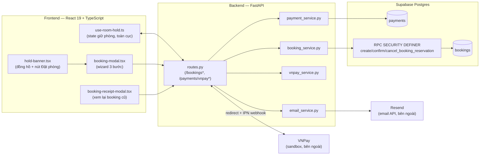
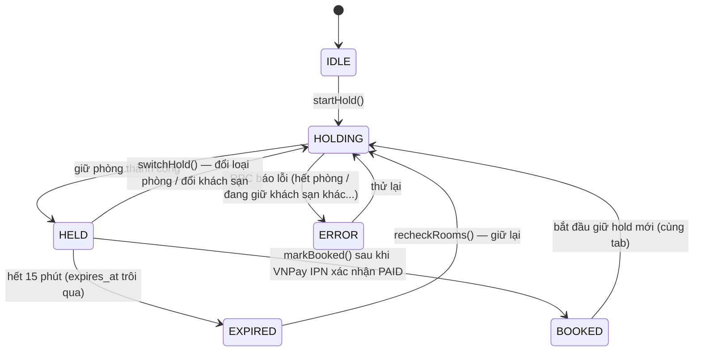
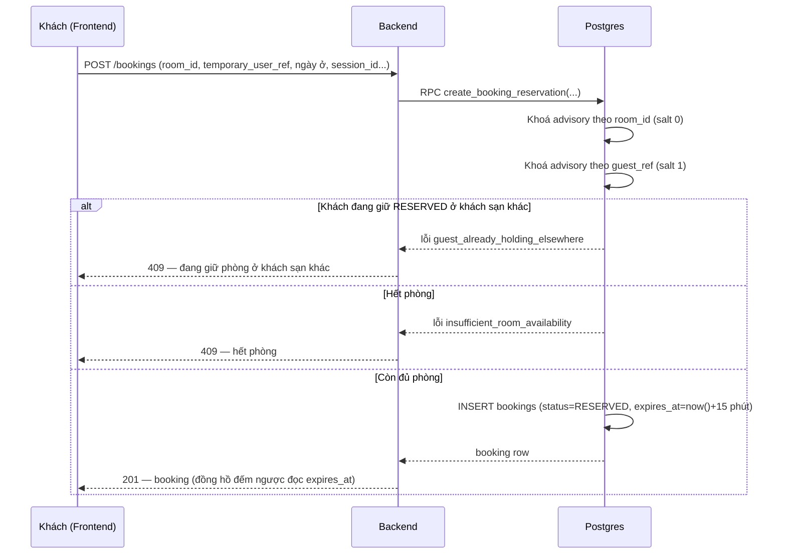
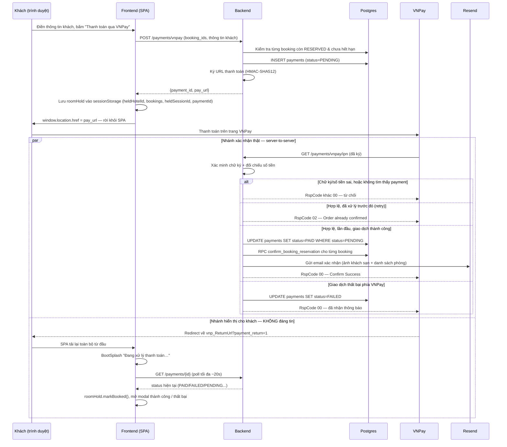

# Tính năng Đặt phòng & Thanh toán VNPay

## Mục đích và phạm vi

Tài liệu này mô tả toàn bộ tính năng đặt phòng của V-OTA: từ lúc khách chọn phòng và **giữ chỗ tạm thời** (room hold), qua **thanh toán thật qua VNPay**, tới khi hệ thống **xác nhận đặt phòng** và **gửi email** cho khách — cùng với các quyết định kiến trúc, sự cố đã gặp và cách khắc phục trong quá trình xây dựng.

Đây là nguồn tham khảo (source of truth) khớp với code đang chạy trên `main`, tính tới commit `c7337f6` (2026-08-19). Toàn bộ tính năng được xây trong khoảng 2026-08-18 → 2026-08-19, bắt đầu từ commit `bce43b6` ("room hold + real VNPay payment with Resend email confirmation").

Không thuộc phạm vi tài liệu này: luồng chat/lập lịch trình AI (xem `docs/architecture/agent_workflow_and_semantic_search_stack_vi.md`), luồng tìm kiếm khách sạn/địa điểm.

## Tổng quan kiến trúc

Frontend không bao giờ tự xác nhận thanh toán — nó chỉ tạo yêu cầu giữ phòng/thanh toán rồi **hỏi lại** backend trạng thái thật. Nguồn xác nhận duy nhất đáng tin là VNPay gọi thẳng vào backend (IPN), không phải bất kỳ thứ gì trình duyệt gửi lên.

## Công nghệ sử dụng

| Lớp | Công nghệ | Vai trò trong tính năng này |
|---|---|---|
| Frontend | React 19 + TypeScript + Tailwind v4 | UI giữ phòng, wizard thanh toán, modal xem lại booking |
| State giữ phòng | React state + `sessionStorage` | `roomHold` sống sót qua lần điều hướng thật sang VNPay và quay lại |
| Định danh khách | `localStorage` (`temporary_user_ref`, UUID sinh 1 lần/trình duyệt) | khách không cần đăng nhập vẫn giữ/xem được đúng booking của mình |
| Backend | FastAPI + Pydantic v2 | định nghĩa route, validate request/response |
| CSDL | Supabase Postgres | bảng `bookings`/`payments`, RPC `SECURITY DEFINER` |
| Khoá đồng thời | Postgres advisory lock (`pg_advisory_xact_lock`) | chặn race condition khi 2 request giữ phòng chạm nhau |
| Cổng thanh toán | VNPay (sandbox) | tạo URL thanh toán ký HMAC-SHA512, xác nhận qua IPN webhook |
| Email | Resend API | gửi email xác nhận đặt phòng (hero ảnh khách sạn + danh sách phòng) |
| Đồng bộ type | FastAPI tự sinh OpenAPI + `openapi-typescript` | type TypeScript sinh tự động từ Pydantic model, tránh lệch tay giữa 2 phía |

## Mô hình dữ liệu

### Bảng `bookings`

| Cột | Kiểu | Ghi chú |
|---|---|---|
| `id` | UUID, PK | |
| `temporary_user_ref` | TEXT | định danh khách (không cần tài khoản) |
| `session_id` | VARCHAR(255) → `sessions.session_id`, `ON DELETE SET NULL` | đoạn chat nào tạo ra booking này — dùng cho nhãn sidebar + dọn dẹp khi xoá session |
| `room_id` | UUID → `rooms.id`, `ON DELETE RESTRICT` | |
| `check_in_date/time`, `check_out_date/time` | DATE / TIME | |
| `room_count` | INTEGER, `CHECK > 0` | |
| `status` | TEXT, `CHECK IN ('PENDING','RESERVED','CONFIRMED','CANCELLED','EXPIRED')` | |
| `expires_at` | TIMESTAMPTZ | chỉ có giá trị khi `RESERVED`; TTL của hold |
| `total_amount`, `currency` | NUMERIC(12,2) / VARCHAR(10) | |
| `cancelled_at`, `created_at`, `updated_at` | TIMESTAMPTZ | |

Ràng buộc bảng: `check_out_date > check_in_date`; `status <> 'RESERVED' OR expires_at IS NOT NULL`. Index `bookings_room_dates_idx (room_id, check_in_date, check_out_date) WHERE status = 'CONFIRMED'`.

### Bảng `payments`

| Cột | Kiểu | Ghi chú |
|---|---|---|
| `id` | UUID, PK | dùng làm `vnp_TxnRef` (bỏ dấu `-`) |
| `temporary_user_ref` | TEXT | |
| `booking_ids` | UUID[], `CHECK array_length(...) > 0` | gộp nhiều loại phòng trong 1 giỏ thành **một** giao dịch, vì VNPay chỉ nhận 1 `vnp_TxnRef`/lượt thanh toán |
| `amount`, `currency` | NUMERIC(12,2) / VARCHAR(10) | |
| `status` | TEXT, `CHECK IN ('PENDING','PAID','FAILED','CANCELLED')` | |
| `guest_name`/`email`/`phone` | TEXT | lấy đúng lúc tạo payment — booking tự nó không có 3 trường này |
| `vnp_transaction_no`, `vnp_response_code` | TEXT | |
| `paid_at`, `created_at`, `updated_at` | TIMESTAMPTZ | |

**RLS**: cả 2 bảng đều **bật RLS nhưng revoke hết quyền của `anon`/`authenticated`**, chỉ cấp cho `service_role`. Không có policy nào lọc theo dòng (row) — toàn bộ quyền truy cập chỉ có một cửa duy nhất là backend (service-role client) gọi các RPC `SECURITY DEFINER` dưới đây.

### 3 hàm RPC (Postgres, `SECURITY DEFINER`)

- **`create_booking_reservation(p_room_id, p_temporary_user_ref, ..., p_hold_minutes=15, p_session_id=NULL)`** — giữ phòng. Lấy **2 khoá advisory theo thứ tự cố định** (theo `room_id`, salt `0`, rồi theo `guest_ref`, salt `1` — luôn cùng thứ tự ở mọi lời gọi nên không thể deadlock), kiểm tra khách chưa giữ `RESERVED` ở khách sạn khác (lỗi `guest_already_holding_elsewhere`), kiểm tra còn đủ phòng (lỗi `insufficient_room_availability`), rồi `INSERT` với `expires_at = now() + p_hold_minutes phút` (mặc định 15, cho phép 1–60).
- **`confirm_booking_reservation(p_booking_id, p_temporary_user_ref)`** — xác nhận đã thanh toán. Khoá đúng dòng booking bằng `SELECT ... FOR UPDATE`; nếu đã hết hạn thì tự chuyển `EXPIRED` và báo lỗi `booking_reservation_expired`; nếu hợp lệ thì `status → CONFIRMED`, `expires_at → NULL`.
- **`cancel_booking(p_booking_id, p_temporary_user_ref)`** — huỷ giữ phòng, **idempotent** (gọi lại trên booking đã `CANCELLED`/`EXPIRED` không lỗi, trả nguyên dòng cũ).

Không có cron/job quét dọn hold hết hạn — một `RESERVED` hết hạn đơn giản là ngừng được tính vào "phòng đang bị giữ" ngay khi `expires_at` trôi qua (điều kiện `expires_at > now()` trong câu truy vấn còn phòng), và chỉ thực sự đổi `status` thành `EXPIRED` khi có ai đó cố `confirm` nó.

## Luồng giữ phòng (Room Hold)

`use-room-hold.ts` là **một state giữ phòng toàn cục cho cả tab trình duyệt, không theo từng đoạn chat** — quyết định kiến trúc có chủ đích, trích nguyên văn từ doc comment của file: *"UI-only state... there is no ChatState slot for 'which rooms are held', so this hook is the source of truth."* Đây là gốc rễ của khá nhiều lỗi phải vá sau này (xem mục 13).

Đồng hồ đếm ngược **không tự đếm 15 phút ở frontend** — nó chỉ đọc lại `expires_at` (sớm nhất trong nhóm booking) do server trả về mỗi giây, nên luôn khớp chính xác với backend dù người dùng có tua đồng hồ máy hay tab bị treo một lúc.

### Chỉ giữ 1 khách sạn tại 1 thời điểm

Giỏ hàng nháp (`cartByHotel`) trước đây không tự xoá — chọn số lượng phòng ở khách sạn A rồi lướt sang xem B vẫn giữ nguyên giỏ của A vô thời hạn, và về lý thuyết có thể **giữ phòng thật ở 2 khách sạn cùng lúc** nếu mở 2 tab (vì RPC chỉ khoá theo `room_id`, không theo khách). Đã vá ở cả 2 tầng:
- Frontend: `applyCartQty` xoá giỏ của mọi khách sạn khác khi sửa số lượng ở 1 khách sạn — **trừ** khách sạn đang thực sự được giữ (`heldHotelId`), vì entry đó phản ánh 1 booking thật, không phải nháp.
- Backend: khoá advisory theo `guest_ref` + guard `guest_already_holding_elsewhere` ở RPC (mục trên) — chặn ở gốc, không phụ thuộc frontend có kiểm tra đúng hay không.

### Đổi lựa chọn khi đang giữ phòng (`switchHold`)

Không có API "sửa" một hold đang có — backend chỉ hỗ trợ tạo mới (insert) + huỷ. Đổi thành công (dù cùng khách sạn đổi loại phòng, hay đổi hẳn khách sạn khác) luôn **huỷ toàn bộ hold cũ rồi tạo lại toàn bộ hold mới**, TTL 15 phút mới tinh cho cả nhóm.

Cài đặt phải tránh bẫy stale closure: `startHold` là hàm được ghi nhớ (`useCallback`) đóng gói giá trị `status` tại thời điểm render, nên gọi `releaseHold()` rồi gọi `startHold()` ngay trong cùng một hàm sẽ tự chặn chính nó bởi giá trị `status` cũ. Giải pháp: tách phần vòng lặp giữ-phòng ra hàm nội bộ `runReservation` **không tự kiểm tra `status`**; `startHold` tự kiểm tra `status !== 'HOLDING'` rồi gọi `runReservation`; `switchHold` gọi `releaseHold()` rồi gọi thẳng `runReservation` — không đi qua `startHold`, nên không dính guard nào.

Sửa số lượng/loại phòng **ngay tại khách sạn đang giữ** → không cần xác nhận (giống sửa giỏ hàng trước khi thanh toán, chưa mất gì), chỉ báo bằng thông báo ngắn. Chuyển sang **khách sạn khác** trong lúc đang giữ, hoặc bấm "Đổi khách sạn" → luôn hỏi xác nhận trước (`ConfirmDialog`, nêu rõ hold nào sẽ mất + còn bao nhiêu phút).

## Luồng thanh toán VNPay

Đây là phần dễ hiểu lầm nhất: **VNPay gọi backend theo 2 kênh hoàn toàn độc lập**, và chỉ một trong hai đáng tin.

1. Backend build một URL thanh toán có ký HMAC-SHA512 (`vnp_HashSecret`), trả về cho frontend.
2. Frontend **điều hướng cả trang** (`window.location.href = pay_url`) sang trang của VNPay — rời khỏi SPA hoàn toàn, không phải mở QR trong app.
3. Khách thanh toán xong, VNPay redirect trình duyệt về `vnp_ReturnUrl` — **chỉ để hiển thị**, query string có thể bị sửa nên **không được tin cậy**.
4. VNPay **đồng thời** gọi thẳng server-to-server vào IPN URL đã đăng ký sẵn trong portal merchant — đây là nguồn xác nhận **duy nhất đáng tin**.

Cập nhật `payments.status = PAID` là một `UPDATE ... WHERE id = ... AND status = 'PENDING'` có điều kiện — bản thân câu lệnh này **là** cơ chế idempotent: một IPN gọi lại (VNPay có thể retry) sẽ update 0 dòng, được hiểu là "đã xử lý rồi", không xử lý lại/gửi trùng email.

## Khôi phục trạng thái sau khi rời trang

Điều hướng sang VNPay (bước 2 ở trên) khiến **toàn bộ state React biến mất** khi khách quay lại — trang tải lại từ đầu. `use-room-hold.ts` lưu `{heldHotelId, bookings, heldSessionId, paymentId, booked}` vào **`sessionStorage`** (không phải `localStorage`) mỗi khi có hold đang sống, và đọc lại lúc mount. Dùng `sessionStorage` vì một "đang chờ thanh toán" chỉ cần sống sót đúng 1 lượt đi-về trong cùng tab, không nên lưu lại qua những lần ghé thăm không liên quan sau này.

Cờ `booked: boolean` được lưu riêng vì lúc trang tải lại, `expires_at` gần như chắc chắn đã ở quá khứ (thời gian thanh toán thật trên VNPay thường vượt quá phần còn lại của hold) — nếu chỉ dựa vào `expires_at` để suy ra trạng thái, màn "Hoàn tất" sẽ bị hiểu nhầm thành "Hết hạn".

## Màn hình "Đang xử lý" che luồng bootstrap

Vấn đề UX: sau khi VNPay redirect về, khách sẽ thấy thoáng qua giao diện "trang chủ" (session đang bootstrap lại) trước khi vào đúng đoạn chat — trông như lỗi. Giải pháp là một state machine nhỏ ở `App.tsx`:

- `paymentReturnPending` — khởi tạo `true` ngay từ lần render đầu tiên nếu URL có `?payment_return=1`.
- `paymentPollDone` — bật `true` khi vòng poll `GET /payments/{id}` ở trên tới bất kỳ kết quả cuối cùng nào (PAID/FAILED/hết lượt thử).
- Một effect chỉ tắt `paymentReturnPending` khi **cả hai** `paymentPollDone` **và** `state.sessionId != null` (bootstrap session xong) — bên nào chậm hơn quyết định thời điểm tắt.
- Một effect chặn an toàn 15 giây, ép tắt `paymentReturnPending` dù thế nào, để không bao giờ kẹt màn hình chờ nếu bootstrap bị treo.

Trong lúc `paymentReturnPending`, `App.tsx` chỉ render `<BootSplash messageKey="paymentReturnProcessing" />` thay vì UI thật — nhưng mọi effect (kể cả vòng poll) vẫn chạy bình thường phía sau, không bị chặn.

## Email xác nhận đặt phòng

Gửi qua Resend, chỉ gửi **sau khi** IPN xác nhận thanh toán thành công (không bao giờ gửi trước — một email gửi lỗi/hỏng chỉ là vấn đề nhỏ so với việc gửi nhầm khi chưa chắc đã thanh toán). Lỗi gửi email bị bắt và ghi log, không làm hỏng luồng xác nhận thanh toán/booking.

Nội dung email: ảnh bìa khách sạn, huy hiệu "V", mã đặt phòng, ngày nhận/trả phòng, **bảng danh sách từng loại phòng** (ảnh thumbnail, tên, số lượng, giá), tổng tiền. Toàn bộ HTML dùng `<table>` và `line-height`/`text-align` để canh giữa — **cố ý không dùng `display:flex`**, vì flexbox không được nhiều email client hỗ trợ ổn định (đặc biệt Outlook desktop dùng engine render của Word).

## Xem lại booking đã thanh toán (Receipt)

Vì `roomHold` là **một object toàn cục duy nhất**, khi khách bắt đầu giữ hold mới ở một đoạn chat khác, đoạn chat cũ (đã thanh toán xong) "mất" hoàn toàn dữ liệu hold của chính nó — không còn cách gì đọc lại từ `roomHold`. Giải pháp là một đường đọc dữ liệu **độc lập hoàn toàn với `roomHold`**, lấy thẳng từ backend:

- `sessionBookedFromBackend` (`App.tsx`) — đọc từ danh sách session (cùng nguồn với nhãn sidebar), không phụ thuộc `roomHold` còn sống hay không.
- Khi đúng session sở hữu (`holdBelongsToSession`) → `hold-banner.tsx` mở `booking-modal.tsx` như bình thường (đọc trực tiếp `roomHold`).
- Khi **không còn** sở hữu nhưng `sessionBookedFromBackend` là `true` → `hold-banner.tsx` vẫn hiện banner "✓ Đã xác nhận đặt phòng", nhưng nút mở `booking-receipt-modal.tsx` — một modal **tự fetch** `GET /chat/{session_id}/booking-receipt`, chỉ đọc, không có bước thanh toán/wizard nào.

Route `GET /chat/{session_id}/booking-receipt` cố ý dùng **quyền sở hữu theo session** (không phải `temporary_user_ref`), vì một session không còn hoạt động không có cách đáng tin để gửi kèm `temporary_user_ref` của đúng khách.

## Nhãn trạng thái ở sidebar

4 trạng thái hiển thị trên `conversation-list.tsx`: `draft` (Bản nháp) / `holding` (Đang giữ phòng) / `paid` (Đã thanh toán) / `completed` (Hoàn tất). Tính **tươi mỗi lần tải danh sách** từ `session_store.py`'s `booking_states_for_sessions` (1 query gộp theo `session_id`), không lưu cứng — vì một hold có thể được tạo ra mà không có thêm lượt chat nào tiếp theo. Thứ tự ưu tiên khi nhiều điều kiện cùng đúng: **`paid` > `holding` > `completed` > `draft`**.

## Bảo mật & tính đúng đắn dữ liệu

- **RLS khoá hoàn toàn**: `bookings`/`payments` revoke hết quyền `anon`/`authenticated`, chỉ `service_role` truy cập được — mọi thao tác đi qua RPC `SECURITY DEFINER`, không có policy lọc theo dòng nào (không cần, vì không có role nào khác được vào).
- **2 khoá advisory transaction-scoped** (`pg_advisory_xact_lock`, luôn cùng thứ tự room→guest) giải quyết race condition ở tầng CSDL, không dựa vào frontend kiểm tra đúng.
- **Chữ ký HMAC-SHA512** cho cả URL thanh toán lẫn IPN, xác minh bằng so sánh hằng thời gian (`hmac.compare_digest`) — chống timing attack khi so khớp chữ ký.
- **Idempotent bằng UPDATE có điều kiện**: `mark_payment_paid`/`mark_payment_failed` chỉ update khi `status = 'PENDING'` — một lời gọi lặp lại (VNPay retry, hoặc replay giả mạo) không làm gì thêm, không gửi trùng email.
- **Kiểm tra quyền sở hữu không rò rỉ thông tin**: `temporary_user_ref` sai và booking/payment không tồn tại đều trả về **y hệt nhau** (404, không phân biệt) — không cho kẻ tấn công dò được id nào có thật.

## Nhật ký xử lý — các vấn đề đã gặp và cách khắc phục

Toàn bộ tính năng được xây và vá liên tục trong ~1 ngày rưỡi; dưới đây là trình tự đầy đủ theo lịch sử commit, mỗi mục nêu **vấn đề → nguyên nhân gốc → giải pháp**.

1. **Ship tính năng gốc** — thay QR giả/nút bấm ép trạng thái demo bằng giữ phòng thật + thanh toán VNPay thật + email xác nhận qua Resend. — `bce43b6`
2. Thiếu dependency `email-validator` khiến `pydantic.EmailStr` lỗi ngay khi khởi động backend → bổ sung vào `requirements.txt`. — `1ce02f9`
3. Trạng thái `BOOKED` (đã thanh toán ở đoạn chat cũ) bị chặn chung với `HELD` khi mở đoạn chat mới để chọn khách sạn khác → tách riêng 2 điều kiện, chỉ `HELD` mới thực sự cần chặn. — `03c59c7`
4. Không có cách sửa một hold đang giữ (đổi loại phòng/khách sạn) mà không tự chặn bởi bẫy stale closure của `useCallback` → tách `runReservation` khỏi `startHold`, thêm `switchHold` gọi thẳng `runReservation` sau `releaseHold()`. — `22c992e`
5. Giỏ hàng nháp giữ nhiều khách sạn cùng lúc không tự xoá; và về lý thuyết **giữ được phòng thật ở 2 khách sạn cùng lúc** nếu mở 2 tab (RPC chỉ khoá theo `room_id`, không theo khách) → `applyCartQty` xoá giỏ khách sạn khác ở frontend; thêm khoá advisory theo `guest_ref` + lỗi `guest_already_holding_elsewhere` ở RPC; đồng thời thêm nhãn sidebar "Đang giữ phòng"/"Đã thanh toán". — `440bf12`
6. Hold không được giải phóng khi khách xoá đúng đoạn chat đang giữ nó — bản vá đầu tiên chỉ xử lý phía client, chưa đủ (người dùng phản hồi "vẫn chưa được"). — `0dbe3d2`
7. → Chuyển hẳn sang dọn dẹp phía **server**: `cancel_reserved_bookings_for_session`, chạy **trước** khi xoá session (vì `bookings.session_id` là `ON DELETE SET NULL`, không phải `CASCADE`, nên phải dọn trước khi liên kết bị cắt). — `52ed73e`
8. Hold hết hạn (`EXPIRED`) trong lúc còn ở màn chọn khách sạn khiến nút "Giữ phòng" bị khoá cứng vĩnh viễn — panel này không có nút "kiểm tra lại" riêng như workspace → thêm `EXPIRED` vào nhóm trạng thái được phép bắt đầu giữ lại. — `ded32e8`
9. `roomHold` toàn cục khiến workspace của một đoạn chat **đã mất quyền sở hữu hold** vẫn hiển thị nhầm đồng hồ đếm ngược + nút "Đặt phòng" **của đoạn chat khác** đang thực sự giữ → thêm `heldSessionId`/`holdBelongsToSession`, chặn render ở `HoldBanner`/`BookingModal` trước khi xét trạng thái. — `e0fbe84`
10. Modal thanh toán tương phản kém ở dark mode; bản đồ/panel chi tiết không reset đúng khi đổi đoạn chat. — `dfddedc`
11. Banner "Đã đặt phòng" **biến mất hoàn toàn** (không chỉ mất nút) một khi `roomHold` bị hold mới ở đoạn chat khác ghi đè → thêm `sessionBookedFromBackend` (nguồn dữ liệu từ backend, bền hơn `roomHold` toàn cục) làm phương án dự phòng hiển thị. — `fc3f2fc`
12. Chỉ có banner trống, không xem lại được **chi tiết đầy đủ** của một booking cũ → route mới `GET /chat/{session_id}/booking-receipt` + modal mới `booking-receipt-modal.tsx` (tự fetch, độc lập với `roomHold`). — `d309c1a`
13. Modal "thanh toán thành công" **tự đóng ngay khi vừa mở** — do chính guard `holdBelongsToSession` mới thêm ở bước trên đụng phải `state.sessionId` còn `null` trong lúc bootstrap (một lỗi tự gây ra) → thêm cờ `sessionResolved`, tách rõ "chưa biết session nào" khỏi "biết rồi và khác thật". — `cc8e4e5`
14. Sau khi quay về từ VNPay, khách thấy thoáng qua giao diện bootstrap xấu trước khi vào đúng đoạn chat → màn hình "Đang xử lý thanh toán…" che đi bằng state machine `paymentReturnPending`/`paymentPollDone`. — `e681fd1`
15. Giao diện modal thành công + email xác nhận còn sơ sài (chỉ tên khách sạn dạng chữ, không ảnh/danh sách phòng); logo "V" trong email bị lệch do `display:flex` không được nhiều email client hỗ trợ → thiết kế lại cả 2 nơi (thêm ảnh khách sạn + danh sách phòng kèm ảnh/số lượng/giá; đổi cách canh logo email sang `line-height`+`text-align`). — `ac7d2ee`
16. Bố cục modal thành công còn rời rạc → gộp mã đặt phòng + tổng tiền vào 1 thẻ "vé", đổi khối ngày nhận/trả phòng sang kiểu "dải ngày" tái dùng đúng pattern đã có sẵn ở modal này. — `97c8401`
17. Bug tự gây ra: quên `overflow-hidden` ở khung ảnh hero mới thêm → ảnh tràn ra ngoài khung; nhân dịp sửa luôn đổi bố cục modal thành công sang **chiều ngang** (ảnh trái/nội dung phải) để không phải cuộn trang. — `be824db`
18. Dải gradient làm mờ dần ảnh dùng nhầm token `--g1` (chỉ đặc ~60%, dành cho nền có backdrop-blur) thay vì `--g3` (đặc ~90%, đúng token mọi chỗ khác trong app đang dùng cho hiệu ứng ảnh-mờ-dần-vào-thẻ này) → ảnh trông "vỡ"/mờ đục; đồng thời bỏ nút "Đóng" màu xanh dương ở receipt modal, thay bằng nút ✕ nổi trên ảnh (đúng kiểu đã có sẵn ở `hotel-detail-panel.tsx`). — `ff194f7`
19. Người dùng tự tay tinh chỉnh thêm bố cục modal thành công + receipt modal. — `c7337f6`

Một sợi chỉ xuyên suốt gần một nửa danh sách trên (mục 5, 6–7, 9, 11–13): **`roomHold` là state toàn cục, không theo từng đoạn chat** — mọi nơi UI đọc thẳng `roomHold` mà không đối chiếu với đoạn chat đang xem đều có nguy cơ hiện nhầm dữ liệu của một đoạn chat khác. Cặp `heldSessionId`/`holdBelongsToSession` là cơ chế chung giải quyết việc này; `sessionBookedFromBackend` là phương án dự phòng cho đúng một trường hợp cặp đó không đủ (dữ liệu đã bị hold mới ghi đè hoàn toàn).

## Bảng file liên quan (tra cứu nhanh)

### Backend

| File | Vai trò |
|---|---|
| `backend/scripts/database_schema.sql` | Định nghĩa bảng `bookings`, `payments`, RPC `get_room_availability` |
| `backend/scripts/migrations/20260818_add_booking_reservation_rpcs.sql` | RPC `confirm_booking_reservation`, `cancel_booking` (và bản gốc — nay đã cũ — của `create_booking_reservation`) |
| `backend/scripts/migrations/20260818_add_payments_table.sql` | Tạo bảng `payments` |
| `backend/scripts/migrations/20260819_add_guest_single_hotel_hold_guard.sql` | Bản `create_booking_reservation` hiện hành: thêm `session_id`, khoá theo guest, guard chéo khách sạn |
| `backend/src/services/booking_service.py` | `reserve_booking`, `confirm_booking`, `cancel_booking`, `cancel_reserved_bookings_for_session`, `get_booking` |
| `backend/src/services/payment_service.py` | `create_payment`, `mark_payment_paid/failed`, `get_booking_receipt_for_session`, `booking_summary_for_email` |
| `backend/src/services/vnpay_service.py` | Ký/xác minh chữ ký HMAC-SHA512, build URL thanh toán |
| `backend/src/services/email_service.py` | Render HTML + gửi email xác nhận qua Resend |
| `backend/src/api/routes.py` | Route `/bookings*`, `/payments/vnpay*`, `/chat/{id}/booking-receipt`, `/chat/sessions` |
| `backend/src/models/schemas.py` | Pydantic model cho toàn bộ request/response ở trên |
| `backend/src/services/session_store.py` | `booking_states_for_sessions`, `summarize` (nhãn sidebar) |
| `backend/src/config.py` | Biến môi trường `VNPAY_*`, `RESEND_*` |

### Frontend

| File | Vai trò |
|---|---|
| `frontend/src/hooks/use-room-hold.ts` | Toàn bộ state máy giữ phòng (toàn cục, không theo session) |
| `frontend/src/lib/vnpay-return.ts` | Đọc/dọn query param `?payment_return=1` |
| `frontend/src/api/payment-client.ts` | `createVnpayPayment`, `getPaymentStatus` |
| `frontend/src/api/session-client.ts` | `getBookingReceipt` |
| `frontend/src/components/booking-modal.tsx` | Wizard 3 bước: thông tin khách → thanh toán → hoàn tất |
| `frontend/src/components/hold-banner.tsx` | Đồng hồ/nút "Đặt phòng" ở workspace |
| `frontend/src/components/booking-receipt-modal.tsx` | Xem lại booking cũ (tự fetch từ backend, không phụ thuộc `roomHold`) |
| `frontend/src/components/hotel-detail-panel.tsx` (`HoldFooter`) | Giỏ hàng + nút giữ/cập nhật/chuyển hold |
| `frontend/src/App.tsx` (`PlannerApp`) | Nối `roomHold` với `state.sessionId`, xử lý quay về từ VNPay |
| `frontend/src/lib/session-status-badge.ts` | Map trạng thái session → nhãn/màu sidebar |
| `frontend/src/lib/booking-error.ts` | Map lỗi backend (snake_case) → khoá i18n |

## Giới hạn đã biết

- **Luồng IPN thật (redirect → thanh toán → webhook) chưa được test round-trip qua VNPay sandbox thật** — cần domain public/ngrok để VNPay gọi được vào IPN URL (`localhost` không nhận được webhook). Logic ký/xác minh chữ ký đã được đối chiếu với ví dụ chính thức của VNPay, nhưng hành vi thật của IPN cần xác nhận riêng.
- Migration `20260814_move_available_room_count_to_rooms.sql` được `test_room_availability_schema.py` tham chiếu nhưng **không tồn tại trong repo** — nhiều khả năng đã áp trực tiếp lên Supabase và không được commit.
- Nếu đoạn chat A đã `BOOKED` rồi khách bắt đầu giữ phòng mới ở đoạn chat B, banner "Đã đặt phòng" của A vẫn phải đi qua `booking-receipt-modal.tsx` (đọc backend) thay vì tiếp tục hiện trực tiếp từ `roomHold` — booking thật trong DB không bị ảnh hưởng, chỉ là 2 đường hiển thị khác nhau tuỳ hold có còn "tươi" trong bộ nhớ hay không.
- Chưa có test ở mức component cho `booking-modal.tsx`, `hold-banner.tsx`, `booking-receipt-modal.tsx`, `HoldFooter`, hay state machine `consumeVnpayReturn` của `App.tsx` — các phần này hiện chỉ được xác minh bằng `tsc`/`oxlint` sạch + test tay theo kịch bản, không có test tự động.

## Kiểm thử hiện có

### Backend (`backend/tests/`)

| File | Phạm vi |
|---|---|
| `test_booking_service.py` | `reserve_booking`, dịch lỗi RPC, `cancel_reserved_bookings_for_session` |
| `test_payment_service.py` | `get_payment_for_booking_ids`, `get_booking_receipt_for_session`, `booking_summary_for_email` |
| `test_email_service.py` | Render HTML email (không flexbox, ảnh bìa, danh sách phòng), gửi qua Resend (mock) |
| `test_vnpay_service.py` | Ký/xác minh chữ ký, build URL thanh toán, quy đổi số tiền |
| `test_api/test_routes.py` | Toàn bộ route `/bookings*`, `/payments/vnpay*`, `/chat/{id}/booking-receipt` ở tầng HTTP |
| `test_booking_reservation_schema.py` | Pin nội dung migration/RPC bằng text-assertion (không cần DB thật) |
| `test_room_availability_schema.py` | Pin quy tắc tính phòng còn trống |
| `test_session_store_summarize.py` | Thứ tự ưu tiên `paid > holding > completed > draft` |

### Frontend (`frontend/src/`)

| File | Phạm vi |
|---|---|
| `hooks/use-room-hold.test.ts` | Các hàm thuần `applyCartQty`, `shouldReleaseHoldForDeletedSession` |
| `lib/format-trip-dates.test.ts` | `formatDateTile`, `nightsBetween` và các hàm định dạng ngày liên quan |
| `lib/session-status-badge.test.ts` | Cả 4 trạng thái ra đúng nhãn/màu |
| `lib/room-cart-diff.test.ts` | `cartMatchesHeldBookings` (so sánh giỏ hàng với hold hiện tại) |
