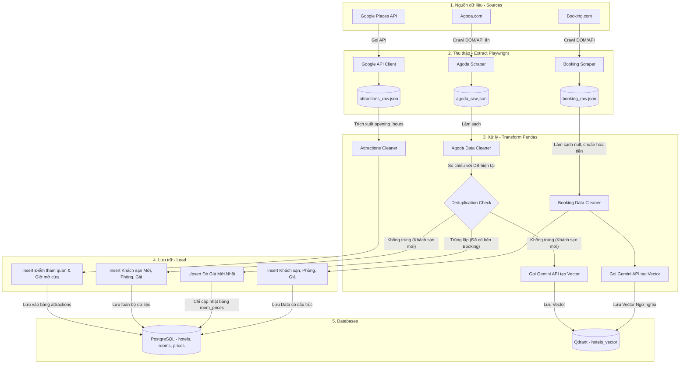

# V-OTA AI Chat: Data Pipeline Architecture

Sơ đồ dưới đây mô tả chi tiết luồng dữ liệu (ETL: Extract - Transform - Load) từ 2 nguồn OTA (Booking và Agoda) đi vào hệ thống cơ sở dữ liệu của chúng ta.

## Giải thích Luồng (Flow Details):
1. **Extract:** Sử dụng Python Playwright để vượt qua anti-bot cơ bản, trích xuất dữ liệu ra file JSON tạm thời.
2. **Transform (Booking - Core):** Data của Booking được xem là luồng chính. Sau khi làm sạch, nó sẽ được gọi qua Gemini API để lấy Vector nhúng (Embedding) cho mô tả khách sạn.
3. **Transform (Agoda - Deduplication):** Sơ đồ trên mô tả kiến trúc mục tiêu dài hạn. **Trạng thái triển khai thực tế (M1, xem `hotel_pipeline.py`) khác với sơ đồ ở bước này:** một khách sạn vật lý xuất hiện trên cả Agoda và Booking hiện được nạp thành **2 dòng `hotels` riêng biệt** (không upsert-đè giá vào 1 dòng), vì giá/chính sách mỗi OTA khác nhau và chatbot cần so sánh cả hai. Việc nhóm khách sạn vật lý trùng lặp liên-OTA cho mục đích AI/RAG (không gộp dòng DB) được tính riêng trong bước Normalize/Dedupe và lưu ở `hotel_identity_groups`/`hotel_identity_members` — xem `docs/data_dictionary.md` §1.4a/1.4b và `plans/260724-0925-hotel-normalize-dedupe-for-vector-rag/`.
4. **Transform (Attractions - Google API):** Luồng này gọi API chính thống của Google Places để lấy tên, hình ảnh và đặc biệt là `opening_hours` (Giờ mở cửa) của các điểm tham quan để phục vụ tính năng xếp lịch trình. (Chỉ áp dụng cho bản PoC).
5. **Databases:** Đích đến cuối cùng được tách bạch rõ ràng giữa PostgreSQL (chuyên filter bằng SQL) và Qdrant (chuyên tìm kiếm ngữ nghĩa).

---

## Ràng buộc Pháp lý & Khả thi (Legal & Feasibility Risks)

> [!WARNING]
> Theo đánh giá tại `legal_risk_assessment.md`, Data Pipeline trên chỉ khả thi cho **Môi trường Thử nghiệm (PoC)** với quy mô nhỏ (cỡ vài trăm khách sạn). Việc cào dữ liệu (scraping) thương mại vi phạm ToS của OTA.

Để tránh bị block IP và giảm thiểu rủi ro pháp lý, Pipeline thu thập này cần được cấu hình tuân thủ các quy tắc sau:
*   **Tuân thủ robots.txt:** Code Scraper KHÔNG BAO GIỜ được nhắm vào các endpoints nằm trong danh sách cấm như `/book`, `/checkout`, `/anysearch`. Chỉ đọc các trang tĩnh (chi tiết khách sạn).
*   **Rate Limiting:** Sử dụng Proxy luân phiên (Rotating Proxies) và cấu hình `time.sleep()` lớn (3-5 giây) giữa các requests của Playwright để tránh gây DDoS lên server của OTA.
*   **Không thu thập Review:** Bỏ qua toàn bộ nội dung Đánh giá (Reviews) của người dùng vì nội dung này được bảo vệ bản quyền gắt gao nhất.
*   **Chuyển đổi khi Production:** Sơ đồ này chỉ dùng cho PoC. Khi lên Production, khối *2. Thu thập* sẽ phải được đập bỏ và thay thế bằng việc kết nối API hợp pháp thông qua Affiliate Partnership với OTA.
