# AI Travel Chatbot - Entity Relationship Diagram (ERD)

Bản đồ thực thể liên kết (ERD) dưới đây thể hiện kiến trúc dữ liệu của các bảng trong
PostgreSQL. Nguồn chuẩn: [`backend/scripts/database_schema.sql`](../../backend/scripts/database_schema.sql)
+ `backend/scripts/migrations/`.

**Số bảng ứng dụng: 17** — `destinations`, `hotels`, `rooms`, `room_prices`,
`hotel_identity_groups`, `hotel_identity_members`, `attractions`, `tours`, `events`,
`sessions`, `chat_messages`, `itineraries`, `itinerary_items`, `bookings`, `payments`,
`amenity_catalog`, `admin_audit_log`. `auth.users` do Supabase Auth quản lý (ngoài 17 bảng này).
Sơ đồ dưới tập trung các cột chính; xem `database_schema.sql` cho danh sách đầy đủ.

**Cập nhật (plan `260814-supabase-auth-and-per-user-history`):** `sessions.user_id` tham
chiếu `auth.users.id` — bảng do Supabase Auth tự quản lý, không nằm trong 10 bảng ứng dụng
kể trên nên không có block riêng trong sơ đồ dưới đây. Mọi visitor (kể cả khách chưa đăng
nhập, qua Supabase Anonymous Auth) đều có một `auth.users` row thật, nên cột này về lý thuyết
luôn có giá trị cho session mới; vẫn để nullable để không phá session cũ tạo trước migration
này hoặc tạo ngoài HTTP API (CLI). Chi tiết ngữ nghĩa phân quyền: `docs/chat_api_contract.md`
§Authentication.

```mermaid
erDiagram
    destinations {
        UUID id PK
        VARCHAR name
        VARCHAR region
        VARCHAR coordinates
        TEXT description
        TIMESTAMP created_at
        TIMESTAMP updated_at
    }
    
    hotels {
        UUID id PK
        UUID destination_id FK
        VARCHAR source_platform
        BIGINT source_hotel_id
        TEXT source_url
        VARCHAR name
        VARCHAR accommodation_type
        TEXT description
        DECIMAL star_rating
        VARCHAR address
        VARCHAR city
        VARCHAR area_name
        VARCHAR country
        VARCHAR location_highlight
        VARCHAR coordinates
        TEXT_ARRAY amenities
        JSONB amenity_groups
        TEXT_ARRAY highlights
        TEXT_ARRAY awards
        TEXT_ARRAY warnings
        DECIMAL review_score
        INT review_count
        VARCHAR review_text
        JSONB category_scores
        JSONB score_distribution
        VARCHAR check_in_time
        VARCHAR check_in_until
        VARCHAR check_out_time
        VARCHAR reception_open_until
        TEXT image_url
        TEXT_ARRAY images
        INT image_count
        JSONB nearby_attractions
        JSONB nearby_essentials
        DECIMAL lowest_price
        VARCHAR currency
        DATE price_check_in_date
        DATE price_check_out_date
        BOOLEAN rooms_available
        SMALLINT offer_count
        TIMESTAMP scraped_at
        TIMESTAMP created_at
        TIMESTAMP updated_at
    }
    
    rooms {
        UUID id PK
        UUID hotel_id FK
        BIGINT source_room_id
        VARCHAR name
        TEXT bed_description
        DECIMAL room_size_sqm
        VARCHAR max_occupancy_raw
        SMALLINT max_guests
        VARCHAR view
        TEXT_ARRAY room_facilities
        JSONB amenity_groups
        TEXT_ARRAY images
        INT image_count
        TIMESTAMP created_at
        TIMESTAMP updated_at
    }
    
    room_prices {
        UUID id PK
        UUID room_id FK
        DECIMAL price
        VARCHAR currency
        DATE check_in_date
        DATE check_out_date
        BOOLEAN sold_out
        BOOLEAN crossed_out
        DECIMAL review_score
        VARCHAR review_text
        TEXT source_url
        TIMESTAMP crawled_at
    }
    
    attractions {
        UUID id PK
        UUID destination_id FK
        VARCHAR name
        VARCHAR category
        BOOLEAN is_tour
        SMALLINT estimated_duration_minutes
        TIME opening_time
        TIME closing_time
        TEXT departure_schedule
        DECIMAL ticket_price_adult
        DECIMAL ticket_price_child
        DECIMAL rating
        INT review_count
        VARCHAR coordinates
        TEXT_ARRAY images
        TIMESTAMP created_at
        TIMESTAMP updated_at
    }
    
    events {
        UUID id PK
        UUID destination_id FK
        UUID attraction_id FK "nullable"
        VARCHAR name
        TEXT description
        TIMESTAMP start_date
        TIMESTAMP end_date
        TEXT_ARRAY images
        TIMESTAMP created_at
        TIMESTAMP updated_at
    }
    
    sessions {
        VARCHAR session_id PK
        JSONB context_data
        UUID user_id FK "auth.users.id — nullable, plan 260814"
        TIMESTAMP created_at
        TIMESTAMP updated_at
    }
    
    chat_messages {
        UUID id PK
        VARCHAR session_id FK
        VARCHAR sender_type
        TEXT message_content
        TIMESTAMP created_at
    }
    
    itineraries {
        UUID id PK
        VARCHAR session_id FK
        SMALLINT duration_days
        SMALLINT number_of_adults
        SMALLINT number_of_children
        DECIMAL budget
        TEXT_ARRAY preferences
        JSONB day_themes
        VARCHAR status "Draft | Finalized"
        UUID destination_id FK
        UUID hotel_id FK
        TEXT summary
        UUID parent_itinerary_id FK "reuse lineage"
        UUID reuse_root_id FK "reuse lineage root"
        INTEGER reuse_count
        VECTOR embedding "1024-dim BGE-M3, finalized only"
        TIMESTAMP created_at
        TIMESTAMP updated_at
    }
    
    itinerary_items {
        UUID id PK
        UUID itinerary_id FK
        SMALLINT day_number
        SMALLINT order_index
        TIME start_time
        TIME end_time
        VARCHAR reference_type "Hotel/Attraction/Event"
        UUID reference_id "Polymorphic"
        DECIMAL estimated_cost
        VARCHAR item_kind "breakfast/attraction/lunch/rest/coffee/dinner/evening"
        TIMESTAMP created_at
        TIMESTAMP updated_at
    }

    hotel_identity_groups {
        UUID id PK
        UUID canonical_hotel_id FK "hotels row đại diện"
        VARCHAR display_name
        VARCHAR review_status "auto_approved|pending_review|rejected"
        DECIMAL confidence
        TIMESTAMP created_at
        TIMESTAMP updated_at
    }

    hotel_identity_members {
        UUID id PK
        UUID group_id FK
        UUID hotel_id FK "UNIQUE — mỗi hotels row thuộc tối đa 1 nhóm"
        DECIMAL pair_confidence
        TIMESTAMP created_at
    }

    tours {
        UUID id PK
        UUID destination_id FK
        VARCHAR source_platform
        VARCHAR source_id "STRING, không phải BIGINT"
        VARCHAR name
        VARCHAR category
        SMALLINT duration_minutes
        DECIMAL price
        VARCHAR currency "thường USD"
        DECIMAL rating
        INT review_count
        BOOLEAN is_bookable
        TEXT_ARRAY whats_included
        JSONB itinerary_details
        TIMESTAMP scraped_at
        TIMESTAMP created_at
        TIMESTAMP updated_at
    }

    bookings {
        UUID id PK
        TEXT temporary_user_ref "định danh khách vãng lai"
        VARCHAR session_id FK "nullable"
        UUID room_id FK
        DATE check_in_date
        DATE check_out_date
        INTEGER room_count
        TEXT status "PENDING|RESERVED|CONFIRMED|CANCELLED|EXPIRED"
        TIMESTAMPTZ expires_at "hold TTL; NULL khi CONFIRMED"
        NUMERIC total_amount
        VARCHAR currency
        TIMESTAMPTZ created_at
        TIMESTAMPTZ updated_at
    }

    payments {
        UUID id PK
        TEXT temporary_user_ref
        UUID_ARRAY booking_ids "1..N booking trong 1 lần thanh toán"
        NUMERIC amount
        VARCHAR currency "VND"
        TEXT status "PENDING|PAID|FAILED|CANCELLED"
        TEXT guest_name
        TEXT guest_email
        TEXT guest_phone
        TEXT vnp_transaction_no
        TEXT vnp_response_code
        TIMESTAMPTZ paid_at
        TIMESTAMPTZ created_at
        TIMESTAMPTZ updated_at
    }

    amenity_catalog {
        TEXT id PK "slug ^[a-z0-9_]{1,64}$"
        TEXT label_vi
        TEXT label_en
        TEXT scope "hotel|room|both"
        TEXT category "14 giá trị enum"
        TEXT icon_key
        TEXT_ARRAY match_keywords
        BOOLEAN is_approved
        TIMESTAMPTZ created_at
        TIMESTAMPTZ updated_at
    }

    admin_audit_log {
        UUID id PK
        UUID actor_id
        TEXT actor_email
        TEXT action
        TEXT entity_type
        TEXT entity_id
        JSONB before
        JSONB after
        TIMESTAMPTZ created_at
    }

    %% Quan hệ Địa lý & Điểm đến
    destinations ||--o{ hotels : "có các Khách sạn"
    destinations ||--o{ attractions : "có Điểm tham quan/Nhà hàng"
    destinations ||--o{ tours : "có các Tour"
    destinations ||--o{ events : "tổ chức Sự kiện"
    
    %% Quan hệ Khách sạn
    hotels ||--o{ rooms : "có các Hạng phòng"
    rooms ||--o{ room_prices : "có các Gói giá theo ngày"
    
    %% Nhóm khách sạn vật lý trùng lặp liên-OTA (không gộp dòng hotels)
    hotel_identity_groups ||--o{ hotel_identity_members : "gồm các dòng hotels"
    hotels ||--o| hotel_identity_members : "thuộc tối đa 1 nhóm"
    
    %% Quan hệ Điểm tham quan - Sự kiện
    attractions |o--o{ events : "là địa điểm tổ chức (Tùy chọn)"
    
    %% Quan hệ AI Chat & Lịch trình
    sessions ||--o{ chat_messages : "lưu Lịch sử Chat"
    sessions ||--o{ itineraries : "sinh ra Lịch trình"
    sessions |o--o{ bookings : "phiên tạo hold (nullable)"
    
    %% Quan hệ Chi tiết Lịch trình
    itineraries ||--o{ itinerary_items : "chứa các Hoạt động"
    itineraries |o--o| itineraries : "parent/reuse lineage"
    
    %% Đặt phòng & Thanh toán
    rooms ||--o{ bookings : "được giữ chỗ / đặt"
    payments }o--o{ bookings : "booking_ids[] — 1 thanh toán cho N booking"
    
    %% Mối quan hệ Đa hình (Polymorphic) - Nét đứt (---) thể hiện Logical Link
    itinerary_items }o..o| hotels : "Có thể trỏ tới"
    itinerary_items }o..o| attractions : "Có thể trỏ tới"
    itinerary_items }o..o| events : "Có thể trỏ tới"
```

