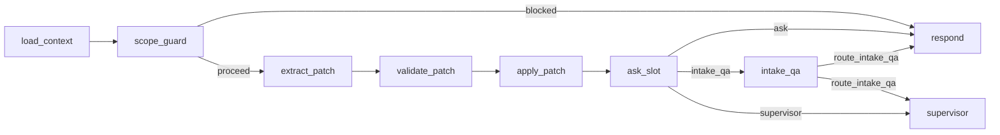
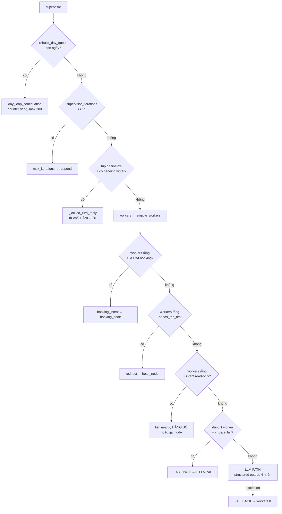
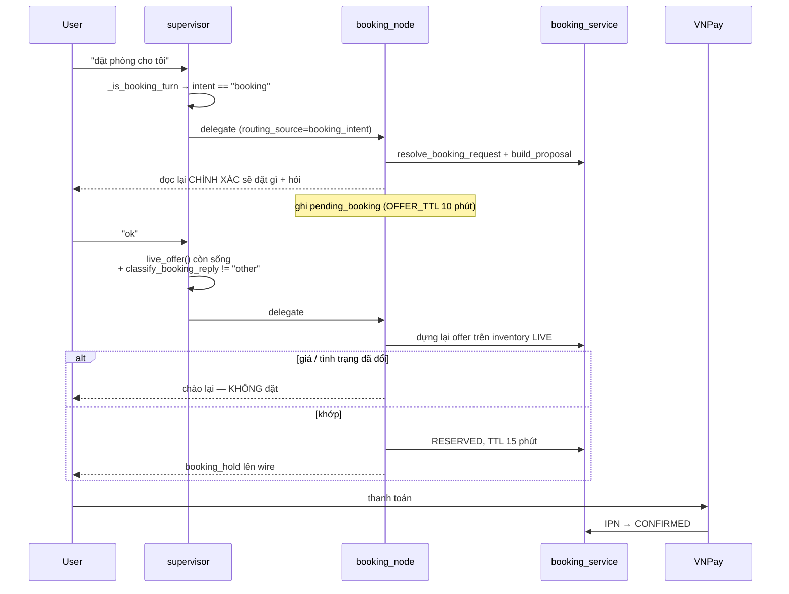
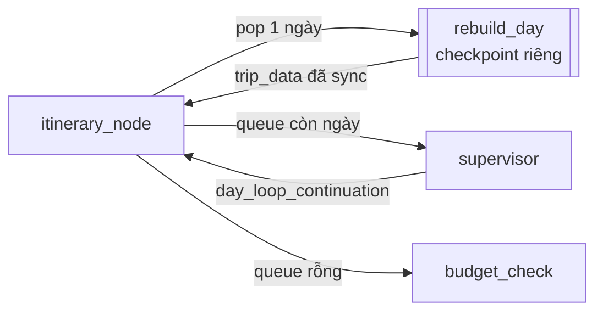

# LangGraph Orchestrator — Chi tiết

> Phần chi tiết của [`langgraph_orchestrator_vi.md`](langgraph_orchestrator_vi.md) (sơ đồ
> tổng thể, state/checkpointer, bảng tra cứu nhanh). Đánh số Phần giữ nguyên giữa hai file.

| Phần | Nội dung |
|---|---|
| [3](#phần-3--patch-pipeline) | Patch pipeline — 6 node, chạy mọi lượt |
| [4](#phần-4--supervisor--delegation) | Supervisor & delegation |
| [5](#phần-5--worker-nodes) | Worker nodes |
| [6](#phần-6--subgraph--hai-kiểu-cô-lập) | Subgraph — hai kiểu cô lập |
| [7](#phần-7--node-contracts) | Node contracts |
| [8](#phần-8--respond--assembler) | `respond` — assembler |
| [9](#phần-9--interrupt--resume) | `interrupt()` & resume |
| [10](#phần-10--streaming--phase-facts) | Streaming & phase facts |

---

## Phần 3 — Patch pipeline



### 3.0 Vì sao patch commit **TRƯỚC** cổng hỏi slot

Thứ tự `extract → validate → apply → ask` là **load-bearing**.

Đảo ngược (hỏi trước, commit sau) tạo ra **cả một lớp deadlock**: câu hỏi đang treo về
slot A chặn mất fact người dùng vừa tự nguyện cung cấp về slot B. Người dùng trả lời một
câu hỏi đã được trả lời, câu trả lời bị vứt vì có câu hỏi khác đang treo, hội thoại
không nhúc nhích.

Commit trước còn làm **câu ghép hoạt động by construction**:
*"đi Đà Nẵng 3 ngày 2 người ngân sách 3 triệu"* set 4 slot trong 1 patch, `ask_slot`
không còn gì để hỏi.

### 3.1 `load_context`

Edge duy nhất từ `START`. **Không** fetch gì từ Supabase hay session store — checkpointer
đã restore mọi field lượt trước ghi, keyed theo `thread_id`. Việc của nó chỉ là:

1. Reset field turn-scoped.
2. Default field chưa tồn tại lần đầu thread được invoke.

### 3.2 `scope_guard`

Hai control ở cùng một node, **chỉ một cái đã ship**:

- `detect_jailbreak` (`guardrails/jailbreak.py`) — **thật**, gated bởi
  `JAILBREAK_GUARD_MODE`. Node tôn trọng đúng setting đó; nếu không, graph sẽ âm thầm bỏ
  một control mà operator tin là đang bật.
- Out-of-scope refusal (Phase 2, `guardrails/scope.py`) — **chưa từng được xây** dù plan
  doc đã đánh dấu done. Hiện là pass-through.

Chặn xảy ra **trước mọi LLM call**. `route_scope_guard` đưa thẳng về `respond` — không
chạm tool, không chạm model.

### 3.3 `extract_patch` — LLM call thứ nhất

Một call duy nhất trả `{intent, changes[], reason}`, thay cho **ba** call trích xuất
riêng biệt của plane cũ (`_llm_extract_intake_facts`, `TripPreferenceUpdate.from_message`,
`plan_trip_edit`).

**`intent` KHÔNG chọn worker.** Việc chọn worker là `detect_impact` + `WORKFLOW_TO_WORKER`
làm, dựa trên patch **đã được validate**. `intent` chỉ tách "câu hỏi read-only" khỏi "lượt
thay đổi state" trên đúng **một** routing edge (`route_ask_slot`).

**Parse phòng thủ:** strict JSON parse → structural validate → retry **một** lần kèm lý do
bị từ chối. Fallback **không bao giờ raise**: `{"patch": [], "intent": "general_question"}`
để lượt vẫn hoàn tất y như mọi patch rỗng khác.

`reason` được parse **không strict** (khác `intent`/`changes`): nó là enhancement trên
fallback shape đó, không thuộc tính đúng đắn của lượt → thiếu key / null / không nhận
diện được đều fail-open về `""` thay vì tiêu mất lần retry.

**Node tự grounding hai thứ mà validator không kiểm:**
- `destination` đối chiếu bảng destinations thật (`_match_known_destination`)
- Tập nhãn đóng cho `preferences.themes` / `.companions` / `.pace` / `.day_rhythm`

**Prompt chỉ thấy đúng một tin nhắn, không bao giờ thấy transcript.** Context xuyên lượt
duy nhất là tên các slot đang treo (`_pending_slots`) — đó là thứ khiến trả lời cụt
("Hồ Chí Minh", "1", "20/7") vẫn hiểu được mà không phải trả tiền cho history vô hạn mỗi
lượt.

**Day-scope là xác định, không do model quyết:** `_resolve_day_scope`/`_rewrite_day_scope`
ép mọi change hình dạng theme về `daily_preferences.<day>.theme` khi tin nhắn nêu ngày —
gỡ đúng cái va chạm prompt giữa "theme của ngày" và "vibe chung" mà
`trip_edit_planner.py` từng có.

### 3.4 `validate_patch`

Tính ra việc áp `state["patch"]` **sẽ** tạo ra gì mà **không** commit: kết quả nằm ở
`proposed_travel_state`. `apply_patch` là node **duy nhất** ghi `travel_state`.

**Reject chứ không coerce.**

Trước đây node này có `interrupt()` cho ngày tháng nhập nhằng ("1-2"). Giờ
`_resolve_numeric_date` luôn ưu tiên cách đọc DD-MM (Việt Nam) nên không còn ca nhập
nhằng — `interrupt()` vẫn là hạ tầng thật, chỉ là dùng ở chỗ khác (`hotel_node`).

### 3.5 `apply_patch`

1. Commit `proposed_travel_state` vào `travel_state`.
2. **Gieo hàng đợi delegation**: từ `impacted_workflows` → worker, sắp theo `WORKER_ORDER`,
   khử trùng lặp (`itinerary` và `itinerary_day` cùng map về `itinerary_node`).
3. Ghi audit record cho mọi change applied/rejected vào
   `sessions.context_data["state_audit"]` — **best-effort, không bao giờ raise**; DB chết
   không được làm hỏng lượt chat.

`pending_tasks` được gieo **một lần** ở đây mỗi lượt; mỗi worker **tự pop chính mình** khi
báo cáo kết quả. Nhờ vậy worker đã xong không bao giờ bị delegate lại, dù
`impacted_workflows` không hề co lại.

### 3.6 `ask_slot`

**Writer duy nhất** của `missing_slots` và `next_question`.

Render ở đây chứ không ở `domain/slot_registry.py`: render cần
`format_guided_question`/`t()` (tầng services), mà một render callable ở tầng domain sẽ
phá test purity của Phase 3. `SlotSpec.prompt_key` nói **hỏi câu nào**; `_render_question`
nói **hỏi như thế nào**.

`route_ask_slot` — 3 nhánh, thứ tự quan trọng:

```python
def route_ask_slot(state):
    if not state.get("missing_slots"):
        return "intake_qa" if is_incomplete_edit(state) else "supervisor"
    if is_intake_question(state):
        return "intake_qa"
    return "ask"
```

Check `missing_slots` **luôn đứng trước**, giữ `ask_slot` là chủ sở hữu duy nhất của cổng
intake.

Nhánh `"ask"` đi qua `respond` chứ **không** thẳng `END` — vì chỉ `respond` dựng đúng shape
`PlannerChatResponse` đã bị đóng băng.

### 3.7 `intake_qa` — van thoát read-only, hai lối vào

| Lối vào | Điều kiện | Vấn đề nó giải |
|---|---|---|
| **Giữa intake** | `missing_slots` còn + `is_intake_question` | Câu hỏi thật ("Đà Nẵng tháng 7 mưa không?") từng bị hỏi lại slot đang treo kèm tiền tố "tôi chưa hiểu" thay vì được trả lời |
| **Sau intake** | `missing_slots` rỗng + `is_incomplete_edit` | Tin nhắn nêu đối tượng sửa nhưng không nêu giá trị ("đổi khách sạn") → hỏi đúng một giá trị đó thay vì commit rỗng |

`is_incomplete_edit` có **3 lớp chặn** để không kích hoạt nhầm lên một lượt vốn đã chạy tốt:

1. **Cấu trúc**: chỉ `update_itinerary` / `update_trip` đủ điều kiện. `hotel_search` /
   `select_hotel` / `finalize` có ngữ nghĩa patch-rỗng hợp lệ sẵn → loại trừ ngay từ đầu,
   nên hành vi của chúng không bao giờ phụ thuộc vào việc `patch_reason` được gán đúng.
2. **Chính hàm đó**: `patch_reason == "missing_value"` — lời khai của **chính extractor**,
   không phải suy diễn về sau. `""` là giá trị fail-open.
3. **Hạ nguồn**: lưới an toàn `route_intake_qa` cho ca declined/failed.

`pending_tasks` (không phải `applied_changes`) là tín hiệu "sẽ có worker nói thay":
`selected_hotel_id` gieo `hotel_node` với **0** applied change, mà lượt đó đã có reply
đang đến.

**Node này tuyệt đối read-only** — chạy sau `apply_patch`, nên một lệnh ghi ở đây sẽ
**bypass hoàn toàn `validate_patch`**. Nó cũng không bao giờ tự hỏi slot; `ask_slot` giữ
độc quyền `next_question`, và prompt được cho biết trước câu hỏi đó để không hỏi trùng.

Nó **không** tái dùng `qa_node`: subgraph đó chỉ chia sẻ channel `messages` nên không đọc
được `travel_state`, không thể biết slot nào đang treo. Tool của nó cũng sai cho intake —
chưa có gì được tìm kiếm cả.

`route_intake_qa` — "không có câu trả lời" mang nghĩa khác nhau ở hai lối vào:

```python
if state.get("missing_slots"):
    return "respond"                                    # câu hỏi treo vẫn phải đi ra
return "respond" if state.get("intake_answer") else "supervisor"
```

Sau intake, answer rỗng mà về `respond` sẽ khiến `_compose(None, None) is None`, không
worker nào chạy, lượt kết thúc ở nhánh ack-chung-chung log ERROR. `supervisor` là nơi lượt
đó **vốn dĩ** sẽ tới nếu không có tính năng này — vừa an toàn vừa trung thực.

---

## Phần 4 — Supervisor & delegation

### 4.0 Ranh giới

> `supervisor` **chỉ delegate**, không bao giờ đếm completion. "Đã xong hết chưa?" là
> `all_tasks_done` — predicate Python thuần trên conditional edge.

```python
def all_tasks_done(state) -> bool:
    return not state.get("pending_tasks")
```

`route_supervisor` chỉ **đọc lại** quyết định node đã ghi, không tự quyết:

```python
def route_supervisor(state) -> str:
    return state.get("next_worker") or "respond"
```

### 4.1 Thứ tự thi hành trong `supervisor`



### 4.2 Ba đường chính

| Đường | Khi nào | Chi phí |
|---|---|---|
| **Fast path** | Đúng 1 worker khả dĩ, chưa worker nào fail lượt này | **0 LLM call** — `WORKER_ORDER` đã cố định thứ tự sẵn. ~90% lượt |
| **LLM path** | Lượt đụng nhiều workflow, hoặc recovery sau khi worker fail | 1 structured-output call, tập nhãn **đóng** 4 worker |
| **Fallback** | Bất kỳ exception nào (kể cả đề xuất bất khả thi) | `workers[0]`, hoặc `respond` nếu hết |

### 4.3 Các nhánh xác định chèn TRƯỚC LLM path

Mỗi nhánh dưới đây tồn tại vì một sự cố cụ thể.

#### `day_loop_continuation` — counter riêng

`rebuild_day_queue` chưa rỗng nghĩa là `itinerary_node` đang rút hàng đợi nhiều ngày. Đây
là pop hàng đợi cơ học do chính node điều khiển, **không phải** supervisor chọn worker.

```python
MAX_SUPERVISOR_ITERATIONS = 5     # chặn delegation chạy loạn
MAX_DAY_REBUILD_HOPS = 100        # chặn day-loop chạy loạn
```

> Dùng chung một ngân sách 5 call đã **âm thầm cắt cụt mọi lịch trình dài hơn ~5 ngày**
> (review finding F3). Khi vượt hop, node **nói thật** ("đã xây N ngày, còn M ngày chưa
> hoàn tất") thay vì rơi vào ack "đã cập nhật" của `respond` trong khi ngày vẫn thiếu —
> đúng cái lỗi "thông báo thành công, dữ liệu sai" mà bailout này từng gây ra âm thầm.

#### `trip_finalized` — từ chối bằng lời, không bằng `_IMPOSSIBLE`

Kiểm **trước** `_eligible_workers`, vì đánh dấu một worker impossible chỉ **xoá** nó khỏi
tập eligible → không ai điền `task_results` → `respond` rơi vào ack chung chung cho một
lượt chẳng làm gì.

#### `booking_intent` — vì node này tiêu tiền thật

```python
if not workers and _is_booking_turn(state) and not is_impossible("booking_node", state):
    return _delegate("booking_node", "booking_intent", state)
```

Gate `not workers` là cố ý: một lượt **cũng** sửa chuyến đi (patch đụng
hotel/itinerary_node) phải đi làm việc đó trước. `booking_node` chỉ pop **chính nó** khỏi
`pending_tasks`, nên chen hàng ở đây sẽ để lại một worker thật sự đang treo không chạy và
quay vòng tới trần iteration. Đó cũng là cách đọc trung thực: một tin nhắn sửa kế hoạch
**không phải** lời xác nhận cho offer chào trên kế hoạch cũ.

#### `needs_trip_first` — chuyển hướng, không từ chối

Xin lịch trình khi chưa có chuyến **không phải ngõ cụt**, mà là yêu cầu bước trước đó.

```python
if not workers and needs_trip_first(state):
    if _has_reported(state, "hotel_node"):
        return _awaiting_hotel_choice(state)      # đã search rồi → chờ user chọn
    return _redirect_to_hotel_node(state)         # chuyển giao slot đang treo
```

Nó **chuyển giao** slot đang treo chứ không cộng thêm: `all_tasks_done` là
`not pending_tasks` và `hotel_node` chỉ pop chính nó, nên để `itinerary_node` treo lại sẽ
quay vòng tới trần iteration.

Hẹp có chủ ý: thiếu **destination** là việc của `ask_slot`; chuyển hướng lượt đó chỉ tạo
ra reply phòng thủ "không có điểm đến" của chính `hotel_node`.

#### `read_only_intent_nearby` — action là HẰNG SỐ

```python
if not workers and state.get("intent") == _READ_ONLY_INTENT:
    # list_nearby là action DUY NHẤT của itinerary_node không ghi gì
```

> **Sự cố day-recap.** Với `workers` rỗng, lượt rơi xuống nhánh LLM — vốn *không bị ràng
> buộc chính vì* hàng đợi rỗng — và lựa chọn không ràng buộc thì bao gồm cả
> `itinerary_node`. Hỏi *"ngày 3 tôi làm gì?"* do đó đã **xây lại cả kế hoạch sau lưng
> người dùng**: điểm tham quan ngày 1 âm thầm đổi từ Bãi biển Mỹ Khê sang Đức Maria Mẹ
> Sao Biển, và không câu nào trong reply nói rằng chuyến đi vừa bị tái sinh. Extractor
> **vô tội** — nó trả `general_question` với patch rỗng, hoàn toàn đúng — nên không lượng
> prompt engineering nào ở thượng nguồn ngăn được.

Action là **hằng số** ở đây, không bao giờ là lựa chọn của model. Không có lựa chọn nào
được đưa ra thì không có đường nào từ lượt read-only tới `rebuild_days` để model đi nhầm.
`radius_km` cố ý bỏ trống — `itinerary_node._resolve_radius_km` tự đọc lại từ lời người
dùng một cách xác định.

`list_nearby` cũng là đường **duy nhất** đặt được địa điểm lên bản đồ: tool của `qa_node`
chỉ chạm tới `messages`, nên `suggested_places` là **bất khả đạt về mặt cấu trúc** từ đó.

### 4.4 `_IMPOSSIBLE` — guard khả thi, không phải guard nhãn

> Structured output đảm bảo nhãn **hợp lệ**, không đảm bảo hành động **khả thi**.

```python
_IMPOSSIBLE = {
    "itinerary_node": lambda s: _no_destination(s) or requires_existing_trip(s),
    "booking_node":   nothing_to_book,
}
```

| Guard | Ý nghĩa |
|---|---|
| `_no_destination` | Không worker nào hành động được trên chuyến không có điểm đến. `ask_slot` chặn từ lâu trước đó; đây là backstop cho các đường bỏ qua nó |
| `requires_existing_trip` | `itinerary_node` là **editor**, không phải builder |
| `nothing_to_book` | Cần `trip_data.hotel.id` **hoặc** card đang hiển thị (`shown_hotel_options`). Cố ý **không** kiểm `destination`: lượt booking không đổi fact chuyến đi nào |

**Vì sao `requires_existing_trip` tồn tại:** một tin nhắn set destination/dates/people/
preferences cùng lúc (lượt intake đầu tiên rất phổ biến) đụng **cả hai** workflow
`hotel` và `itinerary`, nên `itinerary_node` trông "khả thi" thuần từ `destination` và trở
thành một cú tung đồng xu của supervisor LLM. Bug đã báo cáo: LLM đôi khi chọn
`itinerary_node` trước, node bail ngay vì chẳng có gì để làm, người dùng phải gửi lại y
nguyên tin nhắn đó.

### 4.5 `WORKER_ORDER` và đường DUY NHẤT tạo ra chuyến đi

```python
WORKER_ORDER = ("hotel_node", "itinerary_node", "booking_node", "qa_node")
```

```
intake xong → hotel_node search → user CHỌN khách sạn
                                        │
                                        ▼
                    build_selected_hotel_trip tạo TOÀN BỘ chuyến
                    (khách sạn + cả lịch trình xếp quanh nó)
                                        │
                                        ▼
                    itinerary_node từ đây chỉ SỬA
                    (rebuild_days · edit_item · lock_days)
```

Đây là ràng buộc **nhân quả**, không tuỳ tiện: lịch trình được xếp quanh vị trí khách sạn
(khoảng cách, phân cụm, khung giờ ăn), nên không thể xếp trước. `WORKER_ORDER` đặt
`hotel_node` trước `itinerary_node` vì đúng lý do đó — xây lại lịch trước khi đổi khách
sạn là xếp quanh một khách sạn sắp bị thay.

Nhánh `selected_hotel_id` của `hotel_node` là writer **duy nhất tạo ra** `trip_data`.
`itinerary_node`, `budget_check`, subgraph `rebuild_day` đều chỉ sửa một chuyến đã tồn tại.

> **Đường tạo chuyến thứ hai đã được cân nhắc và bác bỏ:** để `itinerary_node` tự dựng
> chuyến quanh khách sạn top-1. Nó lấy mất quyền chọn của người dùng (sản phẩm cố ý đưa ra
> `hotel_options`), nhân bản `build_selected_hotel_trip`, và tạo writer thứ hai cho
> `trip_data`. Chỉ mở lại nếu sản phẩm quyết định muốn chế độ "chọn đại giúp tôi".

---

## Phần 5 — Worker nodes

### 5.1 `hotel_node`

Chạy sau `apply_patch` nên `travel_state` đã có fact của lượt này. Đọc
`hotel_preferences.*` và gọi `select_hotel_candidates` với chúng làm **hard filter cấp
ứng dụng** — không bao giờ là soft bonus mà `rank_hotel_candidates` vẫn áp cho những gì
*không* được yêu cầu làm hard filter.

Là node **thứ hai** được phép gọi `interrupt()` (xem [Phần 9](#phần-9--interrupt--resume)).

Reply mang số được sinh bằng template xác định: `_binding_constraint_reply` đếm chính xác
mỗi filter đã **loại** bao nhiêu khách sạn.

### 5.2 `itinerary_node`

Bốn action, đọc từ `task_description` (JSON string do supervisor set):

| Action | Ghi? | Làm gì |
|---|---|---|
| `rebuild_days` | có | Xác định tập ngày ảnh hưởng → trừ `locked_days` → nạp `rebuild_day_queue` → pop 1 ngày → gọi subgraph `rebuild_day` |
| `edit_item` | có | `plan_trip_edit` (planner 9 operation) → `apply_trip_edit_plan` |
| `lock_days` | có | Ghi ngày vào `planning_constraints.locked_days` |
| `list_nearby` | **không** | Tìm địa điểm quanh khách sạn, chỉ trả danh sách |

`build_itinerary` chỉ còn tồn tại như **alias lịch sử** của `rebuild_days` (thread
checkpointer cũ vẫn có thể mang nó) và **chưa từng** xây gì từ đầu.

**Vòng lặp là conditional edge, không phải `for` Python** — xem
[Phần 6](#phần-6--subgraph--hai-kiểu-cô-lập).

`route_after_itinerary_node` — 3 đích:

```python
if not all_tasks_done(state):                       return "supervisor"
if state.get("routing_source") == "read_only_intent_nearby": return "respond"
return "budget_check"
```

Lượt `list_nearby` phải né `budget_check` vì node đó **re-plan bất cứ khi nào
`budget.trip_total` được set**, bất kể lượt này có ghi gì không: nó vừa âm thầm sửa kế
hoạch, vừa ghi đè `task_results[-1]` — đúng chỗ `suggested_places_from_task_results` đọc
những pin mà lượt này sinh ra để làm.

### 5.3 `booking_node` — 2 lượt, không bao giờ 1



**Ba lớp kiểm tra độc lập** giữa một tin nhắn và một khoản tiền, theo thứ tự, để không
điểm hỏng đơn lẻ nào là đủ:

1. **Routing** (`supervisor._is_booking_turn`) — không có offer đang sống thì node này chỉ
   tới được bằng `intent == "booking"` tường minh. Một chữ "ok" vu vơ **không bao giờ tới
   đây**.
2. **Classification** (`classify_booking_reply`) — bảng xác định, mặc định `other`, không
   phải model đọc giọng điệu. Verdict `other` được kiểm ở **supervisor** chứ không chỉ
   trong node — để *"thời tiết Đà Nẵng thế nào?"* lỡ rơi vào lúc có offer treo vẫn giữ
   đường bình thường tới `qa_node`, thay vì bị nuốt vào một lượt booking rồi từ chối.
3. **Data** (`_handle_confirm`) — dựng lại offer trên inventory **live** trước khi giữ
   chỗ. Giá hoặc tình trạng đổi kể từ lúc người dùng đọc → **chào lại**, không đặt. RPC là
   trọng tài cuối về việc có giữ được phòng không, nhưng **câu mà người dùng đã đồng ý
   không được phép sai**.

`OFFER_TTL_MINUTES = 10` — ngắn hơn TTL 15 phút của chính reservation, vì chưa giữ gì cả;
nó chỉ giới hạn một chữ "ok" sau đó còn tham chiếu ngược lại được bao lâu.

> `booking_node` **không bao giờ** gọi `confirm_booking`: `CONFIRMED` nghĩa là **đã trả
> tiền**, và thứ duy nhất được phép khẳng định điều đó là IPN của VNPay.

Nó ghi `pending_booking`/`booking_hold` **ngoài** `travel_state` để contract `writes` rỗng
của nó vẫn đúng: một lượt booking đổi *cái khách đã đặt*, không đổi *chuyến đi là gì*.

Edge đi thẳng `respond`, **bỏ qua `budget_check`** — cùng lý do `route_after_itinerary_node`
tồn tại: re-plan sẽ âm thầm viết lại chính lịch trình người dùng sắp trả tiền để ở, và
thay mất reply vừa nêu cái gì đã được giữ.

### 5.4 `qa_node` — xem [Phần 6.2](#62-qa_node--cô-lập-bằng-schema-boundary)

### 5.5 `budget_check`

Không phải worker (supervisor không delegate tới), mà là trạm sau khi worker xong.

- Đọc `budget.trip_total`, gọi `_calculate_trip_budget` trên `trip_data`.
- Vượt ngân sách → suy ra trần giá/đêm khách sạn từ phần còn lại sau khi trừ chi phí hoạt
  động đã biết → chạy **đúng một** pass re-plan (search khách sạn + rebuild ngày chưa
  khoá) → tính lại.
- Vẫn vượt → nêu tên hạng mục chi phí chi phối và báo phần thiếu. **Không bao giờ** âm
  thầm trả về kế hoạch vượt ngân sách.
- **Bounded iteration**: đúng một pass rồi báo cáo. Không có vòng tối ưu vô hạn (doc §38).
- **Coverage honesty**: `_calculate_trip_budget` trả `None` (không biết giá nào) hoặc chỉ
  phủ một phần → báo cáo độ phủ thay vì tuyên bố đạt. Giữ nguyên hợp đồng *"không bao giờ
  bịa giá thiếu"*.
- Pass re-plan tôn trọng `locked_days` y như `itinerary_node`.

---

## Phần 6 — Subgraph — hai kiểu cô lập

Hai subgraph, cô lập vì hai lý do **hoàn toàn khác nhau**.

### 6.1 `rebuild_day` — cô lập để có **checkpoint riêng**

> **LangGraph chạy lại một node từ đầu khi resume sau interrupt.**

Nếu vòng lặp ngày nằm trong một `itinerary_node` duy nhất dưới dạng `for` Python, resume
sau interrupt ở ngày 2 sẽ **chạy lại search của ngày 1** → ra địa điểm khác
(`exclude_attraction_ids` đã đổi) → **âm thầm sửa nội dung người dùng chưa hề động vào**.

Một compiled subgraph có checkpoint riêng: interrupt ở ngày 2 resume từ *bên trong* phần
thực thi của ngày 2; checkpoint ngày 1 đã ghi xong và không bao giờ chạy lại.



**`RebuildDayState` chia rõ hai loại key:**

| Loại | Key | Cha thấy? |
|---|---|---|
| Private (scratch) | `day_number`, `day_theme`, `rebuild_candidates` | Không |
| Shared (read-write) | `trip_data` | Có — sync về cha sau khi subgraph xong |

**Checkpointer**: `MemorySaver()` khai báo **tường minh**, không kế thừa mặc định — mỗi
ngày độc lập mà không tốn thêm connection Postgres. Doc yêu cầu đúng chữ: *"Compile it
with an explicit `checkpointer=` rather than relying on the default"*.

**Không tự đặt `thread_id`**: `_invoke_rebuild_day` cố ý không trao `thread_id` của riêng
mình cho subgraph — làm vậy sẽ đứt chuỗi checkpoint namespace lồng dưới task của cha, và
resume sẽ không tìm về đúng ngày.

### 6.2 `qa_node` — cô lập bằng **schema boundary**

```python
builder.add_node("qa_node", build_qa_subgraph(effective_checkpointer))
# ↑ KHÔNG bọc enforce_contract — cố ý
```

`create_react_agent` trả về một **compiled graph**, nên nó được wire như subgraph node chứ
không phải plain function. Checkpointer được truyền **tường minh**, dùng chung với cha,
thay vì rơi vào `MemorySaver()` mặc định.

Đây là node **duy nhất** không bị `enforce_contract` bọc — và đó là guarantee **mạnh hơn**
một runtime check:

> State của subgraph và `TravelGraphState` **chỉ chia sẻ đúng channel `messages`**.
> `travel_state`, `pending_tasks`, `task_results` là **bất khả đạt về mặt cấu trúc** từ
> bên trong. Cô lập bằng ranh giới schema, không phải bằng kiểm tra lúc chạy.

**Hệ quả trực tiếp:** `search_places` phải nhận `destination` làm **tham số tool tường
minh** (model đã có nó từ lịch sử hội thoại) — vì bên trong **không có gì để đọc**.

**Tool set** (`QA_TOOLS`, sắp theo thứ tự context rộng → hẹp, cũng là thứ tự model nên
với tới): `get_hotel_options` → `get_trip_plan` → `query_hotel` → `query_hotel_rooms` →
`search_places`.

`recommend_hotels` / `select_hotel` / `modify_trip_plan` **đã trở thành action của worker
node** — model không còn quyền quyết định một chuyến đi có bị xây lại hay không, chỉ được
trả lời câu hỏi về dữ liệu đã sinh.

**Không có tool `select_place`**: "một gợi ý được chọn" được giải quyết qua điểm
pause-and-resume **bên trong `rebuild_day`**, không phải qua tool của `qa_node`. Một tool
áp dụng edit ở đây cũng mâu thuẫn với chính charter của node (*"You never modify the
trip"*).

Đây cũng là node **duy nhất** được trao cả channel `messages`, nên là prompt duy nhất
phình theo hội thoại — mọi prompt khác trong graph là một message + fact có cấu trúc.
`fit_context_window` làm `pre_model_hook` để chặn.

Edge của nó đi thẳng `respond`: read-only, không có follow-up về budget hay orchestration.

---

## Phần 7 — Node contracts

> Worker **không được tin tưởng**.

`CONTRACTS` (`contracts.py`) khai báo cho mỗi worker:

| Field | Nghĩa |
|---|---|
| `reads` / `writes` | Đường dẫn chấm của **`TravelState`** (shape `ALLOWED_PATHS`, có wildcard) — **không bao giờ** là key graph-state hay tên node |
| `tools` | Tool worker được gọi |
| `emits_reply` | Worker có nợ người dùng một reply mỗi lượt nó kết thúc không |

Phân biệt đó quan trọng vì `enforce_contract` **diff state nghiệp vụ** (`travel_state`),
không diff các field scratch mà worker nào cũng đụng (`task_results`, `pending_tasks`, …).

```python
builder.add_node("hotel_node", enforce_contract("hotel_node", hotel_node))
```

### 7.1 Bảng contract hiện tại

| Worker | `writes` | `emits_reply` |
|---|---|---|
| `hotel_node` | `hotel_preferences.{amenities, radius_km, center, min_star_rating, min_review_score}` | ✅ |
| `itinerary_node` | `daily_preferences.*.theme`, `constraints.max_items_per_day` | ✅ |
| `booking_node` | *(rỗng)* — chỉ reply | ✅ |
| `qa_node` | *(rỗng)* | — (không bao giờ bị bọc) |

### 7.2 `emits_reply` — vì sao nó tồn tại

Không gì khác trong graph bắt worker phải nói: `respond` chỉ **nhặt lên** reply để sẵn
trong `task_results`, nên một worker làm xong việc trong im lặng tạo ra một lượt *thành
công* được trả lời bằng ack chung chung. Khai `emits_reply=True` biến *"worker này nói mỗi
khi nó xong"* từ quy ước thành **nghĩa vụ được kiểm**.

### 7.3 Hai miễn trừ — do node TỰ KHAI

Checker không đoán; node báo trong chính update của nó:

1. **`_is_continuation`** — worker tự đưa mình lại vào `pending_tasks` → đang giữa việc.
   Build lịch nhiều ngày chỉ nói **một lần**, ở cuối; các lượt trung gian im lặng là đúng.
2. **`unresolved_resume_text`** — lượt bị `_run_turn_via_graph` vứt và phát lại như lượt
   mới. Reply rỗng của nó không bao giờ tới người dùng, nên đòi reply ở đây là đòi văn bản
   chết.

### 7.4 `CONTRACT_ENFORCEMENT_MODE`

| Mode | Hành vi | Dùng ở đâu |
|---|---|---|
| `strict` | Raise `ContractViolation` | **Mặc định** → CI chạy trên default nên từ chối merge vi phạm mới |
| `log` | Log ERROR, lượt chạy tiếp | **Production** |

> Raise ở production biến một worker im lặng thành một **lượt bị mất** (HTTP 500) — tệ cho
> người dùng hơn cái reply kém chất lượng mà check này sinh ra để bắt.

---

## Phần 8 — `respond` — assembler

> `respond` **lắp ráp** một reply, nó **không viết** ra reply.

Mọi đường qua graph đều chảy qua node này trước `END` — kể cả bail-out `max_iterations`,
câu hỏi của `ask_slot`, hay câu trả lời của `intake_qa`. Yêu cầu chức năng Phase 5: graph
phải trả về response **không phân biệt được về shape** với plane cũ.

### 8.1 Thứ tự ưu tiên reply

| # | Nguồn | Ghi chú |
|---|---|---|
| 1 | `_compose(intake_answer, next_question)` | Answer của `intake_qa` đứng **trước** câu hỏi treo, cùng một reply. `_question_for_this_reply` bỏ câu hỏi khi reply trước đã hỏi đúng slot đó — hai reply liên tiếp không bao giờ kết thúc bằng câu hỏi y hệt |
| 2 | `task_results[-1]["reply"]` | Reply của worker cuối — được đảm bảo bởi `emits_reply` |
| 3 | AI message cuối trong `messages` | Câu trả lời của `qa_node` — channel duy nhất subgraph đó chia sẻ với cha |
| 4 | Ack chung chung | **Lưới an toàn, và CHỈ là lưới an toàn** → log **ERROR** |

> Tới được bước 4 nghĩa là có node kết thúc lượt trong im lặng — đó là bug, nên nó log
> ERROR chứ không âm thầm che đi. Niềm tin rằng ở đây tồn tại một "node đánh bóng câu chữ"
> chính là lý do worker im lặng không bị phát hiện suốt thời gian dài: ai cũng tưởng có
> thứ gì đó phía sau lo phần từ ngữ.

### 8.2 Ghi transcript

Mọi reply được append ngược vào `messages` dưới dạng `AIMessage` có tag. Trước đó
transcript chỉ có nửa của người dùng (`routes.py` thêm `HumanMessage`, `qa_node` thêm
message của agent nó, **không gì** thêm cái assistant thực sự đã gửi).

Tag mang `asked_slot` — nhờ đó lượt sau biết reply trước đã hỏi gì **mà không phải so khớp
văn bản reply**.

### 8.3 `derive_stage` — thứ tự áp đảo

`stage` được **suy ra từ state**, không từ nhánh nào đã chạy:

```
error (reply có tiền tố SYSTEM ERROR:)
  > missing_slots (intake thật sự chưa xong)
  > trip_data
  > hotel_options
```

`hotel_options` là **chính danh sách caller đã tính**, nên `stage` và `hotel_options` không
bao giờ mâu thuẫn nhau.

Helper shaping payload (`derive_stage`, `intake_status_from_travel_state`,
`hotel_options_from_task_results`, `budget_from_travel_state`) sống ở
`response_payload.py`, **không** ở node này — vì `GET /chat/{id}/restore` phải dựng đúng
những field đó cho hội thoại quá khứ. Hai lựa chọn còn lại là một module API import tên
private ra khỏi graph node, hoặc một implementation thứ hai bị trôi. **Nó đã trôi.**

### 8.4 Luật sinh reply — quy tắc bất di bất dịch

> **Reply mang dữ liệu — giá, số lượng, ngày, giờ, tên thực thể — được sinh bởi template
> xác định đọc thẳng từ state. LLM chỉ dùng ở chỗ không có dữ liệu nào bị đe doạ: câu hỏi
> intake và câu trả lời Q&A. Không có ngoại lệ, kể cả loại "chỉ viết lại" — vì một LLM
> viết lại được một con số là một LLM bịa được ra nó.**

| Nơi | Sinh gì |
|---|---|
| `trip_formatter.format_trip_response_from_json` | Khách sạn, ngày, giờ từ `trip_data` |
| `hotel_node._binding_constraint_reply` | Đếm chính xác mỗi filter đã loại bao nhiêu khách sạn |
| `budget_check` | Độ phủ và phần thiếu; *"không bao giờ bịa giá thiếu"* |

**Một lớp rephrase-only đã được xây, đo, và xoá.** Eval 2026-08-16, 35 mẫu, `gpt-5-mini`:
**100% number parity** — mọi chữ số sống sót mọi lần viết lại. Hàng rào số **đã hoạt
động**. Đọc output vẫn thấy hai bản viết lại lọt qua: một cái biến "7 khách sạn bị **loại**"
thành "7 khách sạn **khớp**" (ngược nghĩa), một cái biến "**sau khi tìm** khách sạn rẻ hơn"
thành "**dù đã tìm được**" (khẳng định một fact bản gốc chưa hề nêu). Cả hai giữ nguyên
**mọi** con số — chúng đổi **điều reply tuyên bố**, không phải từ ngữ.

Parity check là cơ học và **về cấu trúc không thể bắt** một bản viết lại giữ nguyên mọi
chữ số trong khi đảo ngược ý nghĩa. Lớp đó bị **xoá hẳn** chứ không tắt sau flag — một
đường rewrite bị disable là một lời mời bật lại. Muốn đưa lại cần một **lập luận mới**,
không phải một model mới. Bảng đối chiếu đầy đủ: [`ARCHITECTURE.md` §Reply generation
rule](../../ARCHITECTURE.md).

---

## Phần 9 — `interrupt()` & resume

### 9.1 Ai được gọi `interrupt()`

| Node | Khi nào | Trạng thái |
|---|---|---|
| `hotel_node` | `services/search_center.py` không giải được tâm bán kính (không phải landmark geocode được) | **Đang dùng** |
| `rebuild_day` (subgraph) | Shortlist pick trong `fetch_and_schedule_node` | Điểm pause chính thức cho "người dùng chọn địa điểm" |
| `validate_patch` | Ngày tháng nhập nhằng ("1-2") | **Không còn** — `_resolve_numeric_date` luôn chọn cách đọc DD-MM |

### 9.2 Luật vàng khi có `interrupt()`

> LangGraph **chạy lại node từ đầu** khi resume. Yêu cầu thường trực là **mọi thứ trước
> lời gọi `interrupt()` phải PURE-OR-IDEMPOTENT**, chứ không phải literally không I/O.

`hotel_node` không chia sẻ chuẩn zero-I/O của `validate_patch`: I/O duy nhất của
`_resolve_center` trước một `interrupt()` khả dĩ là một lookup **chỉ đọc** vào bảng
`attractions` (`find_attraction_by_name`) — lặp lại nguyên văn khi replay là an toàn.

### 9.3 Resume không giải quyết được

Người dùng trả lời `Command(resume=...)` bằng một ý định hoàn toàn khác
("đổi ngân sách xuống 2 triệu"):

```
node gọi interrupt()  →  lượt sau: Command(resume=…)
                            ├─ giải được chỗ pause  → chạy tiếp bình thường
                            └─ KHÔNG giải được      → set unresolved_resume_text,
                                                      return, KHÔNG chạy search
                                                      → _run_turn_via_graph phát lại
                                                        text đó như một lượt MỚI
```

Cơ chế này **generic cho mọi node**, không riêng `validate_patch`. Reply bị vứt ở nhánh đó
không bao giờ hiển thị cho người dùng — đó cũng là lý do `enforce_contract` miễn trừ
`emits_reply` khi thấy `unresolved_resume_text`.

---

## Phần 10 — Streaming & phase facts

### 10.1 Năm loại SSE event

| Event | Nội dung |
|---|---|
| `phase` | Key tiến trình + số (node vừa xong) |
| `delta` | Chunk text của reply |
| `reasoning` | Model tự tóm tắt suy luận, tách riêng để client phân biệt được |
| `final` | Payload `PlannerChatResponse` đầy đủ |
| `error` | Lỗi |

**Frontend sở hữu mọi chữ người dùng đọc** (`phase-labels.ts`); backend chỉ gửi **key mờ
và số**.

### 10.2 `phase_facts` — default deny

Nửa còn lại của hợp đồng đó: biến dict một node vừa trả về thành đúng vài giá trị một dòng
tiến trình cần, và không gì hơn.

**Mọi node không có nhánh trong `phase_facts` đóng góp `{}`.** Đó không phải phòng thủ cho
vui — đây là shape thực đo được (2026-08-19), không phải đọc từ `return`:

```
node             phase key            keys trong update dict
load_context     compacting_history   22 keys ← NGUYÊN CẢ STATE, kể cả response
scope_guard      —                    None ← không phải dict
extract_patch    intake_check         patch, intent, extraction_failed, patch_reason, …
supervisor       routing              free-text do LLM viết
hotel_node       hotel_search         pending_tasks, task_results
```

> Whitelist là cấu trúc **duy nhất** mà "thêm một node" không thể vô tình publish nguyên
> state hoặc free-text của model ra frontend.

### 10.3 Node nào được stream token

```python
STREAMING_NODES        = frozenset({"qa_node", "intake_qa"})
SUBGRAPH_STREAMING_NODE = {"qa_node": "agent"}
```

Chỉ hai node stream token thật — đúng hai node dùng LLM để **sinh ngôn ngữ**
([Phần 8.4](#84-luật-sinh-reply--quy-tắc-bất-di-bất-dịch)). `SUBGRAPH_STREAMING_NODE`
chỉ ra node con nào **bên trong** subgraph mới được stream, vì `STREAMING_NODES` một mình
không khớp nổi vào trong subgraph.

### 10.4 `turn_runner` — chạy một lượt không cần HTTP

Tách khỏi `routes.py` (plan 260820-1106). Trước đó `_run_turn_via_graph` bám vào **hai
module global** (compiled graph app + policy persist) — chính cái bám đó làm eval harness
vỡ mỗi lần graph thay đổi. Giờ cả hai là **tham số**: `app` do caller sở hữu, `persist` là
callable được tiêm, mặc định `None` — *"không persist"* là **guarantee cấu trúc**, không
phải một lần đọc config. Eval truyền app riêng và không truyền persist callable nào.
