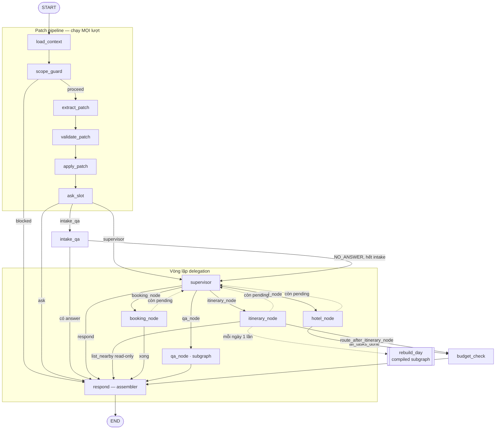
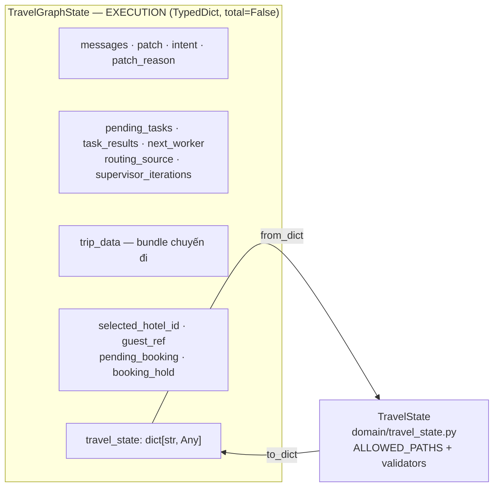

# LangGraph Orchestrator — Tổng thể

> Tầng LangGraph (`backend/src/agents/graph/`) là control plane **duy nhất** mà một lượt
> chat đi qua. Cascade `process_chat_turn` cũ đã bị xoá và không có setting nào bật lại.
>
> - **Chi tiết từng node, từng edge** → [`langgraph_orchestrator_detail_vi.md`](langgraph_orchestrator_detail_vi.md)
> - **Hạ tầng ngoài graph** (React, FastAPI, Supabase, Qdrant, Airflow) → [`ARCHITECTURE.md`](../../ARCHITECTURE.md)

| Phần | Nội dung | Ở đâu |
|---|---|---|
| 1 | Sơ đồ tổng thể | file này |
| 2 | State & Checkpointer | file này |
| 3 | Patch pipeline — 6 node chạy mọi lượt | [chi tiết](langgraph_orchestrator_detail_vi.md#phần-3--patch-pipeline) |
| 4 | Supervisor & delegation | [chi tiết](langgraph_orchestrator_detail_vi.md#phần-4--supervisor--delegation) |
| 5 | Worker nodes | [chi tiết](langgraph_orchestrator_detail_vi.md#phần-5--worker-nodes) |
| 6 | Subgraph — hai kiểu cô lập | [chi tiết](langgraph_orchestrator_detail_vi.md#phần-6--subgraph--hai-kiểu-cô-lập) |
| 7 | Node contracts | [chi tiết](langgraph_orchestrator_detail_vi.md#phần-7--node-contracts) |
| 8 | `respond` — assembler | [chi tiết](langgraph_orchestrator_detail_vi.md#phần-8--respond--assembler) |
| 9 | `interrupt()` & resume | [chi tiết](langgraph_orchestrator_detail_vi.md#phần-9--interrupt--resume) |
| 10 | Streaming & phase facts | [chi tiết](langgraph_orchestrator_detail_vi.md#phần-10--streaming--phase-facts) |
| 11 | Bảng tra cứu nhanh | file này |

---

## Phần 1 — Sơ đồ tổng thể

14 node, khai báo trong `NODE_NAMES` (`graph.py`) — test topology dùng đúng tuple này để
khẳng định không node nào bị mồ côi.



### Ba tầng quyết định, cố ý tách rời

| Tầng | Ai quyết | Bằng gì |
|---|---|---|
| **Hiểu tin nhắn** | LLM | `extract_patch` → structured output `{intent, changes[], reason}` |
| **Chọn worker** | Code (90% lượt) | `detect_impact` → `WORKFLOW_TO_WORKER` → `pending_tasks`; LLM chỉ dùng khi đa workflow hoặc recovery |
| **"Xong chưa?"** | Code, luôn luôn | `all_tasks_done` — predicate thuần trên conditional edge |

> Hỏi model một câu mà code đã trả lời được chính là anti-pattern mà kiến trúc này tồn
> tại để loại bỏ (`supervisor.py` docstring, doc §36).

---

## Phần 2 — State & Checkpointer

### 2.1 Hai loại state



- **`TravelGraphState`** mang *thi hành*, không mang *sự thật*: id, messages, dữ liệu làm
  việc của patch pipeline, sổ sách của vòng lặp supervisor.
- **`travel_state`** là sự thật nghiệp vụ (slot map), được `validate_patch`/`apply_patch`
  nạp/commit qua `TravelState.from_dict()` / `.to_dict()`.

### 2.2 Bẫy đã trả giá: round-trip vứt key lạ

`travel_state` round-trip qua `from_dict()/to_dict()` **mỗi lượt**, và **im lặng vứt bỏ
mọi key ngoài `ALLOWED_PATHS`**.

> Vì vậy `trip_data`, `pending_booking`, `booking_hold` **bắt buộc** là key top-level.
> Trước đây lồng `trip_data` vào `travel_state` khiến **cả lịch trình biến mất đúng 1
> lượt sau đó** (review finding F1).

### 2.3 Ba nhóm vòng đời field

| Nhóm | Field | Luật |
|---|---|---|
| **Turn-scoped** | `patch`, `intent`, `patch_reason`, `extraction_failed`, `asks_nearby_places`, `intake_answer`, `task_results`, `booking_hold`, `supervisor_iterations`, `day_rebuild_hops` | `load_context` reset mỗi lượt |
| **Carried-forward** | `messages`, `trip_data`, `missing_slots`, `pending_clarify_day`, `pending_booking`, `previous_hotel_options` | **KHÔNG** reset — phải sống sót qua ranh giới lượt |
| **Injected** | `selected_hotel_id`, `guest_ref` | API ghi vào input `invoke()`; node tiêu thụ tự clear |

Lý do từng field carried-forward:

- `missing_slots` — `ask_slot` là **writer duy nhất**. Giữ nguyên giá trị cuối lượt trước
  là tín hiệu duy nhất phân biệt "hỏi lại vì câu trả lời trước không trúng" với "hỏi lần
  đầu".
- `trip_data` — mang đi như `messages`; reset ở đây sẽ xoá lịch trình mỗi lượt.
- `selected_hotel_id` — `POST /hotels/select` ghi vào input `invoke()`, được merge vào
  state **TRƯỚC** khi `load_context` chạy; reset ở đây sẽ xoá trước khi `hotel_node` thấy.
- `pending_clarify_day` — prompt của `extract_patch` chỉ thấy **một tin nhắn**, nên câu
  trả lời cụt ("biển") cho câu hỏi "ngày 1 muốn theme gì?" không tự nêu ngày nào. Anchor
  này là fallback. Luôn bị ghi đè bằng ngày mà **chính tin nhắn hiện tại** nêu (hoặc
  clear), nên một lượt không liên quan sau đó không thể gia hạn nó vô hạn.
- `pending_booking` — offer phải sống từ cuối lượt chào giá sang đầu lượt xác nhận.

### 2.4 Đọc bằng `.get()`, không bao giờ `[...]`

Thread mới toanh chưa có checkpoint nào → key chưa tồn tại → `state["travel_state"]` sẽ
`KeyError`. Mọi node đọc bằng `.get(...)`.

### 2.5 Reducer — cảnh báo cho tương lai

```python
messages: Annotated[list, add_messages]   # reducer chuẩn LangGraph
pending_tasks: list[str]                  # KHÔNG reducer → ghi đè
task_results: list[dict[str, Any]]        # KHÔNG reducer → ghi đè
```

Ghi đè **chỉ đúng** vì delegation hiện tại **tuần tự tuyệt đối** (một worker chạy → báo
cáo → quyền điều khiển về `supervisor`).

> Lần fan-out đầu tiên chạy worker song song (`Send` API, hoặc subgraph thực sự đồng
> thời) sẽ có hai nhánh read-modify-write cùng base state và **âm thầm mất kết quả một
> nhánh**. Phải thêm reducer `operator.add` (hoặc merge tương đương) **trước** khi bất kỳ
> node nào được invoke nhiều hơn một lần trong một super-step.

### 2.6 Checkpointer

| Nơi | Checkpointer | Vì sao |
|---|---|---|
| Graph cha (app) | Postgres singleton, tạo ở lifespan | Bền qua restart; `thread_id = session_id` |
| Graph cha (CLI/test/eval) | `MemorySaver()` | Fallback khi caller không có gì để truyền |
| `qa_node` subgraph | **Dùng chung** checkpointer của cha, truyền tường minh | Không rơi vào `MemorySaver()` mặc định |
| `rebuild_day` subgraph | `MemorySaver()` **khai báo tường minh** | Mỗi ngày có checkpoint độc lập mà không tốn thêm connection Postgres |

Toàn bộ "trí nhớ" phiên nằm trong checkpointer, **không** nằm trong RAM của FastAPI.

### 2.7 `SessionManifest` — cái supervisor LLM được đọc

```
[Session manifest — booleans and task queue only, no facts]
- has_trip_data: bool
- pending_tasks: ...
- completed_workers: ...
- task_description: ...
- last_user_message: ...
```

Chỉ **boolean và đếm**, không có fact (giá, tên khách sạn, ngày). Kế thừa luật
`_state_summary` của plane cũ, mở rộng thêm hàng đợi task mà một quyết định delegation
thực sự cần.

---

## Phần 11 — Bảng tra cứu nhanh

### 11.1 File map

| File | Nội dung |
|---|---|
| `graph.py` | `NODE_NAMES`, `build_graph()` — mọi `add_node` / `add_edge` |
| `state.py` | `TravelGraphState`, `SessionManifest`, `initial_graph_state()` |
| `routing.py` | `WORKER_ORDER`, `_IMPOSSIBLE`, mọi hàm `route_*`, `all_tasks_done` |
| `contracts.py` | `CONTRACTS`, `enforce_contract`, `ContractViolation` |
| `prompts.py` | Mọi prompt + `INTAKE_QA_NO_ANSWER_SENTINEL` |
| `phase_keys.py` / `phase_facts.py` | Hợp đồng SSE phía backend |
| `response_payload.py` | `derive_stage` & helper shaping — dùng chung với `/restore` |
| `turn_runner.py` | Chạy một lượt, không import FastAPI |
| `nodes/` | 13 node + `build_qa_subgraph` |
| `subgraphs/rebuild_day.py` | Subgraph rebuild một ngày |

### 11.2 Mọi conditional edge

| Từ | Hàm route | Đích |
|---|---|---|
| `scope_guard` | `route_scope_guard` | `respond` \| `extract_patch` |
| `ask_slot` | `route_ask_slot` | `respond` \| `intake_qa` \| `supervisor` |
| `intake_qa` | `route_intake_qa` | `respond` \| `supervisor` |
| `supervisor` | `route_supervisor` | 4 worker \| `respond` |
| `hotel_node` | `all_tasks_done` | `budget_check` \| `supervisor` |
| `itinerary_node` | `route_after_itinerary_node` | `respond` \| `budget_check` \| `supervisor` |
| `booking_node` | `all_tasks_done` | `respond` \| `supervisor` |

Plain edge: `START→load_context`, `load_context→scope_guard`,
`extract_patch→validate_patch→apply_patch→ask_slot`, `qa_node→respond`,
`budget_check→respond`, `respond→END`.

### 11.3 Mọi bộ đếm chặn

| Counter | Trần | Reset | Chặn gì |
|---|---|---|---|
| `supervisor_iterations` | `MAX_SUPERVISOR_ITERATIONS = 5` | `load_context` | Delegation chạy loạn |
| `day_rebuild_hops` | `MAX_DAY_REBUILD_HOPS = 100` | `load_context` | Day-loop chạy loạn (**tách riêng** — dùng chung đã cắt cụt lịch > 5 ngày) |
| `budget_check` re-plan | Đúng **1** pass | — | Vòng tối ưu vô hạn |
| `extract_patch` retry | Đúng **1** lần | — | Retry storm |
| `_resolve_center` interrupt | **1** lần / invocation | — | Hỏi lại vô hạn |
| `OFFER_TTL_MINUTES` | 10 phút | — | "ok" tham chiếu ngược một offer đã cũ |

### 11.4 Ai được ghi cái gì

| State | Writer duy nhất |
|---|---|
| `travel_state` | `apply_patch` |
| `missing_slots` / `next_question` | `ask_slot` |
| `pending_clarify_day` | `extract_patch` |
| `trip_data` (**tạo**) | `hotel_node` (nhánh `selected_hotel_id`) |
| `trip_data` (**sửa**) | `itinerary_node`, `budget_check`, `rebuild_day` |
| `pending_booking` / `booking_hold` | `booking_node` |
| `pending_tasks` (**gieo**) | `apply_patch` |
| `pending_tasks` (**pop**) | Chính worker đó |
| `next_worker` | `supervisor` |
| `response` | `respond` |

### 11.5 Điều gì KHÔNG BAO GIỜ do LLM quyết

- Đã xong hết task chưa (`all_tasks_done`)
- Một worker có khả thi không (`_IMPOSSIBLE`)
- Lượt read-only chạy action nào (`list_nearby` là **hằng số**)
- Một lượt có phải lượt booking không (`_is_booking_turn` + `classify_booking_reply`)
- Bất kỳ con số nào trong reply (template xác định)
- Cách đọc ngày tháng nhập nhằng (`_resolve_numeric_date` → DD-MM)
- `radius_km` cuối cùng (`_resolve_radius_km` tự kiểm và suy lại)

---

## Nợ kỹ thuật — phần thuộc graph

| Item | Trạng thái | Vì sao còn ở đây |
|---|---|---|
| `guardrails/scope.py` (từ chối out-of-scope) | **Chưa từng được xây** dù plan doc đánh dấu done | `scope_guard` để pass-through. Thay bằng call thật khi Phase 2 ship — shape node/edge không cần đổi |
| `src/cli/terminal_chat.py` | **Vỡ** — `ImportError` khi import (`process_chat_turn` không còn) | Không gì import nó nên không gì fail to. Sửa = port sang `build_graph` hoặc xoá — quyết định sản phẩm |
| `POST /hotels/change` | Chạy được, frontend đang dùng | Nó lái lượt bằng cách bơm chuỗi tiếng Việt `"đổi khách sạn"` vào graph cho extractor diễn giải lại, thay vì set tín hiệu state xác định như `POST /hotels/select` (`extra_state={"selected_hotel_id": …}`). Sửa cần một tín hiệu mới cho `hotel_node` đọc |
| Không reducer trên `pending_tasks`/`task_results` | Đúng với delegation tuần tự | Phải thêm reducer **trước** fan-out song song đầu tiên — xem [2.5](#25-reducer--cảnh-báo-cho-tương-lai) |
| `pending_clarify_day` sống quá một lượt | Trên vài đường bỏ qua `extract_patch` (lượt bị block, hotel pick, interrupt resume) | Khoảng hở đã biết, ghi lại trong docstring của `extract_patch` |
| Docstring nhắc `process_chat_turn` | Chỉ trong văn xuôi (`api/streaming.py`, `agents/tools/*`, `agents/graph/__init__.py`) | Vô hại; đáng một lần quét, không đáng một pass edit rủi ro |
