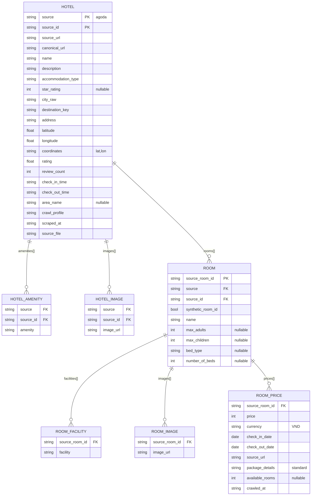

# ERD — `data/interim/manual__2026-07-22T08-08-01.190130-00-00/clean.json`

File là mảng JSON gồm 10 bản ghi khách sạn (nested). Sơ đồ dưới chuẩn hoá cấu trúc nested đó thành các thực thể quan hệ.

## Ghi chú

- Khoá tự nhiên của HOTEL là cặp `(source, source_id)`; `canonical_url` dùng để dedupe cross-source.
- `synthetic_room_id = true` nghĩa là `source_room_id` do pipeline sinh ra, không phải ID gốc từ nguồn.
- `amenities`, `images`, `facilities` là mảng string thuần → tách thành bảng con (hoặc giữ dạng `text[]`/JSONB nếu dùng Postgres).
- `ROOM_PRICE` là bảng fact theo thời gian: 1 dòng / (phòng, khoảng ngày, lần crawl). Trong dữ liệu hiện tại có 48 bản ghi giá.
- `rating` thang 10 (Agoda), khác `star_rating` (1–5, có thể null).
