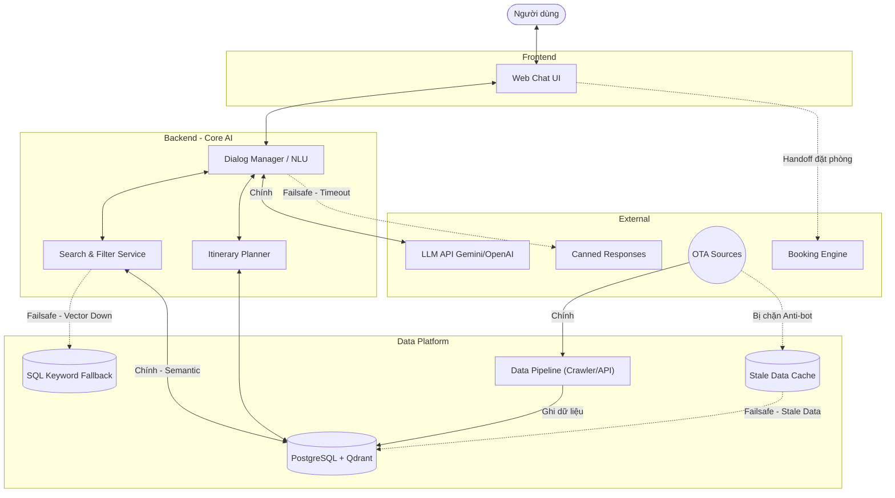
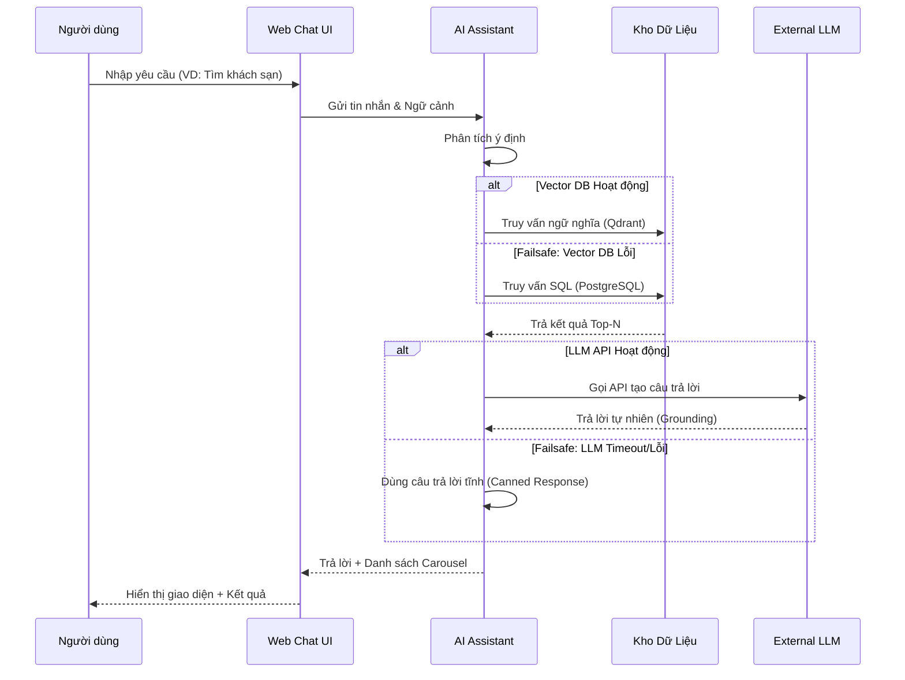
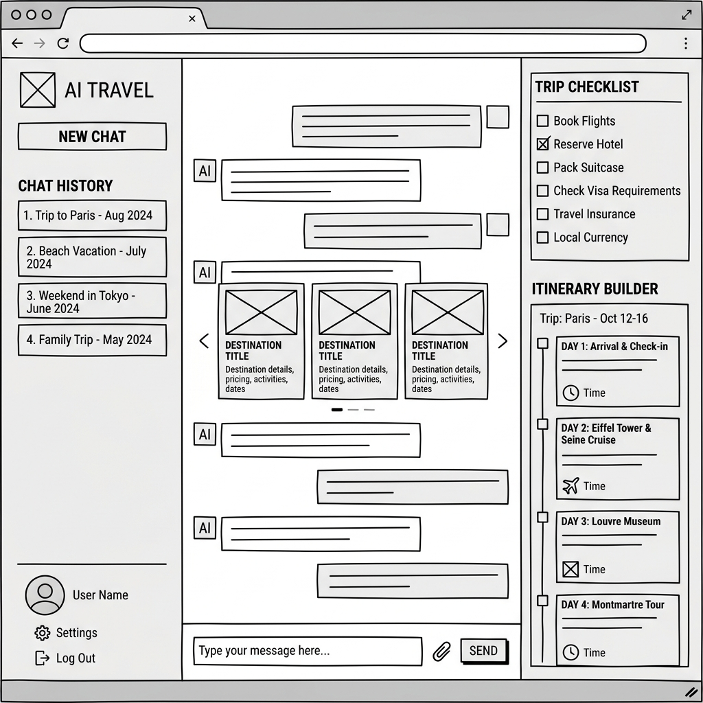

# V-OTA AI Chat - Architecture & Design Proposal

> ℹ️ **Tài liệu ĐỀ XUẤT ban đầu (pre-build).** Kiến trúc đã ship khác ở vài điểm — nguồn
> chuẩn hiện tại là [`../../ARCHITECTURE.md`](../../ARCHITECTURE.md) và `docs/architecture/`.
> Khác biệt chính so với bản đề xuất dưới đây:
> - **Styling:** đã dùng **Tailwind 4**, không phải Vanilla CSS / CSS Modules.
> - **LLM:** mặc định **Cloudflare Workers AI** (two-tier 70B/8B) + OpenAI / OpenRouter / Ollama — không phải Gemini.
> - **Embedding:** `bge-m3` 1024-dim (không phải "Gọi Gemini API tạo Vector").
> - **Data pipeline:** Playwright (không phải Scrapy); Airflow đúng như đề xuất.
> - **Orchestration:** LangGraph 14 node đã ship (patch pipeline + supervisor + workers) — đúng tinh thần, chi tiết ở `langgraph_orchestrator_vi.md`.
> - Các cơ chế failsafe ở §4 (Qdrant→SQL fallback, canned responses, Stale Data Mode) phần lớn **chưa được xây**; grounding guardrail thì có.
> - Auth (Supabase anonymous JWT), Admin console, và thanh toán VNPay thật là tính năng đã ship **không có** trong bản đề xuất này.

Dựa trên yêu cầu từ tài liệu BRD, dưới đây là đề xuất chi tiết về Tech Stack, Luồng xử lý (Flow) và Wireframe cho dự án V-OTA AI Chat.

## 1. Tech Stack Đề xuất

Để đáp ứng các yêu cầu về xử lý AI, luồng dữ liệu liên tục và giao diện web mượt mà, tech stack được đề xuất bao gồm:

*   **Giao diện người dùng (Frontend - Web Chat UI):**
    *   **Framework:** **Vite** (React).
        *   *Lý do chọn:* Kiến trúc React Component giúp dễ dàng tái sử dụng các thẻ UI (khách sạn, lịch trình). Khả năng quản lý state mạnh mẽ cực kỳ cần thiết cho một ứng dụng trò chuyện phức tạp có chứa bộ lọc. Vite mang lại tốc độ build cực nhanh, môi trường dev nhẹ nhàng, rất phù hợp cho một dự án PoC cần phát triển thần tốc.
    *   **Styling:** **Vanilla CSS** (CSS Modules).
        *   *Lý do chọn:* Cho phép kiểm soát giao diện ở mức độ chi tiết nhất, linh hoạt tùy chỉnh các hiệu ứng vi mô (micro-animations) để tạo ra trải nghiệm người dùng cao cấp (Premium UI) mà không bị phụ thuộc vào khuôn mẫu sẵn có của các thư viện UI.
*   **Backend & Xử lý AI (Lõi hội thoại):**
    *   **Framework:** **Python (FastAPI)**.
        *   *Lý do chọn:* Tốc độ thực thi cao, dễ phát triển. Python là ngôn ngữ tiêu chuẩn của hệ sinh thái AI/Data. Hỗ trợ xuất sắc xử lý bất đồng bộ (async), giúp trả về dữ liệu văn bản AI dạng streaming mượt mà cho người dùng.
    *   **LLM Orchestration:** **LangGraph** kết hợp **Google Gemini API** (hoặc OpenAI).
        *   *Lý do chọn:* LangGraph là công cụ tối ưu nhất hiện nay để điều phối luồng xử lý AI đa tác vụ có trạng thái (stateful agentic flow). Việc lập lịch trình du lịch là một bài toán phức tạp đòi hỏi thu thập thông tin qua nhiều bước, phân nhánh xử lý và ghi nhớ ngữ cảnh; đồ thị trạng thái của LangGraph sinh ra để giải quyết chính xác điều này.
*   **Nền tảng Dữ liệu (Kho dữ liệu & Vector):**
    *   **Cơ sở dữ liệu chính:** **PostgreSQL**.
        *   *Lý do chọn:* Tính ổn định tuyệt đối. Hoàn toàn phù hợp để lưu trữ dữ liệu có cấu trúc với ràng buộc phức tạp từ các OTA (thông tin người dùng, giá, lịch trình, phòng, lịch sử phiên chat).
    *   **Vector DB:** **Qdrant**.
        *   *Lý do chọn:* Là cơ sở dữ liệu Vector chuyên dụng, mang lại tốc độ truy xuất và độ mở rộng vượt trội. Đảm bảo việc tìm kiếm ngữ nghĩa (người dùng gõ câu tự nhiên để tìm phòng, tour) diễn ra ngay lập tức, phản hồi theo thời gian thực (real-time).
*   **Data Pipeline (Thu thập dữ liệu):**
    *   **Ngôn ngữ/Công cụ:** **Python** (Scrapy/Requests) kết hợp **Apache Airflow**.
        *   *Lý do chọn:* Khả năng xử lý dữ liệu (crawling) của Python là vô đối. Sử dụng DAG orchestrator như Airflow cho phép thiết lập và tự động hóa các đường ống (pipeline) thu thập dữ liệu giá/phòng định kỳ theo thời gian, kiểm soát lỗi dễ dàng.

---

## 2. Luồng Xử lý (Flows)

### A. Luồng Hệ thống (System Architecture Flow)

Mô tả cách các thành phần kỹ thuật tương tác với nhau (tương ứng với phân lớp L2 trong BRD).

### B. Luồng Trải nghiệm Người dùng (User Flow)

Mô tả kịch bản thao tác của người dùng từ khi bắt đầu tìm kiếm đến khi đặt phòng.

---

## 3. Wireframe & UX Mở rộng (L2)

Giao diện Chat UI được thiết kế để nhấn mạnh tính trực quan, hiện đại và tập trung vào trải nghiệm người dùng cao cấp (Premium). Các đặc điểm chính bao gồm:

### A. Tính năng UX Nổi bật
*   **Hệ sinh thái Vin & Điểm đến Việt Nam:** AI được tinh chỉnh để ưu tiên gợi ý các điểm đến nổi bật tại Việt Nam (Phú Quốc, Nha Trang, Hội An...) và đặc biệt tập trung vào các sản phẩm thuộc hệ sinh thái Vin (như Vinpearl Resort, VinWonders, Vinpearl Safari). Điều này giúp tối ưu hóa doanh thu nội bộ và mang lại trải nghiệm trọn gói cho du khách.
*   **Progressive Profiling (Trip Checklist):** Sử dụng một bảng điều khiển bên (side-panel) cập nhật theo thời gian thực để trích xuất 5 thông tin: Đi đâu, Từ đâu, Với ai, Khi nào, và Phong cách (Vibe). Khi thu thập đủ, một nút "Tạo lịch trình" nổi bật sẽ xuất hiện.
*   **Rich Media Modal (Hình ảnh/Video):** Khi nhấp vào các thẻ khách sạn/điểm đến (VD: phòng tại Vinpearl), thay vì chỉ mở thông tin chữ, hệ thống sẽ hiển thị một modal đa phương tiện chứa thư viện hình ảnh (gallery) sắc nét và các video ngắn dọc từ các nhà sáng tạo nội dung, tạo cảm giác chân thực và kích thích nhu cầu du lịch.
*   **Engaging Loading Copy:** Trong lúc AI xử lý (truy vấn DB, xếp hạng), hệ thống sẽ hiển thị các thông điệp thu hút như: *"Đang tìm kiếm phòng Vinpearl giá tốt nhất..."*, *"Đang lên lịch trình tham quan VinWonders..."*.
*   **Gợi ý thông minh (Contextual Pills):** Các gợi ý động xuất hiện ngay trên khung nhập liệu để giảm thiểu thao tác gõ (VD: "Nghỉ dưỡng Vinpearl Nha Trang", "Gia đình 4 người").
*   **AI Reasonings (Lý giải Khuyến nghị):** Tương tự các nền tảng OTA tiên tiến, AI sinh ra các câu giải thích cá nhân hóa ngắn gọn trên từng thẻ khách sạn (VD: "Phù hợp cho gia đình vì có hồ bơi") để tăng độ tin cậy.
*   **Room Badging:** Hệ thống tự động chọn ra một hạng phòng tối ưu nhất và gắn huy hiệu "On your trip" (Gợi ý cho bạn), giúp giảm gánh nặng quyết định cho khách hàng.
*   **Thematic Itinerary & Timeline:** Lịch trình tham quan được chia theo từng ngày có "Chủ đề" rõ ràng. Đặc biệt, UI sẽ hiển thị **Dòng thời gian (Timeline) chi tiết** (VD: 09:00 - 11:30) cho mỗi điểm tham quan dựa trên thời gian di chuyển và giờ mở cửa, giúp khách hàng canh đúng giờ diễn ra các sự kiện.
*   **Local Events Integration:** Gợi ý lồng ghép các sự kiện, lễ hội địa phương đang diễn ra trùng với ngày đi của khách vào lịch trình.

### B. Cấu trúc Wireframe (Low-fidelity)

> [!NOTE]
> Wireframe được thể hiện dưới dạng cấu trúc khung (skeleton) tập trung hoàn toàn vào **bố cục (layout)**, **luồng người dùng (user flow)** và **chức năng**, loại bỏ các yếu tố về màu sắc hay hình ảnh thực tế.
> 
> Bố cục ứng dụng được thiết kế phân chia thành 3 bảng (panels) độc lập để tối ưu không gian màn hình Web:
> 1.  **Panel Trái:** Quản lý lịch sử hội thoại, các chuyến đi cũ và menu điều hướng.
> 2.  **Panel Giữa (Main Chat):** Không gian trung tâm, rộng rãi nhất dành cho luồng trò chuyện với AI, nơi hiển thị danh sách kết quả tìm kiếm (khách sạn, tour) dưới dạng các thẻ khối (cards).
> 3.  **Panel Phải (Trip Checklist & Itinerary):** Bảng thu thập thông tin người dùng (Progressive Profiling) và chi tiết lịch trình chuyến đi khi đã hoàn thiện.

---

## 4. Cơ chế Failsafe (Dự phòng rủi ro)

Để đảm bảo hệ thống luôn hoạt động ổn định kể cả khi gặp sự cố với các dịch vụ bên thứ ba (Third-party services) hoặc lỗi dữ liệu, kiến trúc V-OTA AI Chat tích hợp các cơ chế Failsafe (Dự phòng) sau:

### A. LLM & AI Orchestration Failsafe
*   **API Timeout / Rate Limit:** Nếu Google Gemini API bị quá tải hoặc phản hồi chậm quá hạn mức (ví dụ: 5 giây), hệ thống tự động chuyển đổi (fallback) sang model dự phòng (như OpenAI) hoặc trả về các câu trả lời tĩnh (Canned Responses) đã được soạn sẵn để người dùng không cảm thấy ứng dụng bị treo.
*   **Hallucination Guardrails:** Nếu AI sinh ra kết quả (khách sạn/tour) không tồn tại trong Database, hệ thống (thông qua LangGraph) sẽ chặn luồng trả lời ở bước xác thực (Validation Node) và buộc AI truy xuất lại dữ liệu gốc (Grounding) thay vì đưa thông tin sai cho khách hàng.

### B. Data Pipeline Failsafe
*   **Crawler bị chặn (Anti-Bot):** Nếu các OTA (Booking, Agoda) chặn IP của Crawler, Data Pipeline sẽ kích hoạt **Stale Data Mode**: Tạm ngưng crawl và hệ thống Web Chat tiếp tục phục vụ người dùng bằng dữ liệu giá/phòng đã được lưu trong bộ đệm (PostgreSQL) từ kỳ crawl gần nhất, tránh làm gián đoạn việc đặt phòng. Đồng thời gửi cảnh báo cho Data Engineer.
*   **Nguồn dữ liệu lỗi:** Nếu dữ liệu trả về từ OTA bị lỗi cấu trúc (thiếu trường giá, sai định dạng), bước Data Cleaning (Pandas) sẽ tự động loại bỏ bản ghi đó thay vì để luồng Pipeline sụp đổ (crash).

### C. Search & Database Failsafe
*   **Vector DB (Qdrant) Down:** Nếu dịch vụ Qdrant gặp sự cố không thể thực hiện tìm kiếm ngữ nghĩa, luồng tìm kiếm tự động chuyển sang (fallback) tìm kiếm bằng từ khóa (Full-text Search) truyền thống bằng lệnh SQL trực tiếp trên PostgreSQL để duy trì luồng trải nghiệm.
