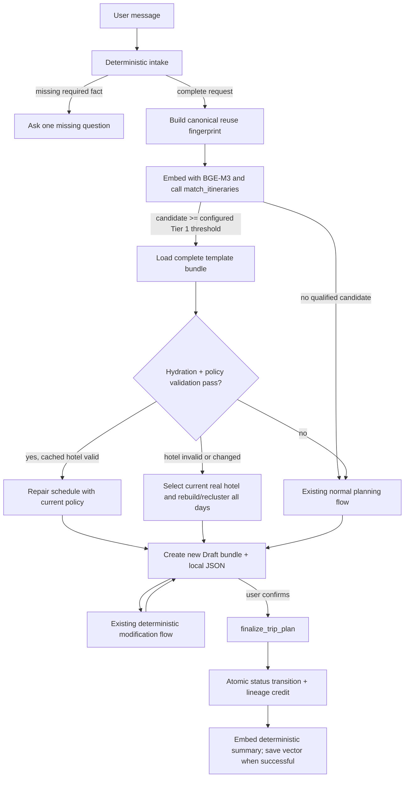

# Implementation Plan: Intelligent Itinerary Embedding and Reuse Pipeline (Reviewed V2)

## Status

Proposed for review. This plan replaces the assumptions in
`docs/ideas/itinerary-embedding-reuse.md` with an implementation sequence that
fits the current terminal agent, Supabase search services, and deterministic
scheduler.

## Goal

Reuse high-quality finalized itineraries to reduce repeated theme generation and
candidate selection while preserving the current correctness guarantees:

- every hotel and venue must be a real Supabase record;
- hotel location, opening hours, meal coverage, distance, rest, beach windows,
  and playground limits remain deterministic;
- cached data is a template, never an instruction to bypass validation;
- drafts do not enter vector search;
- finalization and template popularity are idempotent;
- existing `/search_attractions` and `/search_hotels` contracts remain
  unchanged.

## Review of the original proposal

### What should be retained

- Use Supabase pgvector and BGE-M3 instead of introducing a second itinerary
  vector store.
- Embed only finalized itineraries.
- Search before theme generation so a valid hit can avoid an LLM call.
- Record lineage and increase template popularity only after a reused draft is
  finalized.
- Provide a resumable backfill for existing finalized itineraries.

### What must change before implementation

1. **Add explicit destination and hotel ownership.** The proposed
   `filter_destination_id` cannot work because `itineraries` currently has
   neither `destination_id` nor `hotel_id`.
2. **Persist complete reusable bundles.** The current terminal path upserts only
   itinerary metadata; it does not persist all `itinerary_items`. A database
   template cannot be cloned reliably until draft items and their semantic
   `kind` are stored.
3. **Introduce a real finalization action.** The terminal agent currently
   generates and modifies drafts but exposes no finalize tool or deterministic
   finalize intent.
4. **Do not claim live hotel availability without dates.** `room_prices.sold_out`
   is tied to check-in/check-out records, while current intake has no travel
   dates. MVP can validate that a hotel still exists and is geographically
   usable; date-aware availability belongs in a later phase.
5. **Do not promise cost recalculation while costs are null.** The current
   scheduler writes `budget = null` and `estimated_cost = null`. Accurate
   recalculation requires requested dates, room occupancy/quantity, matching
   room prices, and attraction ticket prices.
6. **Do not copy a schedule after changing only the hotel UUID.** A hotel change
   can invalidate all clusters and travel gaps. If the hotel changes, every day
   must be rehydrated and repaired or rebuilt around the new coordinates.
7. **Make finalization atomic and idempotent.** A client-side status update
   followed by a separate parent counter update can double-count during retry or
   race conditions. The status transition and reuse credit must run in one
   database function.
8. **Avoid duplicate-vector lineage crowding.** A finalized clone can be almost
   identical to its parent. Store a root lineage ID and group or rank results by
   lineage so near-identical descendants do not occupy every top result.
9. **Calibrate the 0.88 threshold.** Treat 0.88 as an initial configuration, not
   a proven quality boundary. Measure it against labeled same-trip and
   different-trip queries before enabling automatic reuse.
10. **Keep embedding metadata minimal.** A non-null vector is the only reuse
    eligibility signal; failed embedding attempts remain retryable because the
    vector stays null.

## Architecture decisions

### AD-1: Supabase is authoritative for reusable templates

Local `current_trip_plan.json` remains the terminal working copy. Supabase is
the authoritative source for finalized reusable templates and their item rows.
A plan is not eligible for reuse until its database bundle is complete and its
embedding column is non-null.

### AD-2: Retrieval proposes; deterministic validation decides

A similarity hit is only a candidate. Before reuse, the system must:

1. load the itinerary, hotel, and all items;
2. verify destination, duration, UUIDs, coordinates, and referential records;
3. validate opening hours and schedule ordering;
4. apply the current meal, beach, playground, and travel-gap policies;
5. fall back to normal planning when repair cannot produce a valid plan.

### AD-3: Hard filters precede semantic ranking

Destination and duration must match exactly for Tier 1 reuse. Party composition,
preferences, hotel characteristics, and child-focused intent contribute to the
fingerprint and ranking but do not silently override deterministic policy.

### AD-4: Summary generation is deterministic

Build embedding text from canonical fields instead of asking an LLM to write a
summary. A stable summary avoids model drift and makes backfills reproducible.
It should include:

- destination ID/name and duration;
- adult/child counts and child-focused flag;
- normalized preferences;
- day theme queries;
- hotel area/star band and covered meals;
- ordered attraction categories and item kinds;
- budget band only when a grounded budget exists.

Do not include volatile UUIDs, timestamps, exact room prices, or conversational
filler in embedding text.

### AD-5: Finalization is an explicit agent capability

Add a narrow `finalize_trip_plan` tool and deterministic phrases such as
“finalize”, “confirm trip”, and “chốt lịch trình”. The agent never auto-finalizes
merely because generation succeeded.

A finalized itinerary is immutable. The edit tool must reject changes before
hydrating, scheduling, or persisting anything; a changed trip starts as a new
draft rather than altering a reusable template.

### AD-6: Availability and pricing are separate capabilities

MVP validates hotel record existence, destination, and coordinates. Date-aware
availability and cost recalculation are enabled only after the intake and
pricing contracts exist.

## Agent-flow integration

### Insertion points in the current flow

- Run reuse search in an internal planning service called by
  `generate_full_itinerary` after deterministic intake and destination
  resolution, but before `_generate_day_themes`.
- Keep `build_itinerary` and `validate_or_repair_day` authoritative for all
  reused schedules.
- Route hotel replacement through the existing full-reclustering behavior.
- Add `finalize_trip_plan` alongside `generate_full_itinerary` and
  `modify_trip_plan` in the LangGraph tool list.
- Preserve the current public semantic-search endpoints and response shapes.

## Proposed data contract

### New or changed `itineraries` columns

| Column | Type | Purpose |
|---|---|---|
| `destination_id` | `uuid references destinations(id)` | Exact destination filter; required for new rows after backfill. |
| `hotel_id` | `uuid references hotels(id) on delete set null` | Canonical selected hotel for hydration and validation. |
| `summary` | `text` | Deterministic embedding input. |
| `parent_itinerary_id` | `uuid references itineraries(id) on delete set null` | Immediate template used for this draft. |
| `reuse_root_id` | `uuid references itineraries(id) on delete set null` | Root lineage used to deduplicate search results. |
| `reuse_count` | `integer not null default 0 check (reuse_count >= 0)` | Number of finalized descendants credited exactly once. |
| `embedding` | `vector(1024)` | BGE-M3 vector. |

Use `reuse_count` rather than `clone_count`: it records successful finalized
descendants, not raw clone creation. Finalizing a clone credits its immediate
parent and every upstream ancestor.

### Changed `itinerary_items` columns

Add `item_kind varchar(20)` with an allow-list covering `breakfast`,
`attraction`, `lunch`, `rest`, `coffee`, `dinner`, and `evening`.
Without it, repeated hotel references cannot be reconstructed as meals versus
rest blocks.

### Backfill strategy

The migration should add nullable ownership fields first. A backfill can derive
`hotel_id` from Hotel itinerary items and `destination_id` from the referenced
hotel. Rows that cannot be resolved remain ineligible for reuse. Enforce
`destination_id NOT NULL` only after reporting unresolved historical rows.

## Database functions

### `match_itineraries`

Inputs:

- `query_embedding vector(1024)`
- `match_threshold float`
- `match_count int`
- `filter_destination_id uuid`
- `filter_duration_days smallint`

The function must filter on:

- `status = 'Finalized'`;
- `embedding is not null`;
- exact destination and duration;

Return the template ID, ownership fields, party counts, preferences, themes,
lineage, reuse count, summary, and cosine similarity. Group or rank by
`coalesce(reuse_root_id, id)` so one lineage cannot monopolize results.

Implement with a fixed `search_path`, explicit grants, bounded
`match_count`, and an HNSW cosine index over eligible finalized rows.

### `persist_itinerary_bundle`

Atomically upsert one draft itinerary and replace its associated item rows. This
prevents metadata-only templates and partially written schedules.

### `finalize_itinerary`

In one transaction:

1. lock the target row;
2. return a no-op when it is already Finalized;
3. set status and the deterministic summary;
4. increment `reuse_count` for the immediate parent and every upstream ancestor.

The locked Draft-to-Finalized transition is the idempotency guard: retries see
the finalized row and cannot increment its ancestors again.

Embedding is an external Ollama call, so it cannot be part of the SQL
transaction. After the transaction, attempt embedding and store the vector. A
failed attempt does not undo finalization; its null vector can be retried by
backfill.

## Internal Python interfaces

Create `src/services/itinerary_reuse.py` for pure contracts and decisions:

- `ItineraryReuseQuery`
- `ItineraryTemplate`
- `ReuseDecision`
- `build_reuse_fingerprint(...)`
- `build_itinerary_summary(...)`
- `classify_reuse_candidate(...)`
- `validate_template_bundle(...)`

Create `src/services/itinerary_store.py` for Supabase reads and writes:

- `search_reusable_itineraries(...)`
- `load_itinerary_bundle(...)`
- `persist_itinerary_bundle(...)`
- `finalize_itinerary(...)`
- `update_embedding_result(...)`

Keep BGE-M3 client construction in `supabase_search.py` or extract one shared
embedding provider without changing existing hotel/attraction search contracts.

## Reuse tiers

### Tier 1: Exact-structure candidate

Initial policy:

- exact destination;
- exact duration;
- similarity at or above configurable `ITINERARY_REUSE_TIER1_THRESHOLD`
  (initial experiment value: 0.88);
- bundle completeness and deterministic validation pass.

A Tier 1 hit may reuse themes and valid schedule structure. It must still create
new itinerary/item IDs and revalidate every day. No theme-generation LLM call is
needed.

### Tier 2: Theme skeleton only (V1.1)

For medium similarity or duration mismatch, reuse only normalized theme queries.
Fill missing themes with `normalize_day_themes`, retrieve fresh venue
candidates, and run `build_itinerary` normally. The LLM does not generate
venue schedules or copy prior item IDs.

### Tier 3: Miss

Run the current hotel selection, theme generation, semantic attraction queries,
and deterministic scheduler unchanged.

## Phased task breakdown

### Phase 1: Contract and schema

#### Task 1: Define reuse contracts and deterministic fingerprint

**Description:** Add pure typed contracts and canonical summary/fingerprint
builders before any database integration.

**Acceptance criteria:**

- [ ] Equivalent requests produce byte-identical summary text and content hashes.
- [ ] Volatile UUIDs, timestamps, and prices are excluded.
- [ ] Destination and duration are explicit fields, not inferred from
      `preferences[0]`.

**Verification:**

- [ ] Unit tests cover Vietnamese/English preferences, child-focused trips,
      missing optional budget, and reordered preference input.
- [ ] Scoped Ruff and Python compilation pass.

**Dependencies:** None

**Files likely touched:**

- `src/services/itinerary_reuse.py`
- `tests/test_itinerary_reuse.py`

**Estimated scope:** S

#### Task 2: Add additive schema and secure RPC migration

**Description:** Add ownership, lineage, embedding-state, and item-kind fields;
create indexes and the three database functions.

**Acceptance criteria:**

- [ ] Migration is idempotent and does not make unresolved historical ownership
      fields non-null immediately.
- [ ] `match_itineraries` hard-filters destination, duration, version, status,
      and embedding readiness.
- [ ] Finalization is retry-safe and parent reuse credit increments once.

**Verification:**

- [ ] Apply migration to a disposable Supabase project.
- [ ] Run SQL tests for repeat finalization, concurrent finalization, lineage
      grouping, and maximum `match_count`.
- [ ] `scripts/database_schema.sql` matches the post-migration schema.

**Dependencies:** Task 1

**Files likely touched:**

- `scripts/migrations/20260728_add_itinerary_reuse.sql`
- `scripts/database_schema.sql`
- `tests/test_itinerary_reuse_schema.py`

**Estimated scope:** M

### Checkpoint: Foundation

- [ ] Fingerprint contract approved.
- [ ] Migration and rollback notes reviewed.
- [ ] Existing attraction/hotel RPC contracts remain unchanged.

### Phase 2: Complete bundle persistence

#### Task 3: Implement itinerary store and embedding operations

**Description:** Add bounded Supabase repository methods for search, complete
bundle load/persist, finalization, and vector updates.

**Acceptance criteria:**

- [ ] Draft persistence writes itinerary metadata and all item rows atomically.
- [ ] Search uses BGE-M3 and rejects a vector whose dimension is not 1024.
- [ ] RPC or Ollama failures return typed outcomes and never corrupt local JSON.

**Verification:**

- [ ] Unit tests use a fake Supabase client and embedding provider.
- [ ] Integration test round-trips one seven/eight-item day including hotel meal
      and rest blocks.

**Dependencies:** Task 2

**Files likely touched:**

- `src/services/itinerary_store.py`
- `src/services/supabase_search.py`
- `tests/test_itinerary_store.py`

**Estimated scope:** M

#### Task 4: Persist current generated and modified drafts as complete bundles

**Description:** Replace metadata-only persistence with the atomic store while
preserving `current_trip_plan.json` as the working copy.

**Acceptance criteria:**

- [ ] New and modified drafts have the same itinerary/item IDs locally and in
      Supabase.
- [ ] `item_kind`, start/end time, and real reference UUIDs survive a
      round-trip.
- [ ] Failed database persistence is visible and does not falsely mark a
      template reusable.

**Verification:**

- [ ] Generate, persist, reload, format, and locally edit a test trip.
- [ ] Existing planner and scheduler tests remain green.

**Dependencies:** Task 3

**Files likely touched:**

- `scripts/poc_trip_planner.py`
- `src/services/itinerary_store.py`
- `tests/test_trip_planner_persistence.py`

**Estimated scope:** M

### Checkpoint: Durable bundles

- [ ] Finalized candidates can be reconstructed without `current_trip_plan.json`.
- [ ] No metadata-only row can be returned by reuse search.

### Phase 3: Safe Tier 1 reuse

#### Task 5: Add search and validation fast path

**Description:** Search before theme generation, load the highest-ranked
candidate, validate it, and fall through safely on any failure.

**Acceptance criteria:**

- [ ] A valid hit avoids `_generate_day_themes`.
- [ ] Deleted/missing references, bad coordinates, closed venues, and policy
      violations cause repair or a normal-planning fallback.
- [ ] A cache-service outage never prevents normal itinerary generation.

**Verification:**

- [ ] Tests cover hit, miss, RPC failure, incomplete bundle, hours drift, and
      destination/duration mismatch.
- [ ] Logs identify `reuse_hit`, `reuse_rejected`, and `reuse_miss` with a
      non-sensitive reason code.

**Dependencies:** Task 4

**Files likely touched:**

- `scripts/poc_trip_planner.py`
- `src/services/itinerary_reuse.py`
- `src/services/itinerary_store.py`
- `tests/test_trip_reuse_flow.py`

**Estimated scope:** M

#### Task 6: Rebuild safely when the cached hotel is unusable

**Description:** Validate the cached hotel record. If it is missing, outside the
destination, or lacks coordinates, select a current real hotel and rebuild all
days from cached themes around its coordinates.

**Acceptance criteria:**

- [ ] The implementation never substitutes only hotel IDs in existing items.
- [ ] All days pass the current distance, travel-gap, hours, meal, beach, and
      playground policies after hotel change.
- [ ] No live availability claim is made without requested dates.

**Verification:**

- [ ] Test same-area, far-area, missing-hotel, and no-valid-replacement cases.
- [ ] Every persisted venue reference is a supplied real UUID.

**Dependencies:** Task 5

**Files likely touched:**

- `scripts/poc_trip_planner.py`
- `src/services/itinerary_reuse.py`
- `tests/test_trip_reuse_flow.py`

**Estimated scope:** M

### Checkpoint: Tier 1

- [ ] Reuse produces a valid Draft with new IDs.
- [ ] A cache hit uses zero theme-generation LLM calls.
- [ ] Latency is measured and reported; no unverified sub-second guarantee is
      used as an acceptance criterion.

### Phase 4: Finalization flywheel

#### Task 7: Add explicit finalization to the agent flow

**Description:** Add deterministic finalization intent and expose a narrow
`finalize_trip_plan` tool.

**Acceptance criteria:**

- [ ] Generation and modification leave a trip in Draft.
- [ ] Only explicit user confirmation transitions it to Finalized.
- [ ] Repeated confirmation is a no-op and does not add reuse credit twice.

**Verification:**

- [ ] Terminal tests cover Vietnamese and English confirmation phrases.
- [ ] Concurrent finalization integration test increments parent reuse count
      exactly once.

**Dependencies:** Task 4

**Files likely touched:**

- `scripts/poc_trip_planner.py`
- `src/services/trip_intake.py`
- `src/services/itinerary_store.py`
- `tests/test_trip_finalization.py`

**Estimated scope:** M

#### Task 8: Embed finalized trips and add resumable backfill

**Description:** Attempt immediate embedding after finalization and add a
resumable script for pending, failed, or stale-version finalized rows.

**Acceptance criteria:**

- [ ] Drafts always have null embeddings and are excluded from search.
- [ ] Successful embedding records model, version, hash, and timestamp.
- [ ] Backfill supports `--dry-run`, `--limit`, retry, and version selection.

**Verification:**

- [ ] Stop Ollama during finalization: trip remains Finalized with failed/pending
      state and no reuse eligibility.
- [ ] Restart Ollama and verify backfill stores the missing vector.
- [ ] Dimension and content-hash tests pass.

**Dependencies:** Tasks 3 and 7

**Files likely touched:**

- `scripts/backfill_itinerary_embeddings.py`
- `src/services/itinerary_store.py`
- `tests/test_itinerary_embedding_backfill.py`

**Estimated scope:** M

### Checkpoint: Reuse flywheel complete

- [ ] Finalization, embedding, and parent credit are independently retry-safe.
- [ ] Only complete, vectorized, finalized bundles are searchable.

### Phase 5: Evaluation and controlled rollout

#### Task 9: Calibrate retrieval and add a feature flag

**Description:** Build a labeled evaluation set and gate automatic reuse behind
`ENABLE_ITINERARY_REUSE`.

**Acceptance criteria:**

- [ ] At least 20 positive paraphrases and 20 hard negatives cover multiple
      destinations, durations, family modes, and themes.
- [ ] Tier 1 threshold is selected from measured precision/recall rather than
      assumed.
- [ ] Disabling the flag restores the current planning path exactly.

**Verification:**

- [ ] Offline evaluation reports top-k precision, false-positive examples, and
      lineage duplication.
- [ ] Three-day Da Nang terminal smoke test covers miss, hit, rejected hit,
      modification, and finalization.

**Dependencies:** Tasks 5–8

**Files likely touched:**

- `eval/itinerary_reuse_cases.json`
- `eval/evaluate_itinerary_reuse.py`
- `src/config.py`
- `scripts/poc_trip_planner.py`

**Estimated scope:** M

### Phase 6: Date-aware availability and grounded costs (separate release)

#### Task 10: Add dates and pricing contracts

**Description:** Extend intake and persistence with check-in/check-out dates,
then define room availability and cost calculations using matching
`room_prices` records.

**Acceptance criteria:**

- [ ] The system never labels a hotel available/booked-out without a matching
      date range.
- [ ] Hotel substitution uses current room capacity, sold-out state, currency,
      and price records.
- [ ] Budget recalculation distinguishes grounded totals from unknown costs.

**Verification:**

- [ ] Tests cover absent dates, stale price rows, partial sold-out rooms,
      occupancy mismatch, currencies, and unavailable alternatives.

**Dependencies:** Tier 1 rollout is stable

**Estimated scope:** Separate plan; likely L and must be decomposed before work.

## Verification matrix

| Area | Required evidence |
|---|---|
| Pure logic | Unit tests for summary stability, content hash, tier decision, and bundle validation. |
| Database | Disposable-project migration test, RPC filters, transaction rollback, and concurrent finalization. |
| Planner | Hit/miss/rejection fallback, all scheduler policies, new IDs, and unaffected public search APIs. |
| Embedding | 1024-dimension assertion, model/version metadata, pending/failed recovery, and backfill resume. |
| Evaluation | Labeled retrieval set and threshold report. |
| Quality gates | `pytest tests -q`, scoped Ruff, Python compilation, `git diff --check`, and GitNexus `detect_changes(scope="all")`. |

## Risks and mitigations

| Risk | Impact | Mitigation |
|---|---|---|
| False-positive reuse | High | Exact destination/duration filters, calibrated threshold, deterministic validation, feature flag. |
| Stale venue or hotel data | High | Rehydrate every reference and repair/rebuild before cloning. |
| Partial database bundle | High | Atomic bundle persistence and completeness checks in the RPC/service. |
| Double-counted popularity | High | Row lock plus one-time credit marker in finalization RPC. |
| Duplicate lineage vectors | Medium | Root lineage field and grouped/reranked search results. |
| Ollama unavailable | Medium | Finalize independently, mark embedding pending/failed, retry with backfill. |
| Model or summary changes | Medium | Model name, embedding version, content hash, and version-filtered search. |
| Latency regression on misses | Medium | Short timeouts, fail-open to current planner, metrics, feature flag. |
| Service-role exposure | High | Keep calls server-side, restrict RPC grants, fixed search path. |
| Availability/cost overclaim | High | Defer until date-aware pricing contract exists. |

## Rollout sequence

1. Merge pure contracts and additive schema behind a disabled feature flag.
2. Persist complete draft bundles and verify round-trip integrity.
3. Backfill a small finalized sample and run offline relevance evaluation.
4. Enable shadow search: log candidates but always execute normal planning.
5. Enable Tier 1 reuse for one destination after precision review.
6. Expand by destination while monitoring hit, rejection, repair, fallback, and
   embedding-failure rates.
7. Plan date-aware hotel availability and cost calculation separately.

## Explicit non-goals for MVP

- No Qdrant itinerary collection.
- No blind copying of database rows without hydration and repair.
- No LLM-generated venue schedules.
- No cross-destination or cross-duration Tier 1 reuse.
- No automatic finalization.
- No live availability or grounded cost claim without travel dates.
- No Tier 2 day extension until Tier 1 precision and safety are demonstrated.

## Approval questions before implementation

1. Is explicit user finalization acceptable, using phrases such as “chốt lịch
   trình” or a future UI button?
2. Should historical itineraries with unresolved destination/hotel ownership be
   excluded permanently or repaired manually?
3. Is Tier 1 exact-duration reuse sufficient for MVP, with theme-only Tier 2
   deferred to V1.1? Recommended: yes.
4. Upstream attribution is defined: every finalized clone credits its immediate
   parent and every ancestor. `reuse_root_id` remains the lineage key for search
   deduplication.
