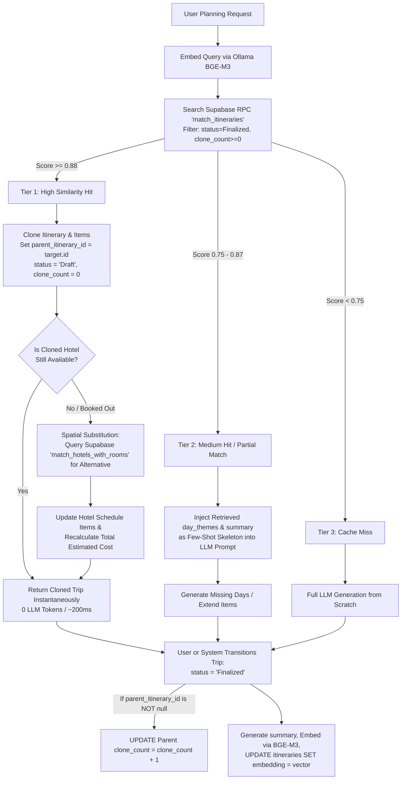

# Intelligent Itinerary Embedding & Reuse Pipeline (Supabase Unified Architecture)

## Problem Statement
How Might We embed and index historical trip itineraries directly into Supabase (`pgvector`) so that when users plan new trips, the system can semantically clone proven trip structures, spatially substitute booked-out hotels, dynamically recalculate costs, and extend multi-day timelines—slashing LLM latency and token costs while eliminating routing hallucinations?

## Recommended Direction: The "Retrieve ➔ Spatial Substitute ➔ Patch/Extend" Pipeline
We implement a tiered semantic caching and RAG pipeline in `poc_trip_planner.py` backed entirely by **Supabase pgvector**, spatial hotel substitution, and empirical popularity scoring.



### Database & Vector Schema Enhancements (All in Supabase)

#### 1. Relational & Vector Schema (`scripts/database_schema.sql`)
```sql
-- Enable pgvector extension if not already enabled
CREATE EXTENSION IF NOT EXISTS vector;

-- Add columns to Table 9 (itineraries)
ALTER TABLE itineraries 
ADD COLUMN summary TEXT,                                     -- For clean embedding & UI cards
ADD COLUMN parent_itinerary_id UUID REFERENCES itineraries(id) ON DELETE SET NULL, -- Lineage
ADD COLUMN clone_count INTEGER DEFAULT 0,                    -- Empirical quality score flywheel
ADD COLUMN is_embedded BOOLEAN DEFAULT FALSE,                -- Sync tracking
ADD COLUMN embedding vector(1024);                           -- BGE-M3 vector embedding directly on table

CREATE INDEX idx_itineraries_parent ON itineraries(parent_itinerary_id);
CREATE INDEX idx_itineraries_clones ON itineraries(clone_count DESC) WHERE status = 'Finalized';
CREATE INDEX idx_itineraries_embedding ON itineraries USING hnsw (embedding vector_cosine_ops) WHERE status = 'Finalized';
```

#### 2. Supabase RPC Function (`match_itineraries`)
```sql
CREATE OR REPLACE FUNCTION match_itineraries(
    query_embedding vector(1024),
    match_threshold float,
    match_count int,
    filter_destination_id uuid DEFAULT NULL
)
RETURNS TABLE (
    id uuid,
    session_id varchar,
    duration_days smallint,
    budget decimal,
    preferences text[],
    day_themes jsonb,
    clone_count int,
    summary text,
    similarity float
)
LANGUAGE plpgsql
AS $$
BEGIN
    RETURN QUERY
    SELECT
        i.id,
        i.session_id,
        i.duration_days,
        i.budget,
        i.preferences,
        i.day_themes,
        i.clone_count,
        i.summary,
        1 - (i.embedding <=> query_embedding) AS similarity
    FROM itineraries i
    WHERE i.status = 'Finalized'
      AND i.embedding IS NOT NULL
      AND 1 - (i.embedding <=> query_embedding) > match_threshold
    ORDER BY i.embedding <=> query_embedding
    LIMIT match_count;
END;
$$;
```

## Core Architectural Rule: Finalization-Triggered Flywheel & Embedding
1. **No Draft Inflation**: `clone_count` ONLY increments when the cloned trip reaches `status = 'Finalized'`. When `_clone_itinerary` is called during draft creation, `parent_itinerary_id` is recorded, but no score is incremented. Once the user finalizes the schedule, an update triggers to increment the parent template's `clone_count` by 1.
2. **No Draft Embedding**: We do not waste compute or contaminate index precision by embedding draft trips. When `status` transitions to `'Finalized'`, we generate the natural language `summary`, embed it via Ollama BGE-M3, and update `itineraries.embedding`.

## Key Assumptions to Validate
- [ ] **Assumption 1 (Spatial Substitution Pacing)**: Finding a replacement hotel within a 2km-5km radius with similar pricing via Supabase `match_hotels_with_rooms` preserves the travel pacing of the original schedule without requiring a full re-routing of day attractions.
  - *Validation*: Test spatial substitution in Da Nang (e.g., swapping a beach resort in My Khe for another beachfront resort 1km away) and verify travel time deltas are `< 5 minutes`.
- [ ] **Assumption 2 (Empirical Flywheel Cold Start)**: When a new destination is added, zero trips have `clone_count > 0`. 
  - *Validation*: Ensure the RPC query falls back gracefully to `status = 'Finalized'` (even with `clone_count = 0`) during cold-start periods before popularity builds up.
- [ ] **Assumption 3 (Summary Embedding Quality)**: BGE-M3 embeddings generated from `itineraries.summary` yield higher precision similarity matches than raw concatenated JSON arrays.
  - *Validation*: Compare cosine retrieval scores between raw JSON dumps and natural language summaries across 20 test queries.

## MVP Scope (What We Are Building First)
1. **Schema & RPC Migration**: Add `summary`, `parent_itinerary_id`, `clone_count`, `is_embedded`, and `embedding vector(1024)` to `itineraries`, and create the `match_itineraries` RPC function in Supabase.
2. **Summary Generator & Supabase Embedding Sync**:
   - Write helper functions in `poc_trip_planner.py` and `supabase_search.py` that auto-generate a 1-sentence `summary` when a trip reaches `status = 'Finalized'`, embed it via `get_embeddings().embed_query(summary)`, and update the row in Supabase.
3. **Tier 1 Fast-Path with Spatial Substitution**:
   - Before LLM generation, invoke `supabase.rpc("match_itineraries", ...)`.
   - If similarity `>= 0.88`, clone the itinerary with `status = 'Draft'` and record `parent_itinerary_id`.
   - Check hotel availability; if booked out, invoke `match_hotels_with_rooms` in Supabase for the closest available hotel with matching stars/price, swap the ID, and recalculate total budget.
4. **Finalization Trigger**:
   - When a trip changes to `status = 'Finalized'`, increment its parent's `clone_count` (if applicable) and embed/update the newly finalized row in Supabase.

## Not Doing (and Why) — *The Focus Guardrails*
- ❌ **No Qdrant Dependencies** — All vector indexing and similarity search are unified inside Supabase (`pgvector`), reducing infrastructure overhead and keeping transactional & vector data in sync.
- ❌ **No Modular Lego Day-Bank (Stitching independent days across multiple trips)** — Causes topological routing chaos, duplicate attractions, and conflicting hotel locations. Too complex for MVP.
- ❌ **No Live Availability Checks for Attractions/Events** — As established by database constraints, attractions don't book out in our system. We assume cached attraction POIs remain valid unless deleted from the DB.
- ❌ **No Post-Generation Vector Auto-Correction** — Adding an extra LLM + Vector validation loop after generation doubles latency. Proper prompt engineering and Skeleton RAG solve hallucination at generation time.

## Open Questions
1. Should we run a background batch cron job to generate summaries and embed all historical finalized trips after deploying this migration?
