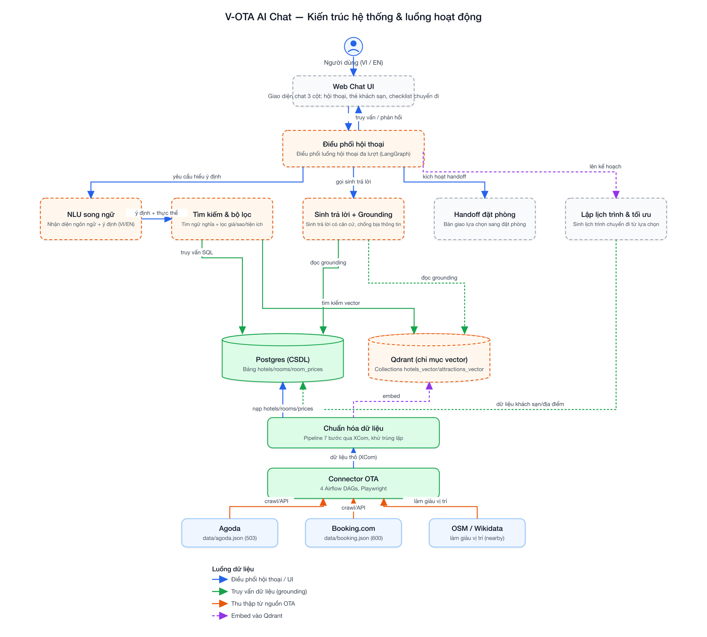
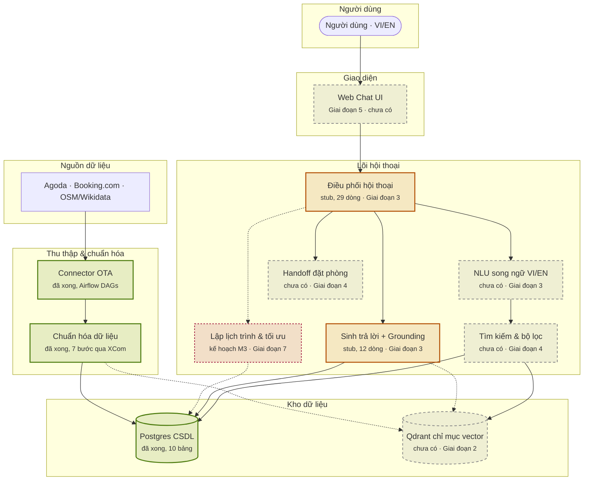

# Sơ đồ tổng thể kiến trúc — V-OTA AI Chat (M1 → M3)

Nguồn: `plans/260723-1015-v-ota-poc-master-roadmap/plan.md` (BRD §13.2 L2), đối chiếu với trạng thái repo thực tế ngày 2026-07-24.

Màu sắc thể hiện **trạng thái đã xác minh**, không phải kỳ vọng: xanh lá = đã xong, cam = stub/khung rỗng, xám nét đứt = chưa có, tím chấm = kế hoạch M3.

## Ảnh xuất bản (publish-grade, qua `/ak:tech-graph`)

- SVG: [`architecture-overview.svg`](./architecture-overview.svg)
- PNG (2x, 2000px): [`architecture-overview.png`](./architecture-overview.png)

## Phiên bản Mermaid (chỉnh sửa nhanh / nhúng vào tài liệu khác)

## Ghi chú xác minh

| Thành phần | Trạng thái | Bằng chứng |
|---|---|---|
| Connector OTA | Đã xong | `src/airflow/dags/data_pipeline/` — DAG hotel/hotel_nearby/osm/ota/google_maps |
| Chuẩn hóa dữ liệu | Đã xong | Pipeline 7 bước qua XCom, khử trùng lặp |
| Postgres CSDL | Đã xong | `scripts/database_schema.sql` — 10 bảng, 1.103 khách sạn đã nạp |
| Qdrant chỉ mục vector | Chưa có | `grep -ri qdrant` trên toàn repo → không kết quả |
| Điều phối hội thoại | Stub | `src/agents/graph.py` — 29 dòng |
| Sinh trả lời + Grounding | Stub | `src/services/llm.py` — 12 dòng |
| NLU song ngữ, Tìm kiếm & bộ lọc, Handoff đặt phòng, Web Chat UI | Chưa có | Không tìm thấy module tương ứng dưới `src/` |
| Lập lịch trình & tối ưu | Kế hoạch M3 | Giai đoạn 7, sau cổng M2 (Giai đoạn 6) |

Chi tiết đối chiếu đầy đủ (bao phủ yêu cầu BR, sổ rủi ro, kế hoạch liên quan): xem [`../visuals/plan-review.html`](../visuals/plan-review.html).
