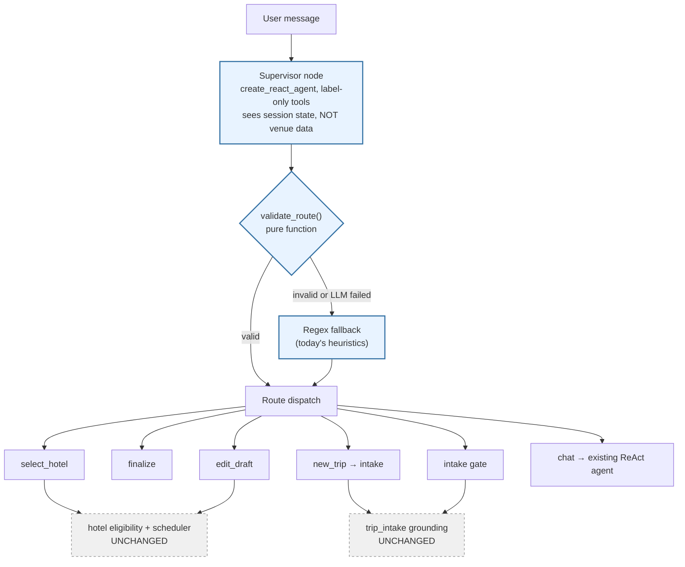

> **Status note (2026-08-02):** frontmatter says `pending`, but this plan's code
> has shipped on `dev` — `src/agents/supervisor.py`, `src/agents/routing_decision.py`,
> `tests/test_agents/test_supervisor.py`, `tests/test_agents/test_supervisor_routing_accuracy.py`
> all exist. Reconcile the status. Plan
> `260802-1437-langgraph-full-orchestration-and-durable-state` consumes this
> plan's output and preserves its deterministic-fallback design unchanged.

# Supervisor ReAct Router For Chat Turn

## Overview

`process_chat_turn` (`src/agents/session.py:444-598`) is a 155-line hand-rolled
cascade of `if` branches that decides what every user message means. Intent is
inferred from regex (`_new_trip_signal`, `_is_hotel_choice_attempt`,
`_OTHER_INTENT_WORDS`, `is_finalization_request`). The ReAct agent built by
`build_trip_agent` is reached only as the **last fallback branch** (`:546`).

This plan inverts that: an **LLM supervisor node runs first** and chooses the
route. Deterministic code then validates that choice and executes the route.
Fact-critical logic is untouched — `trip_intake.py` grounding, hotel eligibility,
and the scheduler keep owning correctness exactly as they do today.

**This plan does not change what any route does. It changes only who decides
which route runs.**

## Outcome and non-goals

**Outcome:** one model-driven routing decision per turn, replacing scattered
regex intent heuristics, with identical downstream behavior and no new
hallucination surface.

**Non-goals:**
- Not touching `trip_intake.py` grounding (`_ground_extracted_facts`).
- Not touching `trip_scheduler.py`, `trip_planner.py`, or venue selection.
- Not letting the supervisor emit destination / duration / people / venue IDs.
- Not building the 5-agent architecture sketched in
  `docs/architecture/agent_workflow_and_semantic_search_stack.md`. That remains
  a proposal; this plan delivers **one** node (its "Agent 1: Gateway/Supervisor").
- Not changing the `stage` / `suggestions` HTTP contract the frontend consumes.

## Decisions

| # | Decision | Rationale |
|---|----------|-----------|
| D1 | Supervisor decides **all** routing; no state hard-gate runs before it | User decision, 2026-07-31. Supervisor receives session state in its prompt and may route around a pending hotel list when the user has clearly moved on. See R1 for the risk this accepts. |
| D2 | Supervisor is a `create_react_agent` whose tools return **only a route label** | Agreed 2026-07-31. Tools carry no payload, so the supervisor structurally cannot emit a fact. A cheaper single structured call is the fallback if latency fails the Phase 4 budget. |
| D3 | Supervisor output is validated by a pure function; invalid/impossible routes fall back to today's regex | Mirrors the codebase's established "LLM proposes, pure function validates" pattern (`trip_intake.py`, `normalize_day_themes`). Keeps Ollama downtime from killing the router. |
| D4 | Existing regex heuristics are **kept** as the fallback layer, not deleted | User decision, 2026-07-31. They encode real bug fixes (e.g. `"3 ngày 2 người"` must not parse as "day 2" scope, `session.py:303`). |
| D5 | Applies to CLI and web API together, via `process_chat_turn` | User decision. Both surfaces already share this function; splitting them would violate DRY and let the two drift. |
| D6 | The `TurnResult` contract bug is fixed in Phase 1 | User decision. Three branches return bare `str`; the refactor would otherwise bury them. |

## Defect found during planning (fixed in Phase 1)

`process_chat_turn` is annotated `-> TurnResult` but three branches return a
bare `str`:

| Line | Returns | Breaks |
|------|---------|--------|
| `session.py:491` | `return unsupported_reply` | `terminal_chat.py:76` `.text` → `AttributeError` |
| `session.py:503` | `return "SYSTEM ERROR: Không thể hiểu an toàn…"` | same, plus `derive_stage()` in `routes.py:136` |
| `session.py:507` | `return edit_plan.clarification_question or "…"` | same |

All three are reachable: `:491` on a new-trip request naming an unknown city
with a saved plan present, `:503`/`:507` on any saved-plan edit that fails or
needs clarification. Both callers (`terminal_chat.py:76`, `routes.py:121,136`)
crash on `str.text`.

## Route taxonomy

Derived from the branches that exist today — the supervisor picks exactly one:

| Route | Today's branch | Executes |
|-------|----------------|----------|
| `select_hotel` | `session.py:456` | `session.tools.select_hotel` |
| `finalize` | `session.py:479` | `session.tools.finalize_trip_plan` |
| `new_trip` | `session.py:486` | `_begin_new_trip_if_requested` then intake |
| `edit_draft` | `session.py:493` | `plan_trip_edit` → `execute_trip_edit_request` |
| `intake` | `session.py:515` | intake gate → hotel-pref gate → `recommend_hotels` |
| `chat` | `session.py:546` | existing `create_react_agent` stream |

## Architecture

Blue is new. Dashed grey is explicitly frozen by this plan.

## Goals

| # | Goal | Priority |
|---|------|----------|
| 1 | One LLM supervisor decides the route for every turn | P1 |
| 2 | Fact-critical grounding and scheduling behavior unchanged | P1 |
| 3 | Router survives LLM failure via deterministic fallback | P1 |
| 4 | `TurnResult` contract holds on every return path | P1 |
| 5 | CLI and web keep one shared routing path | P2 |

## Phases

| # | Phase | Status | Depends on |
|---|-------|--------|------------|
| 1 | [Phase 1: Contract fix and routing seam](./phase-01-start.md) | Complete | — |
| 2 | [Phase 2: Supervisor node](./phase-02-supervisor-node.md) | Complete | 1 |
| 3 | [Phase 3: Integrate both surfaces](./phase-03-integrate-both-surfaces.md) | Complete (steps 7-8 unverified) | 2 |
| 4 | [Phase 4: Verify and document](./phase-04-verify-and-document.md) | Pending | 3 |

## Risks

| # | Risk | Mitigation |
|---|------|------------|
| R1 | **D1 accepts a real regression risk.** With no state gate before the supervisor, an LLM misread can skip the hotel-pick gate that `graph.py:30-38` deliberately protects by withholding `generate_full_itinerary`. | `validate_route()` rejects routes impossible for current state (e.g. `edit_draft` with `trip_data is None`). The pending-hotel-list state is included verbatim in the supervisor prompt. Phase 4 asserts the gate holds. If it does not, revisit D1 with the user — do not silently re-add a pre-gate. |
| R2 | Extra Ollama call per turn adds latency to every message | Phase 4 measures before/after on the same hardware. Budget stated there. D2's single-structured-call fallback is the remedy. |
| R3 | Ollama unreachable makes every turn fail | D3 fallback path; Phase 2 tests force an LLM exception and assert regex routing still answers. |
| R4 | `tests/test_structural_regression_harness.py` stubs module-level symbols by name; a refactor can silently bypass its assertions | Phase 1 runs the harness before and after the seam extraction with zero behavior change, so any harness drift is caught while the diff is still trivial. |
| R5 | Two routing layers (LLM + regex) is duplicated logic, against DRY | Accepted per D4 — the regex layer is a documented fallback, not a parallel implementation. Phase 4 records the deletion criteria for a later cleanup. |

## Success Criteria

- [ ] Every `process_chat_turn` return path returns a `TurnResult`
- [ ] A supervisor node selects the route on every turn
- [ ] Supervisor tools cannot return destination, duration, people, or venue data
- [ ] `validate_route()` rejects state-impossible routes with a deterministic fallback
- [ ] Forced LLM failure still produces a correct routed reply
- [ ] `tests/test_structural_regression_harness.py` passes unchanged
- [ ] `stage` and `suggestions` HTTP contract unchanged for the frontend
- [ ] `trip_intake.py` and `trip_scheduler.py` have zero diff

## Related work

`plans/260729-1637-trip-planner-chat-ui-and-agents-backend/` is marked
`status: pending`, but its phases 2-3 are **already delivered** on `dev`
(`src/agents/session.py`, `build_trip_agent`, `TripSession`, structured chat
API all exist at `3d03220`). Its status is stale. This plan builds on that
delivered work and modifies the same `process_chat_turn`. No blocking edge is
recorded because the overlap is on completed phases; its remaining phases 4-5
are frontend work this plan does not touch.

## Open questions

1. Should the stale `status: pending` on `260729-1637-…` be corrected to reflect
   that phases 1-3 landed? Not done here — it is another plan's state.
2. What is the acceptable added latency per turn (R2)? Phase 4 needs a number
   from the user to pass or fail its budget gate.

<!-- slug: supervisor-react-router-for-chat-turn -->
