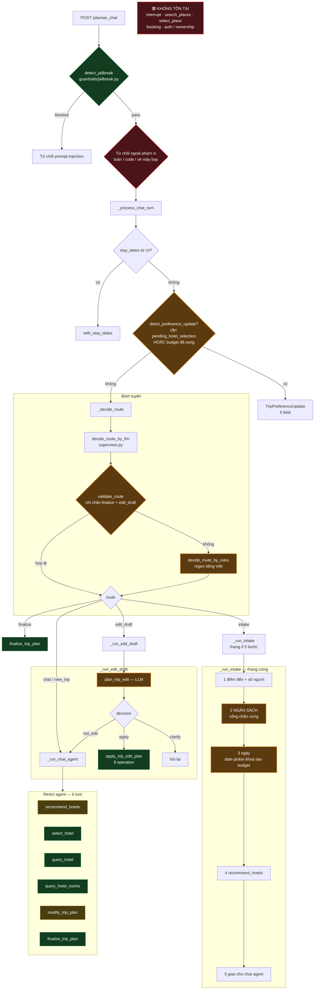
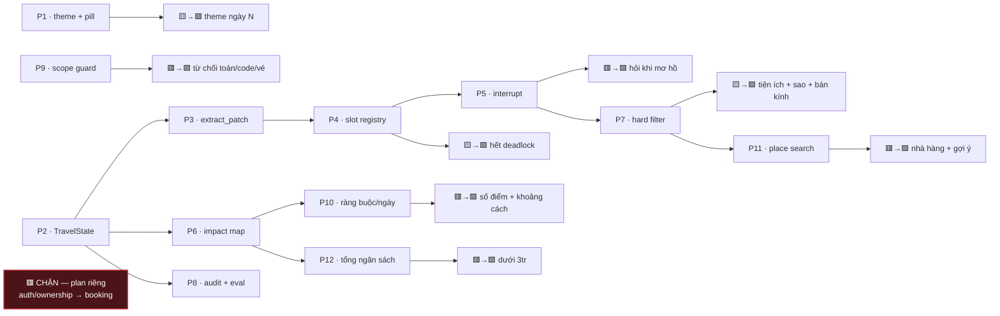

# LangGraph capability map — hiện trạng

Sơ đồ luồng thật của một chat turn, kèm đánh dấu khả năng.
Nguồn: `session.py`, `routing_decision.py`, `supervisor.py`, `graph.py`, `trip_edit_planner.py`.

Legend: 🟩 chạy đúng · 🟨 chạy nhưng sai/không đầy đủ · 🟥 không tồn tại

## Luồng turn

## Bảng khả năng

### 🟩 Làm được

| Khả năng | Đường đi |
|---|---|
| Chọn khách sạn "cái thứ 2" | `resolve_hotel_selection` — rank/id/tên, xác định, không bịa ID |
| Hỏi thông tin khách sạn / phòng | `query_hotel`, `query_hotel_rooms` |
| Chốt lịch trình | `finalize_trip_plan` |
| Đổi 1 hoặc nhiều địa điểm | `replace_item` × N — multi-op hợp lệ |
| Đi cùng người yêu / gia đình | `_COMPANION_LABELS` |
| Khách sạn sang trọng / bình dân | `_QUALITATIVE_BUDGET_PHRASES` |
| Chặn prompt-injection | `detect_jailbreak` — 4 họ pattern |
| Giá phòng/đêm, khoảng giá | tier + `_parse_free_text_price` |

### 🟨 Làm được nhưng sai

| Khả năng | Sai ở đâu |
|---|---|
| Đổi theme ngày N | `normalize_day_themes:534` ghi đè bằng preference cũ; title đúng, nội dung sai |
| Search theo tiện ích | Chỉ là bonus xếp hạng `+0.03`, không phải filter |
| Đánh giá trên 4 sao | `supabase_search.py:281` âm thầm bỏ filter khi 0 kết quả |
| Nhập ngày | Không check năm thiếu, quá khứ, thứ tự ngày/tháng; `:296` khoá cứng không sửa được |
| Sửa khi budget đang chờ | `_run_intake` bước 2 chặn cứng; `direct_preference_update` không với tới được |
| Định tuyến | `validate_route` chỉ chặn 2/5 route; `intake`/`chat` sai vẫn lọt |
| Phân loại edit | Prompt `:442` vs `:445` xung đột cho "ngày 1 thiên nhiên" |

### 🟥 Không tồn tại

| Khả năng | Bằng chứng |
|---|---|
| Bán kính 3km | Có ở tầng dưới, `recommend_hotels` không truyền xuống |
| Tổng ngân sách chuyến | `_calculate_trip_budget` chỉ tính để hiển thị |
| Giới hạn địa điểm/ngày | `planning_constraints` chỉ có `latest_outing_*` + `meal_preferences` |
| Khoảng cách giữa địa điểm | Không có ràng buộc nào |
| Tìm nhà hàng xung quanh | Nhà hàng chỉ là query cố định trong slot bữa ăn |
| Gợi ý địa điểm rồi mới chọn | Chỉ khách sạn có luồng chọn |
| Hỏi lại khi mơ hồ | `interrupt` = 0 lần dùng; `MemorySaver` không resume được |
| Từ chối ngoài phạm vi | `guardrails/` chỉ có jailbreak |
| Booking / giữ chỗ / sold out | 0 hit chức năng trên toàn `src/` |
| Auth / quyền sở hữu | Session ẩn danh; `itineraries` không có `user_id` |

## Ánh xạ sang phase

