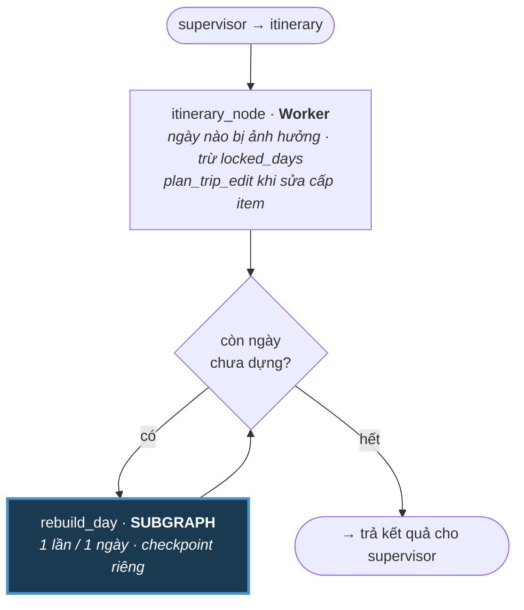

# Phase 9: itinerary_node + rebuild_day subgraph

## Overview

Stop rebuilding the whole trip to edit one day. `itinerary_node` is a supervisor worker node
that decides *which* days change; `rebuild_day` is a **LangGraph subgraph invoked once per
affected day**, so each day checkpoints independently and an `interrupt()` on day 2 never
re-runs day 1. The supervisor delegates itinerary-related tasks to this node.

`IMPACT_MAP` is used as supervisor fallback — it lives in Phase 3 beside
`ALLOWED_PATHS`. This phase consumes them.

## Problem

**Editing one day rebuilds everything.** `_apply_day_replan:1378` calls `_build_trip_data` for
the entire trip, then discards all but one day (`:1388`):

- Every unaffected day is re-searched and re-scheduled — cost and latency for no benefit.
- `exclude_attraction_ids=_scheduled_attraction_ids(current_data)` (`:1386`) excludes every
  scheduled attraction across **all** days, so a thin destination can yield an empty day.
- A failure anywhere in the trip fails the single-day edit.
- Contradicts doc §17: *"Do not regenerate unaffected days."*

**No lock concept.** "Budget còn 8 triệu nhưng giữ nguyên ngày 1" (doc §18) has no
representation — `locked_days` does not exist.

**A Python loop over days cannot hold an interrupt.** LangGraph re-executes a node **from the
beginning** when an interrupted turn resumes
(https://docs.langchain.com/oss/python/langgraph/interrupts). A `for day in days:` inside one
node means resuming after a day-2 shortlist pick re-runs day 1's search and scheduling. Worse
than wasted work: `_search_attraction_candidates` with a changed `exclude_attraction_ids` can
return *different* venues, so day 1 silently changes content the user never touched — the exact
"success message, wrong data" failure this plan exists to remove.

## Requirements

- Functional: a single-day edit regenerates only that day; other days stay byte-identical.
- Functional: each day's rebuild is independently checkpointed — an interrupt or crash on day N
  does not redo days 1..N-1.
- Functional: `locked_days` prevents regeneration of listed days; other days absorb the change.
- Functional: a day-scoped edit excludes only attractions scheduled on *that* day.
- Functional: item-level edits (`replace_item`, `update_time`, …) still work through
  `plan_trip_edit`'s existing 9-operation vocabulary.
- Non-functional: multi-day and whole-trip edits keep working — this narrows scope, it does not
  remove the wide path.
- Non-functional: no second scheduler. `rebuild_day` calls the same primitives
  (`_search_attraction_candidates`, `build_itinerary`) as the whole-trip builder.

## Architecture

### Node vs subgraph — and why

The loop is a **parent-graph conditional edge**, not a Python `for`. Each `rebuild_day`
invocation is its own checkpointed unit, which is the whole reason it is a subgraph rather than
a helper function.

`rebuild_day` internals: theme → `search_places` → per-day constraints (Phase 12) →
optional shortlist + `interrupt` (Phase 13) → route → schedule → save that day.

Compile it with an explicit `checkpointer=` rather than relying on the default — the parent's
app-lifespan checkpointer (Phase 4) is inherited unless stated, and that inheritance must be a
decision, not an accident.

State: `rebuild_day` shares `trip_data` and `locked_days` with the parent, and keeps its own
private keys (`day_number`, candidate lists, shortlist) — the shared/private split the subgraph
docs describe.

### Where the second LLM lives

`plan_trip_edit` (`trip_edit_planner.py`) survives inside the `itinerary_node` for
item-level operations. The patch layer cannot express them: a patch sets
`daily_preferences.1.theme`, but "đổi quán ăn trưa ngày 2" needs `replace_item` against a
specific `item_id`. It plans **operations on data**, never which node runs next — output still
goes through `parse_trip_edit_plan` validation unchanged.

### Day-level rebuild

Extract the per-day path out of `_build_trip_data` as
`rebuild_day(current_data, day_number, theme, *, locked_days)`. Shared primitives mean no second
scheduler to keep in sync.

`locked_days` lives on `itinerary.planning_constraints`, which already carries per-day policy
(`latest_outing_start_by_day`, `meal_preferences_by_day`) — same shape, same persistence, no
schema change.

## Related Code Files

- Create: `backend/src/agents/graph_v2/subgraphs/rebuild_day.py`
- Create: `backend/src/agents/graph_v2/nodes/itinerary_node.py`
- Modify: `backend/src/services/trip_planner.py` — extract `rebuild_day` from `_build_trip_data`; day-scope `_scheduled_attraction_ids` (:1386); retire `_apply_day_replan` (:1354-1392)
- Modify: `backend/src/services/trip_scheduler.py` — honor `locked_days` in repair passes
- Modify: `backend/src/agents/session.py` — `requires_candidate_rebuild` (:554) already replaced by supervisor's routing
- Create: `backend/tests/test_rebuild_day.py`, `backend/tests/test_day_loop_interrupt.py`

## Implementation Steps

1. Run `impact` on `_apply_day_replan` and `_build_trip_data` before touching them.
2. Extract `rebuild_day` as a pure function reusing the existing scheduling primitives.
3. Wrap it as a compiled subgraph with an explicit `checkpointer=`; define shared vs private state keys.
4. Build `itinerary_node` as a worker node: affected days minus `locked_days`, plus `plan_trip_edit`
    for item-level ops.
5. Wire the parent loop as a conditional edge, not a Python `for`.
6. Scope `exclude_attraction_ids` to the target day.
7. Add `locked_days` to `planning_constraints`; honor it in `rebuild_day` and repair passes.
8. **Interrupt-isolation test:** 3-day trip, interrupt on day 2, resume, assert day 1's items are
   byte-identical and that no day-1 attraction search was issued after resume.
9. Benchmark a single-day edit before and after; record both numbers in the PR.

## Success Criteria

- [ ] Editing day 1 leaves days 2..N byte-identical
- [ ] A single-day edit issues no attraction search for other days
- [ ] Interrupt on day 2, then resume: day 1 unchanged, no day-1 search re-issued
- [ ] A crash mid-loop resumes from the next unbuilt day, not from day 1
- [ ] `locked_days: [1]` keeps day 1 unchanged while a budget change reflows days 2..N
- [ ] A day-scoped edit can reuse an attraction scheduled on a different day
- [ ] `rebuild_day` compiles with an explicitly stated `checkpointer=`
- [ ] Item-level edits still work through `plan_trip_edit`'s 9 operations
- [ ] Single-day edit latency measurably lower than the current full rebuild
- [ ] `make test` green

## Risk Assessment

| Risk | Mitigation |
|---|---|
| Subgraph re-execution semantics misunderstood again | Step 8's interrupt-isolation test is the proof, not the prose. It fails loudly if the loop ever collapses back into one node |
| `_build_trip_data` is load-bearing for new-trip creation | `rebuild_day` is extracted, not rewritten — both paths call the same primitives. New-trip tests are the gate |
| Day-level rebuild diverges from whole-trip rebuild over time | Shared primitives, plus a test asserting a 1-day trip produces the same result through both paths |
| Subgraph checkpointer inheritance surprises | `checkpointer=` stated explicitly at compile; asserted in a test |
| Parent-loop edge introduces an infinite cycle | Loop condition is "days remaining", a shrinking list. Topology test (Phase 5) allows exactly this one cycle and no other |
| `locked_days` interacts with existing `planning_constraints` repair | Reuses the established per-day shape; `_reapply_planning_constraints` already scopes by day |
| Narrowing `exclude_attraction_ids` allows a duplicate across days | Intended — previously impossible. Assert explicitly so it reads as a decision, not a regression |
