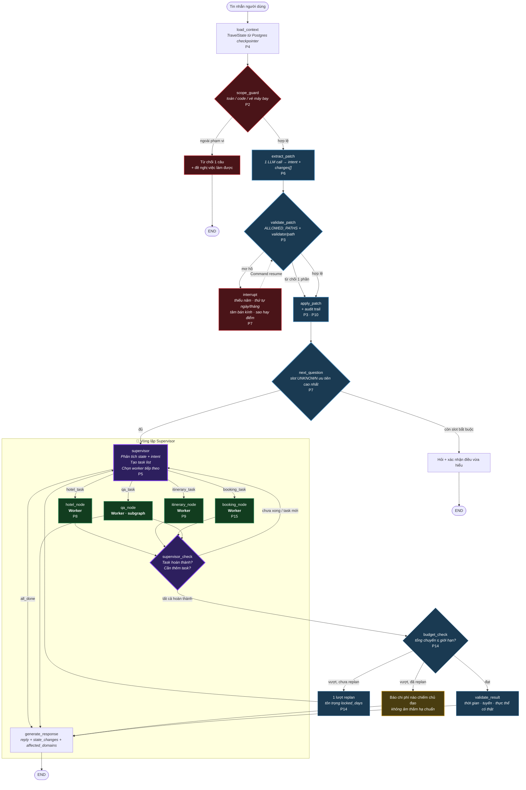
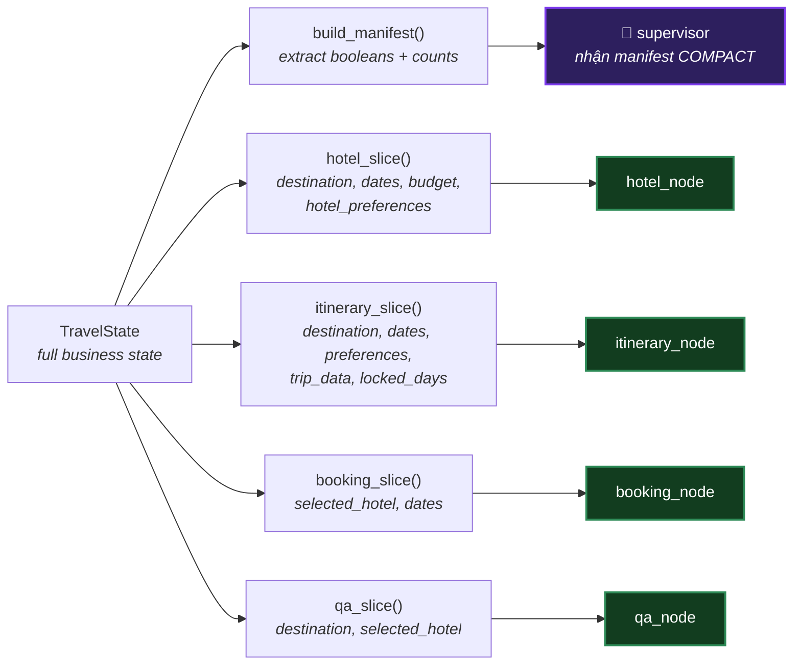
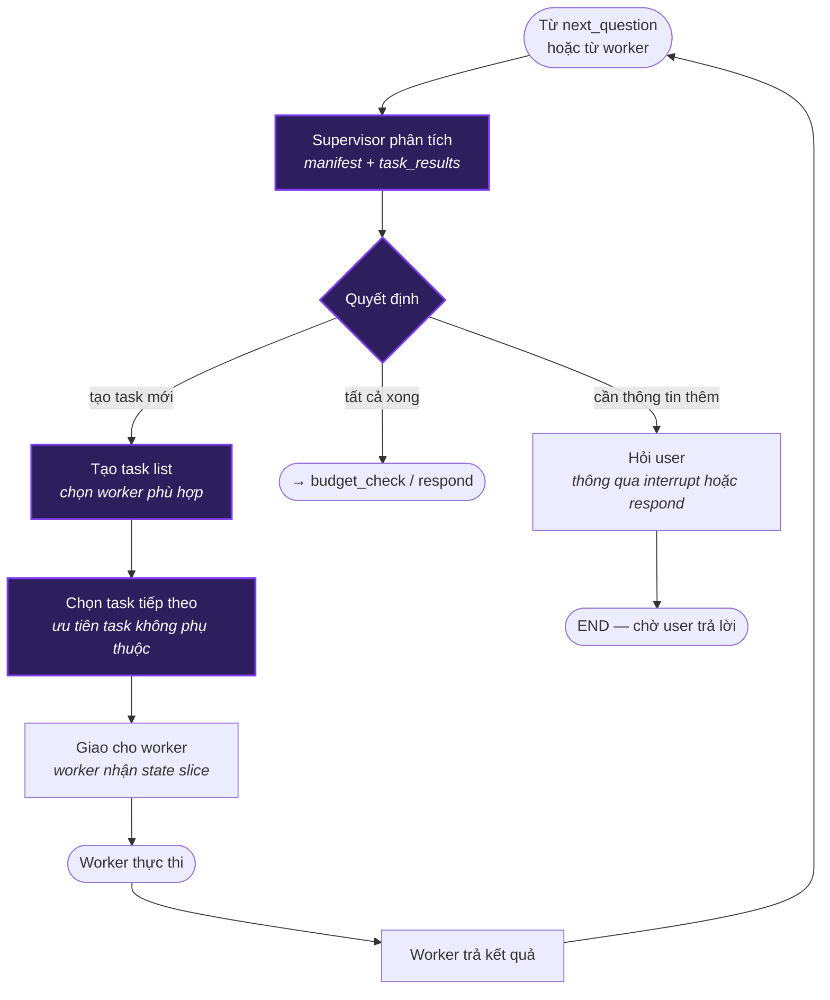
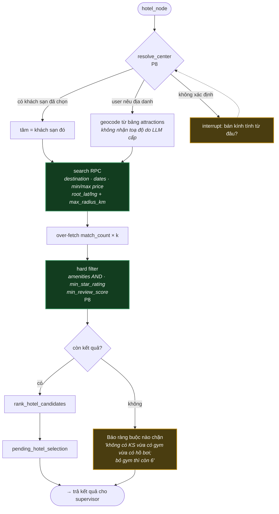
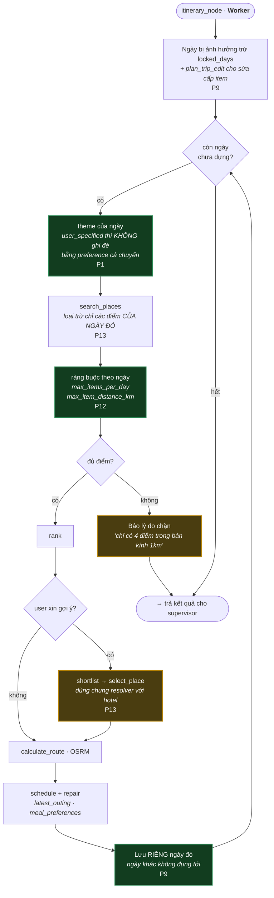
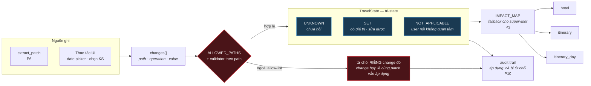

# Kiến trúc đích — Supervisor điều phối 4 worker nodes

Trạng thái **sau khi plan hoàn tất**. Hiện trạng xem `capability-map.md`.
Mỗi node gắn nhãn phase xây nó.

## 1. Tổng quan mô hình Supervisor

Supervisor là **bộ não trung tâm** của graph. Nó:

1. **Nhận** tin nhắn người dùng đã qua tiền xử lý (scope guard, extract patch, validate, apply)
2. **Tạo task list** — phân tích state + intent → danh sách task cần thực hiện
3. **Chia task** cho worker node phù hợp
4. **Kiểm tra** kết quả từ worker → quyết định: giao task tiếp, yêu cầu bổ sung, hoặc hoàn tất

```
┌─────────────────────────────────────────────────────────┐
│                    SUPERVISOR (LLM)                     │
│  • Nhận state + intent + changes[]                      │
│  • Tạo task list                                        │
│  • Chia task → worker                                   │
│  • Kiểm tra hoàn thành → loop hoặc kết thúc            │
└────────┬──────────┬──────────┬──────────┬───────────────┘
         │          │          │          │
    ┌────▼───┐ ┌────▼────┐ ┌──▼───┐ ┌────▼────┐
    │ hotel  │ │itinerary│ │booking│ │   qa    │
    │ _node  │ │ _node   │ │_node │ │  _node  │
    └────┬───┘ └────┬────┘ └──┬───┘ └────┬────┘
         │          │          │          │
         └──────────┴──────────┴──────────┘
                        │
                   Kết quả → Supervisor
```

## 2. Graph chính



**Đảo ngược cốt lõi so với hiện tại:** `extract_patch` chạy **trước** `next_question`.
Hôm nay câu hỏi đang chờ quyết định xem tin nhắn có được phép mang ý nghĩa khác không —
đó chính là nguồn của mọi deadlock. Ở đây patch luôn được thử trước, câu hỏi chỉ hỏi lại sau.

**Mới: Supervisor loop.** Sau khi state đã đầy đủ, supervisor tạo task list và chia cho
worker nodes. Mỗi worker trả kết quả, supervisor kiểm tra hoàn thành. Nếu cần thêm task
(ví dụ: tìm khách sạn xong rồi lên lịch trình), supervisor tạo task mới và giao tiếp.

## 3. Supervisor node — chi tiết

### Input — Session Manifest (không đưa toàn bộ dữ liệu vào model)

Supervisor **không nhận toàn bộ TravelState**. Nó nhận một **Session Manifest** — bản
tóm tắt compact chỉ chứa metadata và tham chiếu, không chứa dữ liệu thô.

**Nguyên tắc:** LLM chỉ nhận thông tin đủ để **quyết định route**, không nhận dữ liệu
mà nó không cần để ra quyết định. Dữ liệu chi tiết được worker lấy trực tiếp từ state.

```python
class SessionManifest(BaseModel):
    """Bản tóm tắt compact cho supervisor — không chứa dữ liệu thô."""
    
    # Từ extract_patch
    intent: str                          # "hotel_search", "update_itinerary", ...
    changes_summary: list[str]           # ["budget.max → 10M", "dates.start → 15/09"]
    
    # Trạng thái phiên — boolean/counts, KHÔNG có values
    has_destination: bool
    has_dates: bool
    has_budget: bool
    has_selected_hotel: bool
    has_trip_data: bool
    trip_day_count: int | None
    pending_hotel_count: int             # số KS đang chờ chọn
    
    # Kết quả từ worker đã chạy (nếu đang trong loop)
    completed_tasks: list[str]           # ["search_hotels", "select_hotel"]
    last_task_status: str | None         # "success" | "no_results" | "error"
    
    # Tin nhắn người dùng
    user_message: str
```

**So sánh: manifest vs full state:**

| Thông tin | Manifest (supervisor nhận) | Full state (worker nhận) |
|-----------|---------------------------|-------------------------|
| Điểm đến | `has_destination: true` | `destination: "Đà Nẵng"` |
| Ngày | `has_dates: true` | `dates: {start: "2026-09-15", end: "2026-09-18"}` |
| Ngân sách | `has_budget: true` | `budget: {min: 5000000, max: 10000000}` |
| Khách sạn chờ chọn | `pending_hotel_count: 5` | `pending_hotel_selection: [{id, name, price, ...}, ...]` |
| Lịch trình | `has_trip_data: true, trip_day_count: 3` | `trip_data: {days: [{items: [...], ...}, ...]}` |
| Thay đổi | `changes_summary: ["budget.max → 10M"]` | `changes: [{path, op, value, old_value}, ...]` |

Supervisor cần biết **có điểm đến chưa** để quyết định routing, nhưng **không cần biết
điểm đến là gì** — đó là việc của worker.

### Data Contracts — mỗi node chỉ đọc/ghi những gì nó cần

```python
# backend/src/agents/graph_v2/contracts.py

@dataclass(frozen=True)
class NodeContract:
    """Khai báo node được đọc/ghi gì trên TravelState."""
    reads: frozenset[str]       # state paths node được đọc
    writes: frozenset[str]      # state paths node được ghi
    requires: frozenset[str]    # state paths phải có giá trị trước khi chạy

CONTRACTS = {
    "supervisor": NodeContract(
        reads=frozenset(),           # Không đọc TravelState — chỉ đọc manifest
        writes=frozenset(),          # Không ghi TravelState
        requires=frozenset(),
    ),
    "hotel_node": NodeContract(
        reads=frozenset({
            "destination", "dates", "budget",
            "hotel_preferences.amenities", "hotel_preferences.radius_km",
            "hotel_preferences.min_star_rating", "hotel_preferences.min_review_score",
            "selected_hotel", "pending_hotel_selection",
        }),
        writes=frozenset({
            "pending_hotel_selection", "selected_hotel",
        }),
        requires=frozenset({"destination"}),
    ),
    "itinerary_node": NodeContract(
        reads=frozenset({
            "destination", "dates", "people_count",
            "preferences.themes", "daily_preferences",
            "trip_data", "selected_hotel",
            "planning_constraints.locked_days",
        }),
        writes=frozenset({
            "trip_data", "planning_constraints",
        }),
        requires=frozenset({"destination", "dates"}),
    ),
    "booking_node": NodeContract(
        reads=frozenset({
            "selected_hotel", "dates", "people_count",
        }),
        writes=frozenset({
            "booking_status",
        }),
        requires=frozenset({"selected_hotel", "dates"}),
    ),
    "qa_node": NodeContract(
        reads=frozenset({
            "destination", "selected_hotel",
            "pending_hotel_selection",
        }),
        writes=frozenset(),          # Read-only — QA không ghi state
        requires=frozenset(),
    ),
}
```

**Enforcement:** `load_context` tạo manifest cho supervisor. Mỗi worker nhận một
**state slice** chỉ chứa các paths trong `reads`. Nếu worker cố ghi path ngoài
`writes` → `apply_patch` reject (đã có sẵn `ALLOWED_PATHS` từ P3).



### Output — Task list

```python
class Task(BaseModel):
    """Một task cụ thể supervisor giao cho worker."""
    task_id: str                    # unique ID
    worker: Literal["hotel_node", "itinerary_node", "booking_node", "qa_node"]
    action: str                     # mô tả task: "search_hotels", "rebuild_day_1", ...
    params: dict                    # tham số cho worker
    depends_on: list[str] = []      # task_id phải xong trước

class SupervisorOutput(BaseModel):
    """Structured output từ supervisor."""
    tasks: list[Task]               # danh sách task cần làm
    reasoning: str                  # lý do — cho audit trail
    is_complete: bool = False       # True khi tất cả task đã xong, sẵn sàng respond
```

### Vòng lặp Supervisor



### Ví dụ cụ thể

**User:** "Tìm khách sạn có gym trong bán kính 3km rồi lên lịch trình cho tôi"

Supervisor nhận **manifest** (không nhận full state):

```json
{
  "intent": "hotel_search",
  "changes_summary": ["hotel_preferences.amenities → [gym]", "hotel_preferences.radius_km → 3"],
  "has_destination": true,
  "has_dates": true,
  "has_budget": true,
  "has_selected_hotel": false,
  "has_trip_data": false,
  "trip_day_count": null,
  "pending_hotel_count": 0,
  "completed_tasks": [],
  "last_task_status": null,
  "user_message": "Tìm khách sạn có gym trong bán kính 3km rồi lên lịch trình cho tôi"
}
```

Supervisor tạo task list:

```json
{
  "tasks": [
    {
      "task_id": "t1",
      "worker": "hotel_node",
      "action": "search_hotels",
      "params": {},
      "depends_on": []
    },
    {
      "task_id": "t2",
      "worker": "itinerary_node",
      "action": "build_itinerary",
      "params": {},
      "depends_on": ["t1"]
    }
  ],
  "reasoning": "User yêu cầu 2 việc tuần tự: tìm KS trước, lên lịch sau. has_destination=true, has_dates=true → đủ điều kiện cho cả hai.",
  "is_complete": false
}
```

- `hotel_node` nhận **hotel_slice**: `{destination, dates, budget, hotel_preferences}` — không có trip_data, không có lịch trình
- `itinerary_node` nhận **itinerary_slice**: `{destination, dates, preferences, selected_hotel}` — không có hotel candidates

### Guardrails

1. **Max loop count = 5** — supervisor không được loop quá 5 lần/turn để tránh vòng lặp vô hạn
2. **IMPACT_MAP fallback** — nếu supervisor LLM fail → dùng `IMPACT_MAP` deterministic như cũ
3. **Structured output** — `with_structured_output(SupervisorOutput)`, không free-text
4. **Task validation** — worker không tồn tại hoặc action không hợp lệ → reject task đó
5. **Audit trail** — mọi routing decision + reasoning đều lưu lại (P10)
6. **Contract enforcement** — worker ghi ngoài `writes` → reject bởi `ALLOWED_PATHS`
7. **Manifest only** — supervisor **không bao giờ** nhận full TravelState, chỉ nhận SessionManifest

## 4. Worker nodes — chi tiết

### 4.1 hotel_node — P8

Chuyên xử lý mọi thao tác liên quan khách sạn.



**Actions có thể nhận từ supervisor:**

| Action | Mô tả |
|--------|-------|
| `search_hotels` | Tìm khách sạn theo filter |
| `select_hotel` | Chọn khách sạn từ danh sách |
| `query_hotel` | Hỏi thông tin chi tiết khách sạn |
| `query_rooms` | Hỏi thông tin phòng |

Điểm chết người đã gỡ: **không còn nhánh nào âm thầm bỏ filter.** Hôm nay
`supabase_search.py:281` tự bỏ `min_star_rating` khi 0 kết quả và trả về semantic matches —
user xin 4 sao, nhận 3 sao, không có dấu hiệu gì.

### 4.2 itinerary_node + rebuild_day (SUBGRAPH) — P9 · P12 · P13

Chuyên xử lý lịch trình: tạo mới, sửa ngày, thêm/bớt địa điểm.



Khối `THEME → SAVEDAY` là **subgraph `rebuild_day`**, gọi một lần cho mỗi ngày qua cạnh
lặp của graph cha — không phải `for` trong Python. Nhờ vậy interrupt ở ngày 2 khi chọn địa
điểm chỉ chạy lại ngày 2; ngày 1 đã checkpoint xong.

**Actions có thể nhận từ supervisor:**

| Action | Mô tả |
|--------|-------|
| `build_itinerary` | Tạo lịch trình mới hoàn chỉnh |
| `rebuild_days` | Dựng lại 1 hoặc nhiều ngày |
| `edit_item` | Sửa cấp item (đổi quán ăn, đổi giờ) |
| `lock_days` | Khoá ngày không cho thay đổi |

### 4.3 booking_node — P15 (plan riêng)

Chuyên xử lý đặt phòng, giữ chỗ, xác nhận.

> **Lưu ý:** Node này hiện tại là **placeholder** — chưa có nguồn inventory/availability thật.
> Cần plan riêng: auth + ownership → booking. Supervisor vẫn nhận diện intent booking nhưng
> trả lời "tính năng đang phát triển" cho đến khi có nguồn dữ liệu thật.

**Actions khi đã có nguồn dữ liệu:**

| Action | Mô tả |
|--------|-------|
| `check_availability` | Kiểm tra còn phòng |
| `hold_room` | Giữ chỗ tạm |
| `confirm_booking` | Xác nhận đặt phòng |
| `cancel_booking` | Huỷ đặt phòng |

### 4.4 qa_node (subgraph) — general Q&A

Trả lời câu hỏi thông tin chung: hỏi về khách sạn, hỏi về điểm đến, small talk.

Là một **subgraph** wrapping `create_react_agent` với **chỉ 2 tools**:
- `query_hotel` — truy vấn thông tin khách sạn
- `query_hotel_rooms` — truy vấn thông tin phòng

`recommend_hotels`, `select_hotel`, `modify_trip_plan` **không nằm trong tool list** —
chúng là actions của `hotel_node` và `itinerary_node`, do supervisor điều phối.

**Actions có thể nhận từ supervisor:**

| Action | Mô tả |
|--------|-------|
| `answer_question` | Trả lời câu hỏi thông tin |
| `explain` | Giải thích quyết định / kết quả trước đó |

## 5. Tầng state — P3



`UNKNOWN` ≠ `NOT_APPLICABLE` là thứ gỡ deadlock ngân sách: hôm nay `None` mang cả hai
nghĩa nên không phân biệt được "chưa trả lời" với "trả lời là không quan tâm".

`IMPACT_MAP` giữ vai trò **fallback** khi supervisor LLM fail — đảm bảo routing luôn hoạt
động ngay cả khi LLM timeout hoặc trả kết quả không hợp lệ.

## 6. So sánh: kiến trúc cũ vs mới

| Khía cạnh | Cũ (detect_impact) | Mới (supervisor) |
|-----------|-------------------|------------------|
| **Routing** | Bảng tra `IMPACT_MAP` — deterministic | Supervisor LLM tạo task list |
| **Đa task/turn** | Chỉ 1 flow/turn | Supervisor có thể giao nhiều task tuần tự |
| **Kiểm tra** | Không — flow chạy xong là xong | Supervisor kiểm tra kết quả, có thể giao thêm |
| **Fallback** | Không cần — đã deterministic | `IMPACT_MAP` khi LLM fail |
| **Linh hoạt** | Cứng — chỉ map được intent đã định | LLM hiểu ngữ cảnh, chia task phức tạp |
| **Audit** | Path → domain | Task list + reasoning + routing_source |
| **Booking** | Không có node | Có `booking_node` (placeholder) |

## 7. Thứ tự thi công

```mermaid
flowchart LR
    subgraph W1["Đợt 1 — độc lập, ~1 ngày"]
        A1["P1 · theme + pill"]
        A2["P2 · scope guard"]
    end

    subgraph W2["Đợt 2 — nền"]
        B3["P3 · TravelState + IMPACT_MAP"]
        B4["P4 · Postgres checkpointer"]
        B5["P5 · graph skeleton + supervisor<br/><i>supervisor node + 4 worker stubs<br/>sau đây 2 plane cùng tồn tại</i>"]
    end

    subgraph W3["Đợt 3 — điền node"]
        C6["P6 · extract_patch"]
        C7["P7 · slot + interrupt"]
        C8["P8 · hotel_node"]
        C9["P9 · itinerary_node"]
        C10["P10 · audit + eval"]
    end

    CUT["P11 · CUTOVER<br/><i>bật mặc định, XOÁ plane cũ</i><br/>~1.400 LOC"]

    subgraph W4["Đợt 4 — năng lực mới"]
        D12["P12 · ràng buộc/ngày"]
        D13["P13 · place search"]
        D14["P14 · tổng ngân sách"]
    end

    B3 --> B5
    B4 --> B5
    B5 --> C6 --> C7
    C7 --> C8
    C7 --> C9
    B3 --> C10

    C8 --> CUT
    C9 --> CUT
    C10 --> CUT

    CUT --> D12
    CUT --> D13
    CUT --> D14

    FUTURE["📋 TƯƠNG LAI — plan riêng<br/>auth + ownership → booking_node"]

    class W1 first
    class CUT cutover
    class FUTURE future
    classDef first fill:#123d1f,stroke:#2e8b57,stroke-width:2px
    classDef cutover fill:#4a1418,stroke:#b8232c,stroke-width:3px,color:#fff
    classDef future fill:#1a3a52,stroke:#4a90c2,stroke-width:2px,color:#fff
```



**P5** giờ bao gồm supervisor node + 4 worker stubs. Supervisor chạy với structured output
từ đầu; worker nodes được điền nội dung qua P8 (hotel), P9 (itinerary), và plan riêng
(booking). `qa_node` hoạt động ngay từ P5 vì wrap `create_react_agent` đã có sẵn.

**P5 → P11 là cửa sổ duy nhất hai plane cùng tồn tại**, sau cờ `orchestrator=graph|legacy`.
Plane cũ bị đóng băng từ P5 (chỉ được revert, không được sửa). P11 đóng cửa sổ bằng cách
xoá hẳn — nếu không xoá thì plan chưa đạt mục tiêu đã tuyên bố.

Điểm dừng hợp lý: sau **Đợt 1** hết 2 bug + có từ chối · sau **P7** hết deadlock ·
sau **P11** còn đúng một control plane · sau **Đợt 4** mọi khả năng đã nêu đều chạy.
