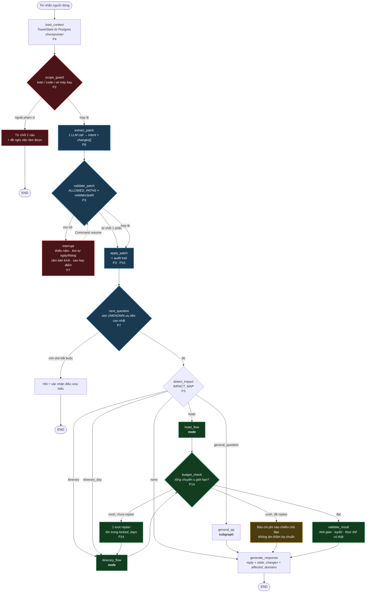
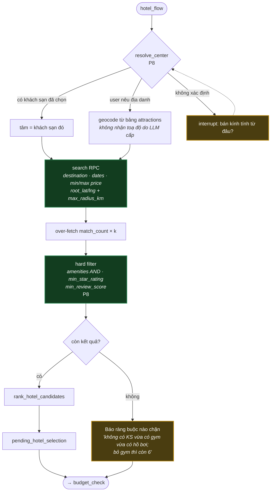
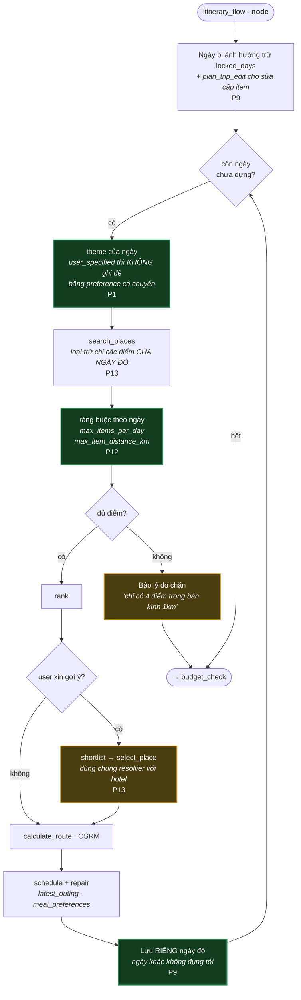
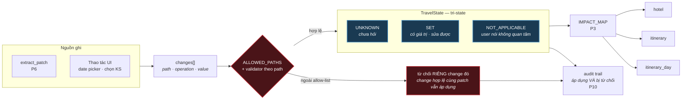

# Kiến trúc đích — LangGraph một control plane, sau 14 phase

Trạng thái **sau khi plan hoàn tất**. Hiện trạng xem `capability-map.md`.
Mỗi node gắn nhãn phase xây nó.

## 1. Graph chính

**Đảo ngược cốt lõi so với hiện tại:** `extract_patch` chạy **trước** `next_question`.
Hôm nay câu hỏi đang chờ quyết định xem tin nhắn có được phép mang ý nghĩa khác không —
đó chính là nguồn của mọi deadlock. Ở đây patch luôn được thử trước, câu hỏi chỉ hỏi lại sau.

## 2. hotel_flow — P8

Điểm chết người đã gỡ: **không còn nhánh nào âm thầm bỏ filter.** Hôm nay
`supabase_search.py:281` tự bỏ `min_star_rating` khi 0 kết quả và trả về semantic matches —
user xin 4 sao, nhận 3 sao, không có dấu hiệu gì.

## 3. itinerary_flow (node) + rebuild_day (SUBGRAPH) — P9 · P12 · P13

Khối `THEME → SAVEDAY` là **subgraph `rebuild_day`**, gọi một lần cho mỗi ngày qua cạnh
lặp của graph cha — không phải `for` trong Python. Nhờ vậy interrupt ở ngày 2 khi chọn địa
điểm chỉ chạy lại ngày 2; ngày 1 đã checkpoint xong.

Hai thứ hôm nay chưa có: vòng lặp **chỉ chạy trên ngày bị ảnh hưởng** — hiện
`_apply_day_replan:1378` dựng lại cả chuyến rồi vứt hết trừ 1 ngày; và loại trừ điểm
tham quan **chỉ trong phạm vi ngày đó** — hiện loại trừ toàn bộ mọi ngày, làm ngày mới
có thể rỗng ở điểm đến ít dữ liệu.

## 4. Tầng state — P3

`UNKNOWN` ≠ `NOT_APPLICABLE` là thứ gỡ deadlock ngân sách: hôm nay `None` mang cả hai
nghĩa nên không phân biệt được "chưa trả lời" với "trả lời là không quan tâm".

## 5. Thứ tự thi công

```mermaid
flowchart LR
    subgraph W1["Đợt 1 — độc lập, ~1 ngày"]
        A1["P1 · theme + pill"]
        A2["P2 · scope guard"]
    end

    subgraph W2["Đợt 2 — nền"]
        B3["P3 · TravelState + IMPACT_MAP"]
        B4["P4 · Postgres checkpointer"]
        B5["P5 · graph skeleton<br/><i>sau đây 2 plane cùng tồn tại</i>"]
    end

    subgraph W3["Đợt 3 — điền node"]
        C6["P6 · extract_patch"]
        C7["P7 · slot + interrupt"]
        C8["P8 · hotel_flow"]
        C9["P9 · itinerary_flow"]
        C10["P10 · audit + eval"]
    end

    CUT["P11 · CUTOVER<br/><i>bật mặc định, XOÁ plane cũ</i><br/>~1.400 LOC"]

    subgraph W4["Đợt 4 — năng lực mới"]
        D12["P12 · ràng buộc/ngày"]
        D13["P13 · place search"]
        D14["P14 · tổng ngân sách"]
    end

    B3 --> B5
    B4 --> B5
    B5 --> C6 --> C7
    C7 --> C8
    C7 --> C9
    B3 --> C10

    C8 --> CUT
    C9 --> CUT
    C10 --> CUT

    CUT --> D12
    CUT --> D13
    CUT --> D14

    BLOCKED["🚫 CHẶN — plan riêng<br/>auth + ownership → booking"]

    class W1 first
    class CUT cutover
    class BLOCKED blocked
    classDef first fill:#123d1f,stroke:#2e8b57,stroke-width:2px
    classDef cutover fill:#4a1418,stroke:#b8232c,stroke-width:3px,color:#fff
    classDef blocked fill:#4a1418,stroke:#b8232c,stroke-width:2px,color:#fff
```

**P5 → P11 là cửa sổ duy nhất hai plane cùng tồn tại**, sau cờ `orchestrator=graph|legacy`.
Plane cũ bị đóng băng từ P5 (chỉ được revert, không được sửa). P11 đóng cửa sổ bằng cách
xoá hẳn — nếu không xoá thì plan chưa đạt mục tiêu đã tuyên bố.

Điểm dừng hợp lý: sau **Đợt 1** hết 2 bug + có từ chối · sau **P7** hết deadlock ·
sau **P11** còn đúng một control plane · sau **Đợt 4** mọi khả năng đã nêu đều chạy.
